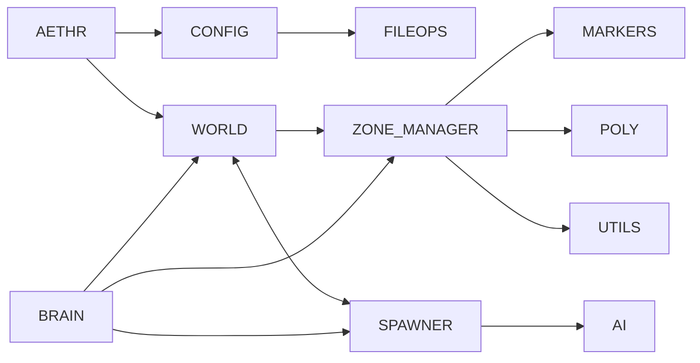

# AETHR Diagrams Index

Master index for all Mermaid diagrams and flow descriptions across AETHR.

Conventions
- All diagrams use GitHub Mermaid fenced blocks: ```mermaid
- Avoid double quotes and parentheses in Mermaid labels inside brackets.
- Flow types: flowchart LR for pipelines; sequenceDiagram for inter-module handoffs.
- Source anchors link to code using relative paths and stable line anchors.

Cross-module overview



Module documentation index

Core orchestration
- [AETHR overview](aethr/README.md)
- [CONFIG](config/README.md)
- [FILEOPS](fileops/README.md)
- [IO](io/README.md)
- [POLY](poly/README.md)
- [MARKERS](markers/README.md)
- [UTILS](utils/README.md)
- [ENUMS](enums/README.md)
- [AUTOSAVE](autosave/README.md)
- [MATH](math/README.md)
- [TYPES](types/README.md)
- [FSM](fsm/README.md)

Runtime systems
- [WORLD](world/README.md)
- [SPAWNER](spawner/README.md)
- [ZONE_MANAGER](zone_manager/README.md)
- [BRAIN](brain/README.md)
- [AI](ai/README.md)

Source anchors examples
- [AETHR.CONFIG:initConfig()](../dev/CONFIG_.lua:364), [AETHR.CONFIG:loadConfig()](../dev/CONFIG_.lua:380), [AETHR.CONFIG:saveConfig()](../dev/CONFIG_.lua:404)
- [AETHR.WORLD:generateWorldDivisions()](../dev/WORLD.lua:1156), [AETHR.WORLD:initMizFileCache()](../dev/WORLD.lua:90)
- [AETHR.SPAWNER:generateDynamicSpawner()](../dev/SPAWNER.lua:563)
- [AETHR.ZONE_MANAGER:drawGameBounds()](../dev/ZONE_MANAGER.lua:931)
- [AETHR.BRAIN:scheduleTask()](../dev/BRAIN.lua:277)
- [AETHR.AI.DBSCANNER:Scan()](../dev/_AI.lua:319)
- [AETHR.FSM:processQueue()](../dev/FSM.lua:515)

Notes
- Existing module pages will be standardized in subsequent steps; links above point to top-level READMEs where applicable.
- Use consistent orientation and section headings so anchors can be indexed reliably.
## Diagrams index (all modules)

Quick links to pages containing Mermaid flowcharts and sequence diagrams.

Core orchestration
- [AETHR](aethr/README.md)
- [CONFIG](config/README.md)
- [FILEOPS](fileops/README.md)
- [IO](io/README.md)
- [POLY](poly/README.md)
- [MARKERS](markers/README.md)
- [UTILS](utils/README.md)
- [ENUMS](enums/README.md)
- [AUTOSAVE](autosave/README.md)
- [MATH](math/README.md)
- [TYPES](types/README.md)
- [FSM](fsm/README.md)

WORLD
- [Overview and init](world/README.md)
- [Initialization timeline](world/initialization.md)
- [Divisions and grid](world/divisions.md)
- [Ownership changes](world/ownership.md)
- [Objects and ground DB](world/objects_and_db.md)
- [MIZ cache](world/miz_cache.md)
- [Towns clustering](world/towns.md)
- [Spawner integration](world/spawner_integration.md)

SPAWNER
- [Overview](spawner/README.md)
- [Pipeline overview](spawner/pipeline.md)
- [Zones and divisions pairing](spawner/zones_and_divisions.md)
- [Placement (centers and units)](spawner/placement.md)
- [Types and counts](spawner/types_and_counts.md)
- [Auxiliary](spawner/auxiliary.md)
- [NoGo checks](spawner/nogo.md)
- [Async job runner](spawner/async.md)
- [Spawn and despawn flows](spawner/spawn_despawn.md)

ZONE_MANAGER
- [Overview](zone_manager/README.md)
- [Zone data lifecycle](zone_manager/zone_data.md)
- [Borders and master polygon](zone_manager/borders_and_master.md)
- [Markers and arrows](zone_manager/markers_and_arrows.md)
- [Game bounds](zone_manager/game_bounds.md)
- [Watchers](zone_manager/watchers.md)
- [Airbases](zone_manager/airbases.md)

BRAIN
- [Overview](brain/README.md)
- [Scheduler](brain/scheduler.md)
- [Coroutines](brain/coroutines.md)
- [Data structures](brain/data_structures.md)
- [Watchers](brain/watchers.md)

AI
- [Overview](ai/README.md)
- [DBSCAN flow](ai/dbscan.md)
- [Data structures](ai/data_structures.md)