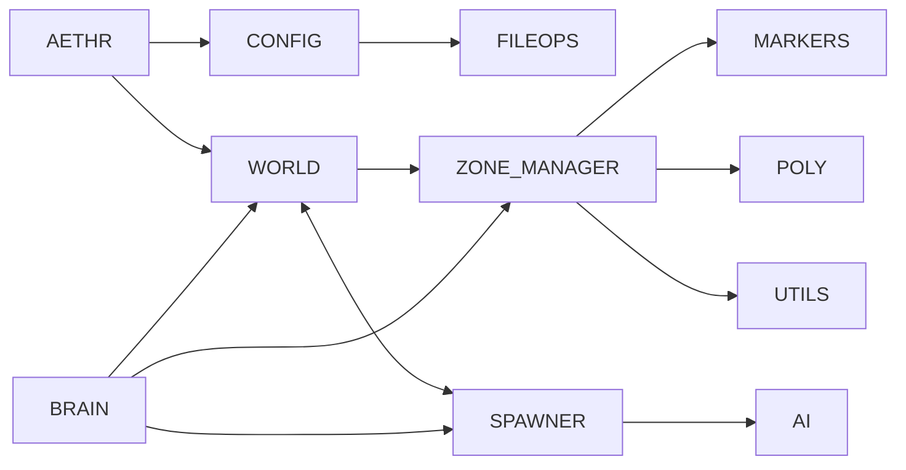

# AETHR Diagrams Index

Master index for all Mermaid diagrams and flow descriptions across AETHR.

Conventions
- All diagrams use GitHub Mermaid fenced blocks: ```mermaid
- Avoid double quotes and parentheses in Mermaid labels inside brackets.
- Flow types: flowchart LR for pipelines; sequenceDiagram for inter-module handoffs.
- Source anchors link to code using relative paths and stable line anchors.

Cross-module overview



Module documentation index

Core orchestration
- [AETHR overview](aethr/README.md)
- [CONFIG](config/README.md)
- [FILEOPS](fileops/README.md)
- [IO](io/README.md)
- [POLY](poly/README.md)
- [MARKERS](markers/README.md)
- [UTILS](utils/README.md)
- [ENUMS](enums/README.md)
- [AUTOSAVE](autosave/README.md)
- [MATH](math/README.md)
- [TYPES](types/README.md)
- [FSM](fsm/README.md)

Runtime systems
- [WORLD](world/README.md)
- [SPAWNER](spawner/README.md)
- [ZONE_MANAGER](zone_manager/README.md)
- [BRAIN](brain/README.md)
- [AI](ai/README.md)

Source anchors examples
- [AETHR.CONFIG:initConfig()](../dev/CONFIG_.lua:364), [AETHR.CONFIG:loadConfig()](../dev/CONFIG_.lua:380), [AETHR.CONFIG:saveConfig()](../dev/CONFIG_.lua:404)
- [AETHR.WORLD:generateWorldDivisions()](../dev/WORLD.lua:1156), [AETHR.WORLD:initMizFileCache()](../dev/WORLD.lua:90)
- [AETHR.SPAWNER:generateDynamicSpawner()](../dev/SPAWNER.lua:563)
- [AETHR.ZONE_MANAGER:drawGameBounds()](../dev/ZONE_MANAGER.lua:931)
- [AETHR.BRAIN:scheduleTask()](../dev/BRAIN.lua:277)
- [AETHR.AI.DBSCANNER:Scan()](../dev/_AI.lua:319)
- [AETHR.FSM:processQueue()](../dev/FSM.lua:515)

Notes
- Existing module pages will be standardized in subsequent steps; links above point to top-level READMEs where applicable.
- Use consistent orientation and section headings so anchors can be indexed reliably.
## Diagrams index (all modules)

Quick links to pages containing Mermaid flowcharts and sequence diagrams.

Core orchestration
- [AETHR](aethr/README.md)
- [CONFIG](config/README.md)
- [FILEOPS](fileops/README.md)
- [IO](io/README.md)
- [POLY](poly/README.md)
- [MARKERS](markers/README.md)
- [UTILS](utils/README.md)
- [ENUMS](enums/README.md)
- [AUTOSAVE](autosave/README.md)
- [MATH](math/README.md)
- [TYPES](types/README.md)
- [FSM](fsm/README.md)

AETHR
- [Overview](aethr/README.md)
- [Instance creation](aethr/instance_creation.md)
- [Modules wiring](aethr/modules_wiring.md)
- [Init orchestration](aethr/init.md)
- [Startup and watchers](aethr/startup_and_watchers.md)
- [Background processes](aethr/background_processes.md)
- [User storage](aethr/user_storage.md)
WORLD
- [Overview and init](world/README.md)
- [Initialization timeline](world/initialization.md)
- [Divisions and grid](world/divisions.md)
- [Ownership changes](world/ownership.md)
- [Objects and ground DB](world/objects_and_db.md)
- [MIZ cache](world/miz_cache.md)
- [Towns clustering](world/towns.md)
- [Spawner integration](world/spawner_integration.md)

SPAWNER
- [Overview](spawner/README.md)
- [Pipeline overview](spawner/pipeline.md)
- [Zones and divisions pairing](spawner/zones_and_divisions.md)
- [Placement (centers and units)](spawner/placement.md)
- [Types and counts](spawner/types_and_counts.md)
- [Auxiliary](spawner/auxiliary.md)
- [NoGo checks](spawner/nogo.md)
- [Async job runner](spawner/async.md)
- [Spawn and despawn flows](spawner/spawn_despawn.md)

ZONE_MANAGER
- [Overview](zone_manager/README.md)
- [Zone data lifecycle](zone_manager/zone_data.md)
- [Borders and master polygon](zone_manager/borders_and_master.md)
- [Markers and arrows](zone_manager/markers_and_arrows.md)
- [Game bounds](zone_manager/game_bounds.md)
- [Watchers](zone_manager/watchers.md)
- [Airbases](zone_manager/airbases.md)

BRAIN
- [Overview](brain/README.md)
- [Scheduler](brain/scheduler.md)
- [Coroutines](brain/coroutines.md)
- [Data structures](brain/data_structures.md)
- [Watchers](brain/watchers.md)

AI
- [Overview](ai/README.md)
- [DBSCAN flow](ai/dbscan.md)
- [Data structures](ai/data_structures.md)
## IO

- Overview: [docs/io/README.md](io/README.md)
- Store and variants: [docs/io/store_and_variants.md](io/store_and_variants.md)
- Load and deSerialize: [docs/io/load_and_deserialize.md](io/load_and_deserialize.md)
- Writers and refCount internals: [docs/io/writers_and_refcount.md](io/writers_and_refcount.md)
- Serialize NoFunc: [docs/io/serialize_nofunc.md](io/serialize_nofunc.md)
- Dump helper: [docs/io/dump.md](io/dump.md)
## FILEOPS

- Overview: [docs/fileops/README.md](fileops/README.md)
- Paths and ensure: [docs/fileops/paths_and_ensure.md](fileops/paths_and_ensure.md)
- Save and load: [docs/fileops/save_and_load.md](fileops/save_and_load.md)
- Chunking and tracker: [docs/fileops/chunking.md](fileops/chunking.md)
- Deep copy helper: [docs/fileops/deepcopy.md](fileops/deepcopy.md)
## CONFIG

- Overview: [docs/config/README.md](config/README.md)
- Init and persistence: [docs/config/init_and_persistence.md](config/init_and_persistence.md)
- Paths and filenames: [docs/config/paths_and_filenames.md](config/paths_and_filenames.md)
- Main schema: [docs/config/main_schema.md](config/main_schema.md)
- Flags and counters: [docs/config/flags_counters.md](config/flags_counters.md)
- Zone paint and bounds: [docs/config/zone_paint_and_bounds.md](config/zone_paint_and_bounds.md)
- World bounds and divisions: [docs/config/world_bounds_and_divisions.md](config/world_bounds_and_divisions.md)
- OutText settings: [docs/config/out_text.md](config/out_text.md)
- Save chunks: [docs/config/save_chunks.md](config/save_chunks.md)
## ENUMS

- Overview: [docs/enums/README.md](enums/README.md)
- Categories: [docs/enums/categories.md](enums/categories.md)
- Lines and markers: [docs/enums/lines_and_markers.md](enums/lines_and_markers.md)
- Coalition and text: [docs/enums/coalition_and_text.md](enums/coalition_and_text.md)
- Surface types and NOGO: [docs/enums/surface_types.md](enums/surface_types.md)
- Spawn types and priority: [docs/enums/spawn_types.md](enums/spawn_types.md)
- Events: [docs/enums/events.md](enums/events.md)
- Countries and skill: [docs/enums/countries_and_skill.md](enums/countries_and_skill.md)
## MARKERS

- Overview: [docs/markers/README.md](markers/README.md)
- Polygons and freeform: [docs/markers/polygons.md](markers/polygons.md)
- Arrows: [docs/markers/arrows.md](markers/arrows.md)
- Circles and generic circle: [docs/markers/circles.md](markers/circles.md)
- Removal helpers: [docs/markers/removal.md](markers/removal.md)
## FSM

- Overview: [docs/fsm/README.md](fsm/README.md)
- Transition lifecycle and async: [docs/fsm/transition_lifecycle.md](fsm/transition_lifecycle.md)
- Creation and callbacks: [docs/fsm/creation_and_callbacks.md](fsm/creation_and_callbacks.md)
- Events and queries: [docs/fsm/events_and_queries.md](fsm/events_and_queries.md)
- Manager and queue: [docs/fsm/manager.md](fsm/manager.md)
- Export and tooling: [docs/fsm/export_and_tooling.md](fsm/export_and_tooling.md)
## MATH

- Overview: [docs/math/README.md](math/README.md)
- Orientation: [docs/math/orientation.md](math/orientation.md)
- Vectors and angles: [docs/math/vectors.md](math/vectors.md)
- Equality and centroid: [docs/math/equality_and_centroid.md](math/equality_and_centroid.md)
- Randomization helpers: [docs/math/randomization.md](math/randomization.md)
- Degree and turn angle notes: [docs/math/angles.md](math/angles.md)
## POLY

- Overview: [docs/poly/README.md](poly/README.md)
- Intersections and orientation: [docs/poly/intersections_and_orientation.md](poly/intersections_and_orientation.md)
- Point in polygon and overlap: [docs/poly/point_in_polygon_and_overlap.md](poly/point_in_polygon_and_overlap.md)
- Distance, projection, and offset: [docs/poly/distance_projection_and_offset.md](poly/distance_projection_and_offset.md)
- Random points and sampling: [docs/poly/random_points_and_sampling.md](poly/random_points_and_sampling.md)
- Convert and order: [docs/poly/convert_and_order.md](poly/convert_and_order.md)
- Bounds and divisions: [docs/poly/bounds_and_divisions.md](poly/bounds_and_divisions.md)
- Hulls densify and gaps: [docs/poly/hulls_densify_and_gaps.md](poly/hulls_densify_and_gaps.md)
- Rays, midpoints, and slopes: [docs/poly/rays_midpoints_and_slopes.md](poly/rays_midpoints_and_slopes.md)
- Reorder and centroids: [docs/poly/reorder_and_centroids.md](poly/reorder_and_centroids.md)