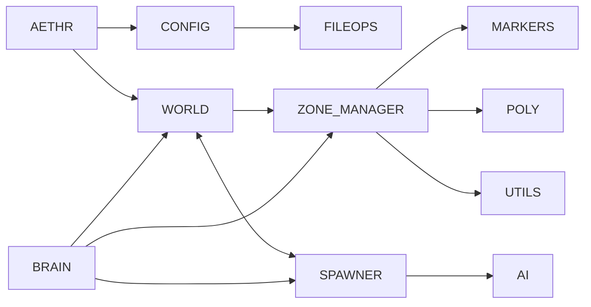

# AETHR Diagrams Index

Master index for all Mermaid diagrams and flow descriptions across AETHR.

Conventions
- All diagrams use GitHub Mermaid fenced blocks: ```mermaid
- Avoid double quotes and parentheses in Mermaid labels inside brackets.
- Flow types: flowchart LR for pipelines; sequenceDiagram for inter-module handoffs.
- Source anchors link to code using relative paths and stable line anchors.

Cross-module overview



Module documentation index

Core orchestration
- [AETHR overview](aethr/README.md)
- [CONFIG](config/README.md)
- [FILEOPS](fileops/README.md)
- [IO](io/README.md)
- [POLY](poly/README.md)
- [MARKERS](markers/README.md)
- [UTILS](utils/README.md)
- [ENUMS](enums/README.md)
- [AUTOSAVE](autosave/README.md)
- [MATH](math/README.md)
- [TYPES](types/README.md)

Runtime systems
- [WORLD](world/README.md)
- [SPAWNER](spawner/README.md)
- [ZONE_MANAGER](zone_manager/README.md)
- [BRAIN](brain/README.md)
- [AI](ai/README.md)

Source anchors examples
- [AETHR.CONFIG:initConfig()](../dev/CONFIG_.lua:364), [AETHR.CONFIG:loadConfig()](../dev/CONFIG_.lua:380), [AETHR.CONFIG:saveConfig()](../dev/CONFIG_.lua:404)
- [AETHR.WORLD:generateWorldDivisions()](../dev/WORLD.lua:1156), [AETHR.WORLD:initMizFileCache()](../dev/WORLD.lua:90)
- [AETHR.SPAWNER:generateDynamicSpawner()](../dev/SPAWNER.lua:563)
- [AETHR.ZONE_MANAGER:drawGameBounds()](../dev/ZONE_MANAGER.lua:931)
- [AETHR.BRAIN:scheduleTask()](../dev/BRAIN.lua:277)
- [AETHR.AI.DBSCANNER:Scan()](../dev/_AI.lua:319)

Notes
- Existing module pages will be standardized in subsequent steps; links above point to top-level READMEs where applicable.
- Use consistent orientation and section headings so anchors can be indexed reliably.