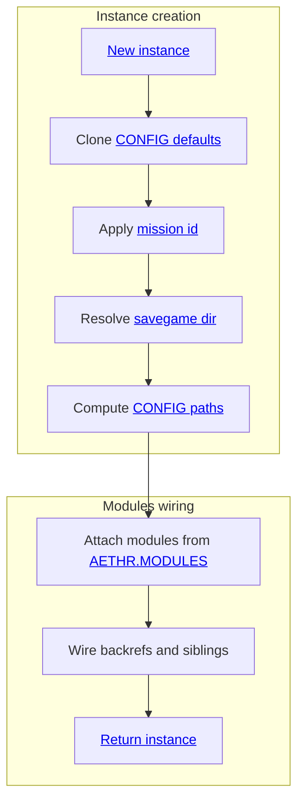
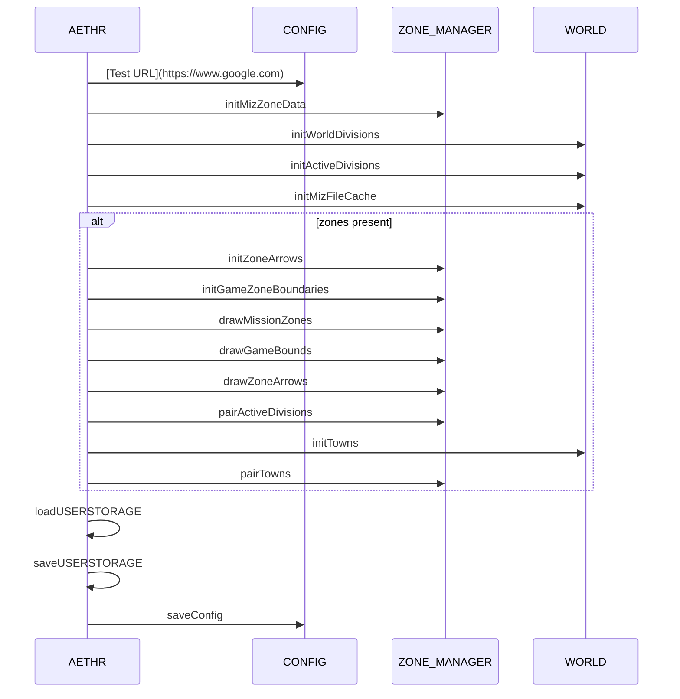
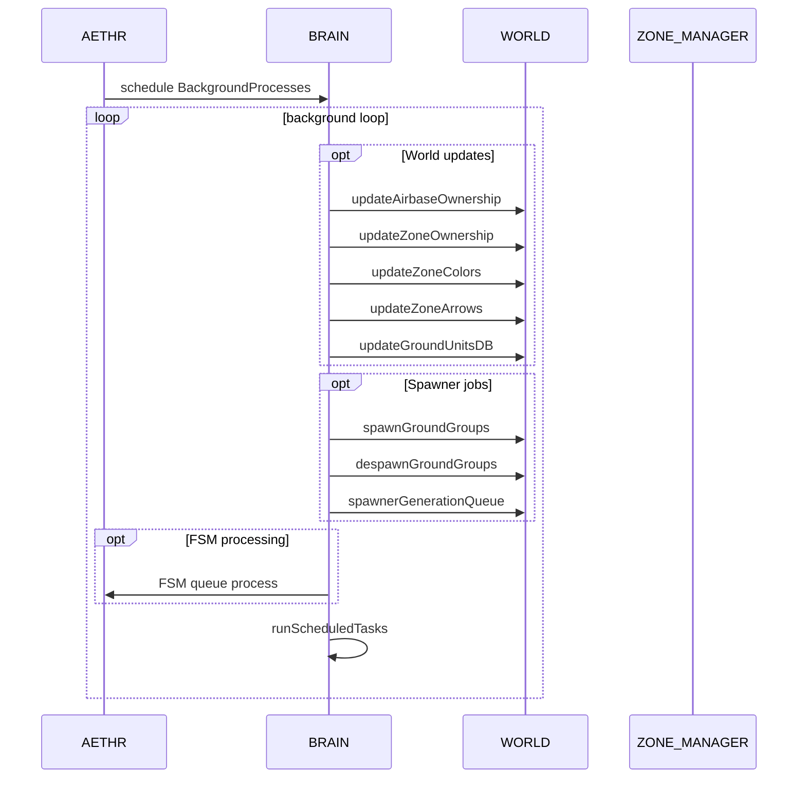

# AETHR overview and diagrams

## Primary entry points
- [AETHR:New()](https://github.com/Gh0st352/AETHR/blob/main/dev/AETHR.lua#L65)
- [AETHR:Init()](https://github.com/Gh0st352/AETHR/blob/main/dev/AETHR.lua#L199)
- [AETHR:Start()](https://github.com/Gh0st352/AETHR/blob/main/dev/AETHR.lua#L252)
- [AETHR:BackgroundProcesses()](https://github.com/Gh0st352/AETHR/blob/main/dev/AETHR.lua#L267)
- [AETHR:setupWatchers()](https://github.com/Gh0st352/AETHR/blob/main/dev/AETHR.lua#L334)
- [AETHR:loadUSERSTORAGE()](https://github.com/Gh0st352/AETHR/blob/main/dev/AETHR.lua#L344)
- [AETHR:saveUSERSTORAGE()](https://github.com/Gh0st352/AETHR/blob/main/dev/AETHR.lua#L361)
- [AETHR.MODULES](https://github.com/Gh0st352/AETHR/blob/main/dev/AETHR.lua#L40)

## Documents
- Module indices: [docs/README.md](../README.md)
- WORLD module: [docs/world/README.md](../world/README.md)
- ZONE_MANAGER module: [docs/zone_manager/README.md](../zone_manager/README.md)
- SPAWNER module: [docs/spawner/README.md](../spawner/README.md)
- BRAIN module: [docs/brain/README.md](../brain/README.md)
- AI module: [docs/ai/README.md](../ai/README.md)

## Breakout pages
- Instance creation: [instance_creation.md](./instance_creation.md)
- Modules wiring: [modules_wiring.md](./modules_wiring.md)
- Init orchestration: [init.md](./init.md)
- Startup and watchers: [startup_and_watchers.md](./startup_and_watchers.md)
- Background processes: [background_processes.md](./background_processes.md)
- User storage: [user_storage.md](./user_storage.md)

# Instance creation and wiring

# Init orchestration

```mermaid
%% shared theme: docs/_mermaid/theme.json %%
flowchart
  %% Main container
  subgraph INIT [Initialization]
    I[<a href='https://github.com/Gh0st352/AETHR/blob/main/dev/AETHR.lua#L199'>Init</a>]
    subgraph STORAGE [Storage prep]
      P1[<a href='https://github.com/Gh0st352/AETHR/blob/main/dev/AETHR.lua#L208'>Ensure storage folders</a>]
    end
    subgraph MODS [Modules]
      L1[CONFIG <a href='https://github.com/Gh0st352/AETHR/blob/main/dev/AETHR.lua#L219'>initConfig</a>]
      Z1[ZONE_MANAGER <a href='https://github.com/Gh0st352/AETHR/blob/main/dev/AETHR.lua#L220'>initMizZoneData</a>]
      W1[WORLD <a href='https://github.com/Gh0st352/AETHR/blob/main/dev/AETHR.lua#L221'>initWorldDivisions</a>]
      W2[WORLD <a href='https://github.com/Gh0st352/AETHR/blob/main/dev/AETHR.lua#L222'>initActiveDivisions</a>]
      W3[WORLD <a href='https://github.com/Gh0st352/AETHR/blob/main/dev/AETHR.lua#L223'>initMizFileCache</a>]
    end
    subgraph ZONES [Zone drawing and pairing]
      ZB[ZONE_MANAGER <a href='https://github.com/Gh0st352/AETHR/blob/main/dev/AETHR.lua#L230'>game bounds and arrows</a>]
      T1[WORLD <a href='https://github.com/Gh0st352/AETHR/blob/main/dev/AETHR.lua#L230'>initTowns</a> and ZONE_MANAGER <a href='https://github.com/Gh0st352/AETHR/blob/main/dev/AETHR.lua#L230'>pairTowns</a>]
    end
    subgraph PERSIST [Persistence]
      US[<a href='https://github.com/Gh0st352/AETHR/blob/main/dev/AETHR.lua#L241'>Load and save USERSTORAGE</a>]
      CS[<a href='https://github.com/Gh0st352/AETHR/blob/main/dev/AETHR.lua#L243'>saveConfig</a>]
    end

    %% Flow
    I --> P1
    P1 --> L1
    L1 --> Z1
    Z1 --> W1
    W1 --> W2
    W2 --> W3
    W3 --> ZB
    ZB --> T1
    T1 --> US
    US --> CS
  end

  %% Class assignments (house buckets)
  class I,CS class_result;
  class P1,L1,Z1,W1,W2,W3,ZB,T1,US class_step;

  click I "https://github.com/Gh0st352/AETHR/blob/main/dev/AETHR.lua#L199" "AETHR:Init"
  click P1 "https://github.com/Gh0st352/AETHR/blob/main/dev/AETHR.lua#L208" "Ensure storage folders"
  click L1 "https://github.com/Gh0st352/AETHR/blob/main/dev/AETHR.lua#L219" "CONFIG:initConfig (call site)"
  click Z1 "https://github.com/Gh0st352/AETHR/blob/main/dev/AETHR.lua#L220" "ZONE_MANAGER:initMizZoneData"
  click W1 "https://github.com/Gh0st352/AETHR/blob/main/dev/AETHR.lua#L221" "WORLD:initWorldDivisions"
  click W2 "https://github.com/Gh0st352/AETHR/blob/main/dev/AETHR.lua#L222" "WORLD:initActiveDivisions"
  click W3 "https://github.com/Gh0st352/AETHR/blob/main/dev/AETHR.lua#L223" "WORLD:initMizFileCache"
  click ZB "https://github.com/Gh0st352/AETHR/blob/main/dev/AETHR.lua#L230" "Zone drawing and pairing"
  click T1 "https://github.com/Gh0st352/AETHR/blob/main/dev/AETHR.lua#L230" "initTowns / pairTowns"
  click US "https://github.com/Gh0st352/AETHR/blob/main/dev/AETHR.lua#L241" "load/save USERSTORAGE"
  click CS "https://github.com/Gh0st352/AETHR/blob/main/dev/AETHR.lua#L243" "saveConfig"
```

# Runtime sequence during Init

# Background processes loop

# Key anchors
- Construction and wiring
  - [AETHR:New()](https://github.com/Gh0st352/AETHR/blob/main/dev/AETHR.lua#L65), [AETHR.MODULES](https://github.com/Gh0st352/AETHR/blob/main/dev/AETHR.lua#L40)
- Initialization flow
  - [AETHR:Init()](https://github.com/Gh0st352/AETHR/blob/main/dev/AETHR.lua#L199)
- Startup and watchers
  - [AETHR:Start()](https://github.com/Gh0st352/AETHR/blob/main/dev/AETHR.lua#L252), [AETHR:setupWatchers()](https://github.com/Gh0st352/AETHR/blob/main/dev/AETHR.lua#L334)
- Background loop
  - [AETHR:BackgroundProcesses()](https://github.com/Gh0st352/AETHR/blob/main/dev/AETHR.lua#L267)
- User storage
  - [AETHR:loadUSERSTORAGE()](https://github.com/Gh0st352/AETHR/blob/main/dev/AETHR.lua#L344), [AETHR:saveUSERSTORAGE()](https://github.com/Gh0st352/AETHR/blob/main/dev/AETHR.lua#L361)

# Source references
- CONFIG interactions: [AETHR.CONFIG:initConfig()](https://github.com/Gh0st352/AETHR/blob/main/dev/CONFIG_.lua#L364), [AETHR.CONFIG:saveConfig()](https://github.com/Gh0st352/AETHR/blob/main/dev/CONFIG_.lua#L404)
- WORLD ownership updates: [AETHR.WORLD:updateAirbaseOwnership()](https://github.com/Gh0st352/AETHR/blob/main/dev/WORLD.lua#L501), [AETHR.WORLD:updateZoneOwnership()](https://github.com/Gh0st352/AETHR/blob/main/dev/WORLD.lua#L633), [AETHR.WORLD:updateZoneColors()](https://github.com/Gh0st352/AETHR/blob/main/dev/WORLD.lua#L683), [AETHR.WORLD:updateZoneArrows()](https://github.com/Gh0st352/AETHR/blob/main/dev/WORLD.lua#L730)
- WORLD divisions: [AETHR.WORLD:generateWorldDivisions()](https://github.com/Gh0st352/AETHR/blob/main/dev/WORLD.lua#L1156)
- ZONE manager arrows and bounds: [AETHR.ZONE_MANAGER:drawZoneArrows()](https://github.com/Gh0st352/AETHR/blob/main/dev/ZONE_MANAGER.lua#L1025), [AETHR.ZONE_MANAGER:drawGameBounds()](https://github.com/Gh0st352/AETHR/blob/main/dev/ZONE_MANAGER.lua#L931)

# Notes
- Mermaid labels avoid double quotes and parentheses to satisfy renderer constraints.
- All diagrams use GitHub Mermaid fenced blocks.