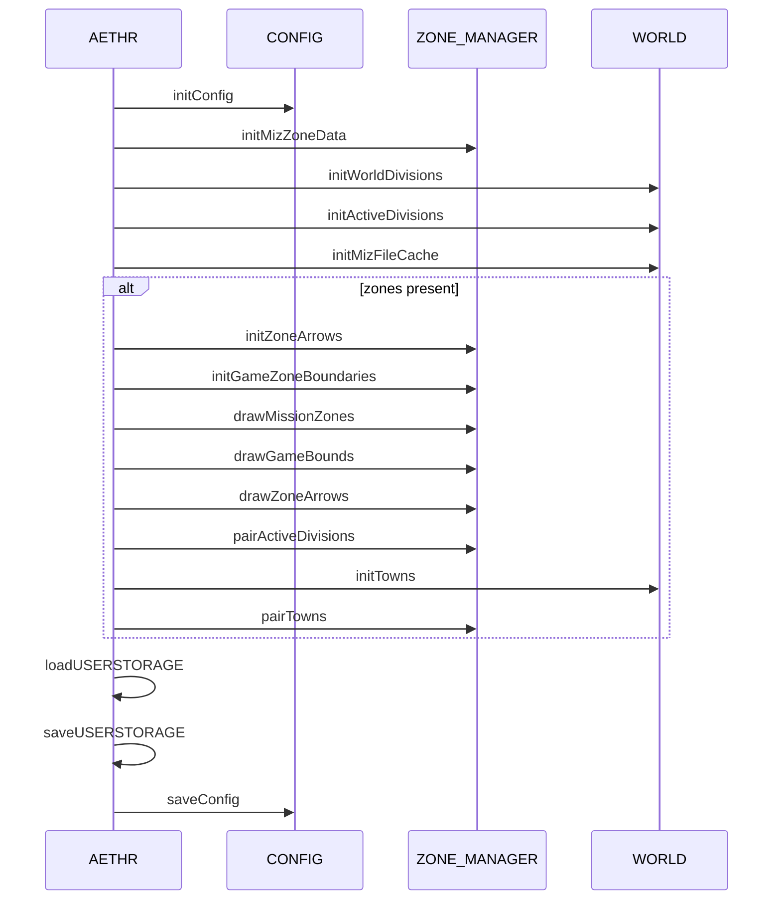
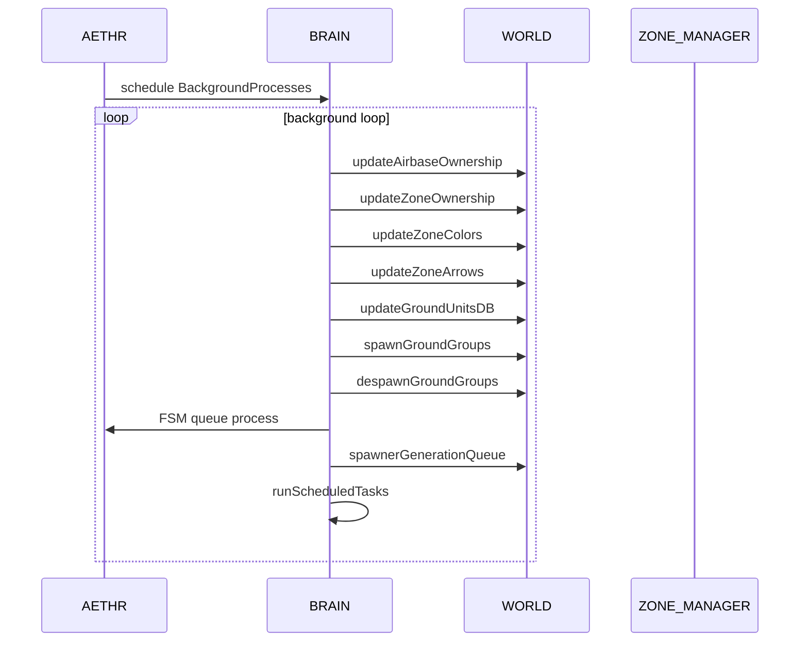

# AETHR overview and diagrams

Primary entry points
- [AETHR:New()](../../dev/AETHR.lua:65)
- [AETHR:Init()](../../dev/AETHR.lua:199)
- [AETHR:Start()](../../dev/AETHR.lua:252)
- [AETHR:BackgroundProcesses()](../../dev/AETHR.lua:267)
- [AETHR:setupWatchers()](../../dev/AETHR.lua:334)
- [AETHR:loadUSERSTORAGE()](../../dev/AETHR.lua:344)
- [AETHR:saveUSERSTORAGE()](../../dev/AETHR.lua:361)
- [AETHR.MODULES](../../dev/AETHR.lua:40)

Documents
- Module indices: [docs/README.md](../README.md)
- WORLD module: [docs/world/README.md](../world/README.md)
- ZONE_MANAGER module: [docs/zone_manager/README.md](../zone_manager/README.md)
- SPAWNER module: [docs/spawner/README.md](../spawner/README.md)
- BRAIN module: [docs/brain/README.md](../brain/README.md)
- AI module: [docs/ai/README.md](../ai/README.md)

Breakout pages
- Instance creation: [instance_creation.md](./instance_creation.md)
- Modules wiring: [modules_wiring.md](./modules_wiring.md)
- Init orchestration: [init.md](./init.md)
- Startup and watchers: [startup_and_watchers.md](./startup_and_watchers.md)
- Background processes: [background_processes.md](./background_processes.md)
- User storage: [user_storage.md](./user_storage.md)
Instance creation and wiring

```mermaid
%% shared theme: docs/_mermaid/theme.json %%
flowchart LR
  %% Groupings
  subgraph INSTANCE ["Instance creation"]
    N["New instance"]
    C["Clone CONFIG defaults"]
    ID["Apply mission id"]
    SD["Resolve savegame dir"]
    PC["Compute CONFIG paths"]
  end

  subgraph MODULES ["Modules wiring"]
    AM["Attach modules from AETHR MODULES"]
    BR["Wire backrefs and siblings"]
    RT["Return instance"]
  end

  %% Flow
  N --> C --> ID --> SD --> PC --> AM --> BR --> RT

  %% Class assignments (house buckets)
  class N,RT class-result;
  class C,ID,SD,PC,AM,BR class-step;
```

Init orchestration

```mermaid
%% shared theme: docs/_mermaid/theme.json %%
flowchart TB
  %% Main container
  subgraph INIT ["Initialization"]
    I["Init"]
    subgraph STORAGE ["Storage prep"]
      P1["Ensure storage folders"]
    end
    subgraph MODS ["Modules"]
      L1["CONFIG initConfig"]
      Z1["ZONE_MANAGER initMizZoneData"]
      W1["WORLD initWorldDivisions"]
      W2["WORLD initActiveDivisions"]
      W3["WORLD initMizFileCache"]
    end
    subgraph ZONES ["Zone drawing and pairing"]
      ZB["ZONE_MANAGER game bounds and arrows"]
      T1["WORLD initTowns and ZONE_MANAGER pairTowns"]
    end
    subgraph PERSIST ["Persistence"]
      US["Load and save USERSTORAGE"]
      CS["saveConfig"]
    end

    %% Flow
    I --> P1 --> L1 --> Z1 --> W1 --> W2 --> W3 --> ZB --> T1 --> US --> CS
  end

  %% Class assignments (house buckets)
  class I,CS class-result;
  class P1,L1,Z1,W1,W2,W3,ZB,T1,US class-step;
```

Runtime sequence during Init



Background processes loop



Key anchors
- Construction and wiring
  - [AETHR:New()](../../dev/AETHR.lua:65), [AETHR.MODULES](../../dev/AETHR.lua:40)
- Initialization flow
  - [AETHR:Init()](../../dev/AETHR.lua:199)
- Startup and watchers
  - [AETHR:Start()](../../dev/AETHR.lua:252), [AETHR:setupWatchers()](../../dev/AETHR.lua:334)
- Background loop
  - [AETHR:BackgroundProcesses()](../../dev/AETHR.lua:267)
- User storage
  - [AETHR:loadUSERSTORAGE()](../../dev/AETHR.lua:344), [AETHR:saveUSERSTORAGE()](../../dev/AETHR.lua:361)

Source references
- CONFIG interactions: [AETHR.CONFIG:initConfig()](../../dev/CONFIG_.lua:364), [AETHR.CONFIG:saveConfig()](../../dev/CONFIG_.lua:404)
- WORLD ownership updates: [AETHR.WORLD:updateAirbaseOwnership()](../../dev/WORLD.lua:501), [AETHR.WORLD:updateZoneOwnership()](../../dev/WORLD.lua:633), [AETHR.WORLD:updateZoneColors()](../../dev/WORLD.lua:683), [AETHR.WORLD:updateZoneArrows()](../../dev/WORLD.lua:730)
- WORLD divisions: [AETHR.WORLD:generateWorldDivisions()](../../dev/WORLD.lua:1156)
- ZONE manager arrows and bounds: [AETHR.ZONE_MANAGER:drawZoneArrows()](../../dev/ZONE_MANAGER.lua:1025), [AETHR.ZONE_MANAGER:drawGameBounds()](../../dev/ZONE_MANAGER.lua:931)

Notes
- Mermaid labels avoid double quotes and parentheses to satisfy renderer constraints.
- All diagrams use GitHub Mermaid fenced blocks.