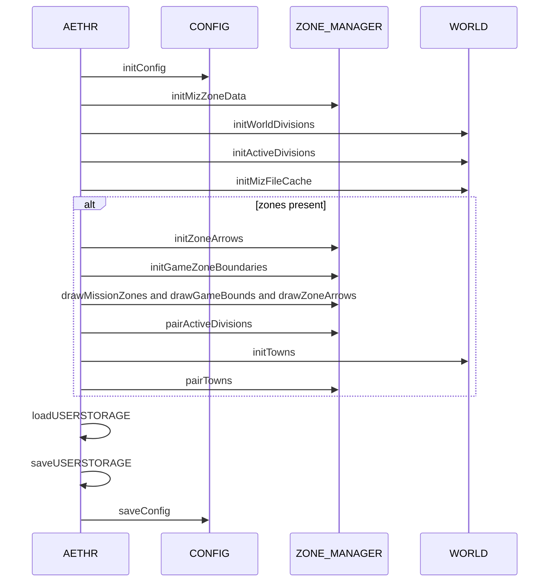
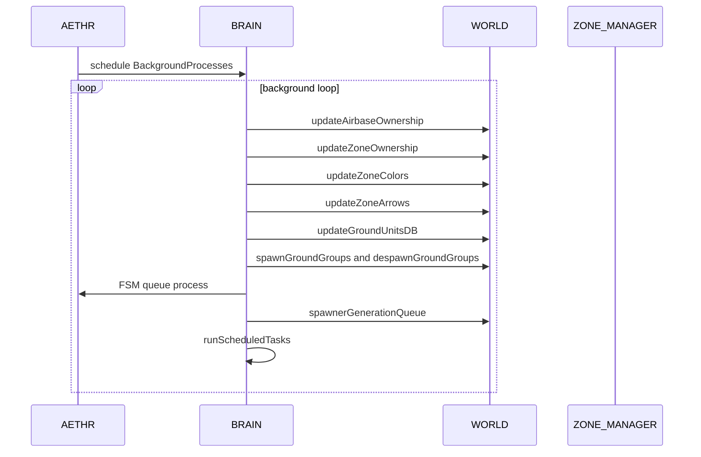

# AETHR overview and diagrams

Primary entry points
- [AETHR:New()](dev/AETHR.lua:65)
- [AETHR:Init()](dev/AETHR.lua:199)
- [AETHR:Start()](dev/AETHR.lua:252)
- [AETHR:BackgroundProcesses()](dev/AETHR.lua:267)
- [AETHR:setupWatchers()](dev/AETHR.lua:334)
- [AETHR:loadUSERSTORAGE()](dev/AETHR.lua:344)
- [AETHR:saveUSERSTORAGE()](dev/AETHR.lua:361)
- [AETHR.MODULES](dev/AETHR.lua:40)

Documents
- Module indices: [docs/README.md](docs/README.md)
- WORLD module: [docs/world/README.md](docs/world/README.md)
- ZONE_MANAGER module: [docs/zone_manager/README.md](docs/zone_manager/README.md)
- SPAWNER module: [docs/spawner/README.md](docs/spawner/README.md)
- BRAIN module: [docs/brain/README.md](docs/brain/README.md)
- AI module: [docs/ai/README.md](docs/ai/README.md)

Instance creation and wiring

Init orchestration

```mermaid
flowchart LR
  I[Init] --> P1[Ensure storage folders]
  P1 --> L1[CONFIG initConfig]
  L1 --> Z1[ZONE_MANAGER initMizZoneData]
  Z1 --> W1[WORLD initWorldDivisions]
  W1 --> W2[WORLD initActiveDivisions]
  W2 --> W3[WORLD initMizFileCache]
  W3 --> ZB[ZONE_MANAGER game bounds and arrows]
  ZB --> T1[WORLD initTowns and ZONE_MANAGER pairTowns]
  T1 --> US[Load and save USERSTORAGE]
  US --> CS[saveConfig]
```

Runtime sequence during Init

Background processes loop

Key anchors
- Construction and wiring
  - [AETHR:New()](dev/AETHR.lua:65), [AETHR.MODULES](dev/AETHR.lua:40)
- Initialization flow
  - [AETHR:Init()](dev/AETHR.lua:199)
- Startup and watchers
  - [AETHR:Start()](dev/AETHR.lua:252), [AETHR:setupWatchers()](dev/AETHR.lua:334)
- Background loop
  - [AETHR:BackgroundProcesses()](dev/AETHR.lua:267)
- User storage
  - [AETHR:loadUSERSTORAGE()](dev/AETHR.lua:344), [AETHR:saveUSERSTORAGE()](dev/AETHR.lua:361)

Source references
- CONFIG interactions: [AETHR.CONFIG:initConfig()](dev/CONFIG_.lua:364), [AETHR.CONFIG:saveConfig()](dev/CONFIG_.lua:404)
- WORLD ownership updates: [AETHR.WORLD:updateAirbaseOwnership()](dev/WORLD.lua:501), [AETHR.WORLD:updateZoneOwnership()](dev/WORLD.lua:633), [AETHR.WORLD:updateZoneColors()](dev/WORLD.lua:683), [AETHR.WORLD:updateZoneArrows()](dev/WORLD.lua:730)
- WORLD divisions: [AETHR.WORLD:generateWorldDivisions()](dev/WORLD.lua:1156)
- ZONE manager arrows and bounds: [AETHR.ZONE_MANAGER:drawZoneArrows()](dev/ZONE_MANAGER.lua:1025), [AETHR.ZONE_MANAGER:drawGameBounds()](dev/ZONE_MANAGER.lua:931)

Notes
- Mermaid labels avoid double quotes and parentheses to satisfy renderer constraints.
- All diagrams use GitHub Mermaid fenced blocks.