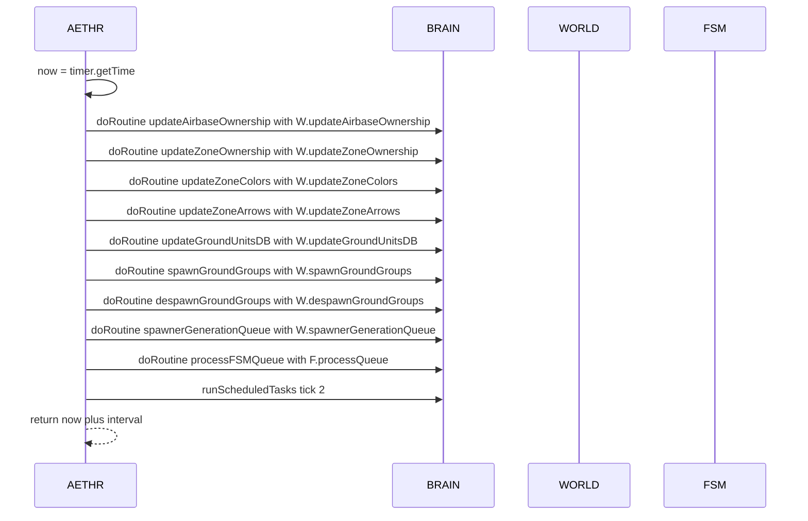

# AETHR background processes loop

## Primary anchors
- [AETHR:BackgroundProcesses()](https://github.com/Gh0st352/AETHR/blob/main/dev/AETHR.lua#L267)
- [now capture](https://github.com/Gh0st352/AETHR/blob/main/dev/AETHR.lua#L269)
- [updateAirbaseOwnership routine](https://github.com/Gh0st352/AETHR/blob/main/dev/AETHR.lua#L275)
- [updateZoneOwnership routine](https://github.com/Gh0st352/AETHR/blob/main/dev/AETHR.lua#L281)
- [updateZoneColors routine](https://github.com/Gh0st352/AETHR/blob/main/dev/AETHR.lua#L287)
- [updateZoneArrows routine](https://github.com/Gh0st352/AETHR/blob/main/dev/AETHR.lua#L293)
- [updateGroundUnitsDB routine](https://github.com/Gh0st352/AETHR/blob/main/dev/AETHR.lua#L299)
- [spawnGroundGroups routine](https://github.com/Gh0st352/AETHR/blob/main/dev/AETHR.lua#L305)
- [despawnGroundGroups routine](https://github.com/Gh0st352/AETHR/blob/main/dev/AETHR.lua#L311)
- [spawnerGenerationQueue routine](https://github.com/Gh0st352/AETHR/blob/main/dev/AETHR.lua#L317)
- [FSM processQueue routine](https://github.com/Gh0st352/AETHR/blob/main/dev/AETHR.lua#L323)
- [runScheduledTasks tick](https://github.com/Gh0st352/AETHR/blob/main/dev/AETHR.lua#L327)
- [next invocation return](https://github.com/Gh0st352/AETHR/blob/main/dev/AETHR.lua#L328)

## Overview
[AETHR:BackgroundProcesses()](https://github.com/Gh0st352/AETHR/blob/main/dev/AETHR.lua#L267) is the timer scheduled loop that advances world state, spawner pipelines, and FSM transitions on a steady cadence. It uses BRAIN.doRoutine to rate limit individual jobs and returns the absolute mission time for the next invocation.

# Loop flow

```mermaid
%% shared theme: docs/_mermaid/theme.json %%
flowchart 
  subgraph LOOP [Background loop]
    subgraph WORLD [WORLD]
      R1[Airbase ownership]
      R2[Zone ownership]
      R3[Zone colors]
      R4[Zone arrows]
      R5[Ground units DB]
    end

    subgraph SPAWNER [SPAWNER]
      R6[Spawn groups]
      R7[Despawn groups]
      R8[Spawner generation queue]
    end

    subgraph FSM [FSM]
      R9[FSM queue process]
    end

    subgraph BRAIN [BRAIN]
      RS[Run scheduled tasks]
    end

    BP[BackgroundProcesses] --> N[now timestamp]
    N --> R1 --> R2 --> R3 --> R4 --> R5 --> R6 --> R7 --> R8 --> R9 --> RS --> NX[Return next time]
  end

  class BP,NX class_result;
  class N,R1,R2,R3,R4,R5,R6,R7,R8,R9,RS class_step;
```

# Coroutine scheduling timeline

# Cadence and re-scheduling
- The function must return the next absolute time, calculated as [now plus interval](https://github.com/Gh0st352/AETHR/blob/main/dev/AETHR.lua#L328)
- The interval is read from [self.BRAIN.DATA.BackgroundLoopInterval](https://github.com/Gh0st352/AETHR/blob/main/dev/AETHR.lua#L328) with a fallback to 0.5 when missing

# Notes
- Each doRoutine call wraps a unit of work with BRAIN controls for pacing and error isolation
- FSM processing is invoked after world and spawner jobs to progress pending transitions
- The tick parameter for [runScheduledTasks](https://github.com/Gh0st352/AETHR/blob/main/dev/AETHR.lua#L327) is 2, establishing the per loop task budget

## Source anchors
- [BackgroundProcesses entry](https://github.com/Gh0st352/AETHR/blob/main/dev/AETHR.lua#L267)
- [doRoutine airbase](https://github.com/Gh0st352/AETHR/blob/main/dev/AETHR.lua#L275)
- [doRoutine zone](https://github.com/Gh0st352/AETHR/blob/main/dev/AETHR.lua#L281)
- [doRoutine colors](https://github.com/Gh0st352/AETHR/blob/main/dev/AETHR.lua#L287)
- [doRoutine arrows](https://github.com/Gh0st352/AETHR/blob/main/dev/AETHR.lua#L293)
- [doRoutine ground db](https://github.com/Gh0st352/AETHR/blob/main/dev/AETHR.lua#L299)
- [doRoutine spawn](https://github.com/Gh0st352/AETHR/blob/main/dev/AETHR.lua#L305)
- [doRoutine despawn](https://github.com/Gh0st352/AETHR/blob/main/dev/AETHR.lua#L311)
- [doRoutine spawner gen](https://github.com/Gh0st352/AETHR/blob/main/dev/AETHR.lua#L317)
- [doRoutine fsm queue](https://github.com/Gh0st352/AETHR/blob/main/dev/AETHR.lua#L323)
- [runScheduledTasks](https://github.com/Gh0st352/AETHR/blob/main/dev/AETHR.lua#L327)
- [return next time](https://github.com/Gh0st352/AETHR/blob/main/dev/AETHR.lua#L328)

