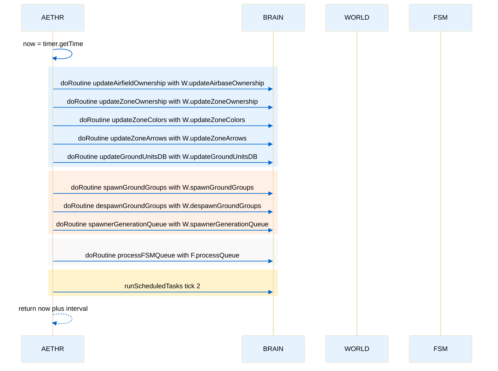

# AETHR background processes loop

Primary anchors
- [AETHR:BackgroundProcesses()](../../dev/AETHR.lua:267)
- [now capture](../../dev/AETHR.lua:269)
- [updateAirbaseOwnership routine](../../dev/AETHR.lua:275)
- [updateZoneOwnership routine](../../dev/AETHR.lua:281)
- [updateZoneColors routine](../../dev/AETHR.lua:287)
- [updateZoneArrows routine](../../dev/AETHR.lua:293)
- [updateGroundUnitsDB routine](../../dev/AETHR.lua:299)
- [spawnGroundGroups routine](../../dev/AETHR.lua:305)
- [despawnGroundGroups routine](../../dev/AETHR.lua:311)
- [spawnerGenerationQueue routine](../../dev/AETHR.lua:317)
- [FSM processQueue routine](../../dev/AETHR.lua:323)
- [runScheduledTasks tick](../../dev/AETHR.lua:327)
- [next invocation return](../../dev/AETHR.lua:328)

Overview
[AETHR:BackgroundProcesses()](../../dev/AETHR.lua:267) is the timer scheduled loop that advances world state, spawner pipelines, and FSM transitions on a steady cadence. It uses BRAIN.doRoutine to rate limit individual jobs and returns the absolute mission time for the next invocation.

Loop flow

Coroutine scheduling timeline

Cadence and re-scheduling
- The function must return the next absolute time, calculated as [now plus interval](../../dev/AETHR.lua:328)
- The interval is read from [self.BRAIN.DATA.BackgroundLoopInterval](../../dev/AETHR.lua:328) with a fallback to 0.5 when missing

Notes
- Each doRoutine call wraps a unit of work with BRAIN controls for pacing and error isolation
- FSM processing is invoked after world and spawner jobs to progress pending transitions
- The tick parameter for [runScheduledTasks](../../dev/AETHR.lua:327) is 2, establishing the per loop task budget

Source anchors
- [BackgroundProcesses entry](../../dev/AETHR.lua:267)
- [doRoutine airbase](../../dev/AETHR.lua:275)
- [doRoutine zone](../../dev/AETHR.lua:281)
- [doRoutine colors](../../dev/AETHR.lua:287)
- [doRoutine arrows](../../dev/AETHR.lua:293)
- [doRoutine ground db](../../dev/AETHR.lua:299)
- [doRoutine spawn](../../dev/AETHR.lua:305)
- [doRoutine despawn](../../dev/AETHR.lua:311)
- [doRoutine spawner gen](../../dev/AETHR.lua:317)
- [doRoutine fsm queue](../../dev/AETHR.lua:323)
- [runScheduledTasks](../../dev/AETHR.lua:327)
- [return next time](../../dev/AETHR.lua:328)

