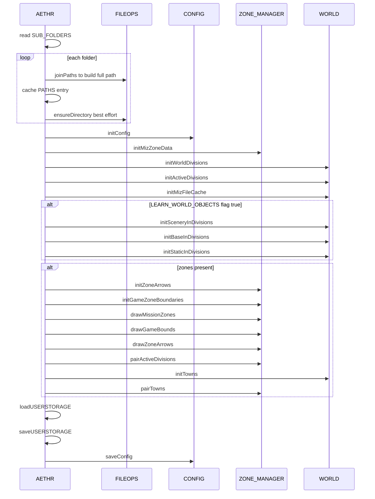

# AETHR initialization orchestration

## Primary anchors
- [AETHR:Init()](https://github.com/Gh0st352/AETHR/blob/main/dev/AETHR.lua#L199)
- [Iterate SUB_FOLDERS and ensureDirectory](https://github.com/Gh0st352/AETHR/blob/main/dev/AETHR.lua#L208)
- [PATHS cache assignment](https://github.com/Gh0st352/AETHR/blob/main/dev/AETHR.lua#L214)
- [CONFIG initConfig](https://github.com/Gh0st352/AETHR/blob/main/dev/AETHR.lua#L219)
- [ZONE_MANAGER initMizZoneData](https://github.com/Gh0st352/AETHR/blob/main/dev/AETHR.lua#L220)
- [WORLD initWorldDivisions](https://github.com/Gh0st352/AETHR/blob/main/dev/AETHR.lua#L221)
- [WORLD initActiveDivisions](https://github.com/Gh0st352/AETHR/blob/main/dev/AETHR.lua#L222)
- [WORLD initMizFileCache](https://github.com/Gh0st352/AETHR/blob/main/dev/AETHR.lua#L223)
- [LEARN_WORLD_OBJECTS conditional](https://github.com/Gh0st352/AETHR/blob/main/dev/AETHR.lua#L225)
- [Zones present conditional and drawing](https://github.com/Gh0st352/AETHR/blob/main/dev/AETHR.lua#L230)
- [loadUSERSTORAGE](https://github.com/Gh0st352/AETHR/blob/main/dev/AETHR.lua#L241)
- [saveUSERSTORAGE](https://github.com/Gh0st352/AETHR/blob/main/dev/AETHR.lua#L242)
- [CONFIG saveConfig](https://github.com/Gh0st352/AETHR/blob/main/dev/AETHR.lua#L243)

## Overview
The initializer [AETHR:Init()](https://github.com/Gh0st352/AETHR/blob/main/dev/AETHR.lua#L199) prepares storage directories, caches resolved paths, initializes configuration and world data, optionally performs world object learning, performs zone drawing and pairing when zones are present, and persists both user storage and config.

# Flowchart

```mermaid
%% shared theme: docs/_mermaid/theme.json %%
flowchart TB
  subgraph INIT [Initialization]
    subgraph STORAGE [Storage prep]
      S[Defensive checks]
      SF[Iterate sub folders]
      ED[Ensure directories]
      PC[Cache PATHS into CONFIG]
    end

    subgraph INIT_MODS [Initialize modules]
      C[CONFIG initConfig]
      Z[ZONE_MANAGER initMizZoneData]
      W1[WORLD initWorldDivisions]
      W2[WORLD initActiveDivisions]
      W3[WORLD initMizFileCache]
    end

    subgraph LEARNING [Optional object learning]
      LWO[Optional learn world objects]
    end

    subgraph ZONES [Zones present flows]
      ZP[If zones present do zone flows]
    end

    subgraph PERSIST [Persistence]
      US[load and save USERSTORAGE]
      CS[saveConfig]
    end

    I[Init] --> S --> SF --> ED --> PC --> C --> Z --> W1 --> W2 --> W3 --> LWO --> ZP --> US --> CS
  end

  class I,CS class_result;
  class S,SF,ED,PC,C,Z,W1,W2,W3,LWO,ZP,US class_step;
```

# Sequence timeline

# Key branches
- Object learning controlled by [self.CONFIG.MAIN.FLAGS.LEARN_WORLD_OBJECTS](https://github.com/Gh0st352/AETHR/blob/main/dev/AETHR.lua#L225) to avoid heavy scans unless requested.
- Zone drawing and pairing guarded by [sumTable of MIZ_ZONES](https://github.com/Gh0st352/AETHR/blob/main/dev/AETHR.lua#L230) to skip work when no zones.

# Source anchors
- [AETHR:Init()](https://github.com/Gh0st352/AETHR/blob/main/dev/AETHR.lua#L199)
- [subFolders iteration](https://github.com/Gh0st352/AETHR/blob/main/dev/AETHR.lua#L208)
- [PATHS cache write](https://github.com/Gh0st352/AETHR/blob/main/dev/AETHR.lua#L214)
- [initConfig](https://github.com/Gh0st352/AETHR/blob/main/dev/AETHR.lua#L219)
- [initMizZoneData](https://github.com/Gh0st352/AETHR/blob/main/dev/AETHR.lua#L220)
- [initWorldDivisions](https://github.com/Gh0st352/AETHR/blob/main/dev/AETHR.lua#L221)
- [initActiveDivisions](https://github.com/Gh0st352/AETHR/blob/main/dev/AETHR.lua#L222)
- [initMizFileCache](https://github.com/Gh0st352/AETHR/blob/main/dev/AETHR.lua#L223)
- [LEARN_WORLD_OBJECTS block](https://github.com/Gh0st352/AETHR/blob/main/dev/AETHR.lua#L225)
- [zones present block](https://github.com/Gh0st352/AETHR/blob/main/dev/AETHR.lua#L230)
- [loadUSERSTORAGE](https://github.com/Gh0st352/AETHR/blob/main/dev/AETHR.lua#L241)
- [saveUSERSTORAGE](https://github.com/Gh0st352/AETHR/blob/main/dev/AETHR.lua#L242)
- [saveConfig](https://github.com/Gh0st352/AETHR/blob/main/dev/AETHR.lua#L243)