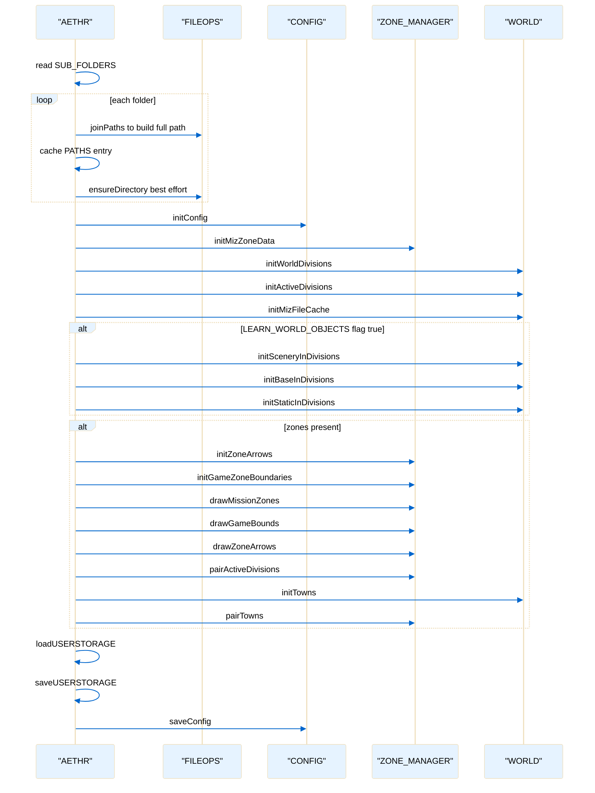

# AETHR initialization orchestration

Primary anchors
- [AETHR:Init()](../../dev/AETHR.lua:199)
- [Iterate SUB_FOLDERS and ensureDirectory](../../dev/AETHR.lua:208)
- [PATHS cache assignment](../../dev/AETHR.lua:214)
- [CONFIG initConfig](../../dev/AETHR.lua:219)
- [ZONE_MANAGER initMizZoneData](../../dev/AETHR.lua:220)
- [WORLD initWorldDivisions](../../dev/AETHR.lua:221)
- [WORLD initActiveDivisions](../../dev/AETHR.lua:222)
- [WORLD initMizFileCache](../../dev/AETHR.lua:223)
- [LEARN_WORLD_OBJECTS conditional](../../dev/AETHR.lua:225)
- [Zones present conditional and drawing](../../dev/AETHR.lua:230)
- [loadUSERSTORAGE](../../dev/AETHR.lua:241)
- [saveUSERSTORAGE](../../dev/AETHR.lua:242)
- [CONFIG saveConfig](../../dev/AETHR.lua:243)

Overview
The initializer [AETHR:Init()](../../dev/AETHR.lua:199) prepares storage directories, caches resolved paths, initializes configuration and world data, optionally performs world object learning, performs zone drawing and pairing when zones are present, and persists both user storage and config.

Flowchart

```mermaid
%%{init: {"theme":"base","themeVariables":{"primaryColor":"#e6f3ff","primaryBorderColor":"#0066cc","lineColor":"#495057","textColor":"#000000ff","fontSize":"14px"}}}%%
flowchart
  %% Main container
  subgraph INIT ["Initialization"]
    %% Logical groupings
    subgraph STORAGE ["Storage prep"]
      S["Defensive checks"]
      SF["Iterate sub folders"]
      ED["Ensure directories"]
      PC["Cache PATHS into CONFIG"]
    end

    subgraph INIT_MODS ["Initialize modules"]
      C["CONFIG initConfig"]
      Z["ZONE_MANAGER initMizZoneData"]
      W1["WORLD initWorldDivisions"]
      W2["WORLD initActiveDivisions"]
      W3["WORLD initMizFileCache"]
    end

    subgraph LEARNING ["Optional object learning"]
      LWO["Optional learn world objects"]
    end

    subgraph ZONES ["Zones present flows"]
      ZP["If zones present do zone flows"]
    end

    subgraph PERSIST ["Persistence"]
      US["load and save USERSTORAGE"]
      CS["saveConfig"]
    end

    %% Flow
    I["Init"] --> S
    S --> SF
    SF --> ED
    ED --> PC
    PC --> C
    C --> Z
    Z --> W1
    W1 --> W2
    W2 --> W3
    W3 --> LWO
    LWO --> ZP
    ZP --> US
    US --> CS
  end

  %% Styles
  classDef core fill:#e6f3ff,stroke:#0066cc,stroke-width:2px,color:#000
  classDef process fill:#cce5ff,stroke:#0066cc,color:#000

  %% Apply classes
  class I,CS core
  class S,SF,ED,PC,C,Z,W1,W2,W3,LWO,ZP,US process

  %% Subgraph styles
  style INIT fill:#e6f3ff,stroke:#0066cc,stroke-width:2px
  style STORAGE fill:#f9f9f9,stroke:#ccc,stroke-width:2px
  style INIT_MODS fill:#f9f9f9,stroke:#ccc,stroke-width:2px
  style LEARNING fill:#e6ffe6,stroke:#009900,stroke-width:2px,stroke-dasharray: 5 5
  style ZONES fill:#fff0e6,stroke:#ff9900,stroke-width:2px
  style PERSIST fill:#f8f9fa,stroke:#495057,stroke-width:2px
```

Sequence timeline

Key branches
- Object learning controlled by [self.CONFIG.MAIN.FLAGS.LEARN_WORLD_OBJECTS](../../dev/AETHR.lua:225) to avoid heavy scans unless requested.
- Zone drawing and pairing guarded by [sumTable of MIZ_ZONES](../../dev/AETHR.lua:230) to skip work when no zones.

Source anchors
- [AETHR:Init()](../../dev/AETHR.lua:199)
- [subFolders iteration](../../dev/AETHR.lua:208)
- [PATHS cache write](../../dev/AETHR.lua:214)
- [initConfig](../../dev/AETHR.lua:219)
- [initMizZoneData](../../dev/AETHR.lua:220)
- [initWorldDivisions](../../dev/AETHR.lua:221)
- [initActiveDivisions](../../dev/AETHR.lua:222)
- [initMizFileCache](../../dev/AETHR.lua:223)
- [LEARN_WORLD_OBJECTS block](../../dev/AETHR.lua:225)
- [zones present block](../../dev/AETHR.lua:230)
- [loadUSERSTORAGE](../../dev/AETHR.lua:241)
- [saveUSERSTORAGE](../../dev/AETHR.lua:242)
- [saveConfig](../../dev/AETHR.lua:243)