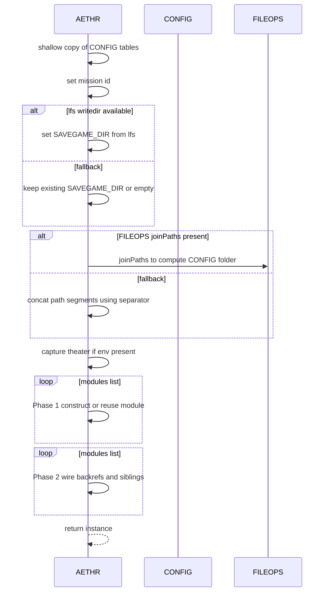

# AETHR instance creation and configuration

## Primary anchors
- [AETHR:New()](https://github.com/Gh0st352/AETHR/blob/main/dev/AETHR.lua#L65)
- [local function shallow_copy](https://github.com/Gh0st352/AETHR/blob/main/dev/AETHR.lua#L73)
- [local id assignment](https://github.com/Gh0st352/AETHR/blob/main/dev/AETHR.lua#L80)
- [SAVEGAME_DIR resolve](https://github.com/Gh0st352/AETHR/blob/main/dev/AETHR.lua#L111)
- [CONFIG_FOLDER path compute](https://github.com/Gh0st352/AETHR/blob/main/dev/AETHR.lua#L121)
- [Theater capture](https://github.com/Gh0st352/AETHR/blob/main/dev/AETHR.lua#L140)
- [Build modulesList](https://github.com/Gh0st352/AETHR/blob/main/dev/AETHR.lua#L148)
- [Phase 1 module construction](https://github.com/Gh0st352/AETHR/blob/main/dev/AETHR.lua#L155)
- [Phase 2 backrefs and siblings](https://github.com/Gh0st352/AETHR/blob/main/dev/AETHR.lua#L172)

## Overview
The constructor [AETHR:New()](https://github.com/Gh0st352/AETHR/blob/main/dev/AETHR.lua#L65) creates an instance table with metatable inheritance, clones mutable config subtables, applies mission id, resolves a writable directory, computes config paths, optionally captures current theater, and wires modules for the instance.

# Instance creation flow

```mermaid
%% shared theme: docs/_mermaid/theme.json %%
flowchart LR
  subgraph SETUP [Instance setup]
    N[New called]
    I[Create instance table]
  end

  subgraph CONFIG_PATHS [Config and paths]
    SC[Clone config subtables]
    ID[Select mission id]
    WD[Resolve savegame dir]
    JP[Compute config folder path]
    TH[Capture theater if available]
  end

  subgraph MODULES [Modules]
    ML[Build modules list]

    subgraph P1GRP ["Phase 1 (construct)"]
      P1[Phase 1 construct submodules]
    end

    subgraph P2GRP ["Phase 2 (wire)"]
      P2[Phase 2 wire backrefs and siblings]
    end

    RT[Return instance]
  end

  %% Flow (linear for readability)
  N --> I --> SC --> ID --> WD --> JP --> TH --> ML --> P1 --> P2 --> RT

  %% House class buckets
  class N,RT class_result;
  class I,SC,ID,WD,JP,TH,ML,P1,P2 class_step;
```

# Sequence details

# Notes and edge cases
- If [self.CONFIG](https://github.com/Gh0st352/AETHR/blob/main/dev/AETHR.lua#L86) is not a table, a minimal structure is created to avoid nil indexing.
- When [FILEOPS joinPaths](https://github.com/Gh0st352/AETHR/blob/main/dev/AETHR.lua#L121) is not available, a separator from [package.config](https://github.com/Gh0st352/AETHR/blob/main/dev/AETHR.lua#L132) is used for a safe fallback.
- Module wiring is two-pass to allow submodules to reference siblings without order constraints; see [Phase 1](https://github.com/Gh0st352/AETHR/blob/main/dev/AETHR.lua#L155) and [Phase 2](https://github.com/Gh0st352/AETHR/blob/main/dev/AETHR.lua#L172).

## Source anchors
- [AETHR:New()](https://github.com/Gh0st352/AETHR/blob/main/dev/AETHR.lua#L65)
- [shallow_copy](https://github.com/Gh0st352/AETHR/blob/main/dev/AETHR.lua#L73)
- [mission id select](https://github.com/Gh0st352/AETHR/blob/main/dev/AETHR.lua#L80)
- [SAVEGAME_DIR resolve](https://github.com/Gh0st352/AETHR/blob/main/dev/AETHR.lua#L111)
- [CONFIG folder path compute](https://github.com/Gh0st352/AETHR/blob/main/dev/AETHR.lua#L121)
- [theater capture](https://github.com/Gh0st352/AETHR/blob/main/dev/AETHR.lua#L140)
- [modules list build](https://github.com/Gh0st352/AETHR/blob/main/dev/AETHR.lua#L148)
- [Phase 1 loop](https://github.com/Gh0st352/AETHR/blob/main/dev/AETHR.lua#L155)
- [Phase 2 loop](https://github.com/Gh0st352/AETHR/blob/main/dev/AETHR.lua#L172)