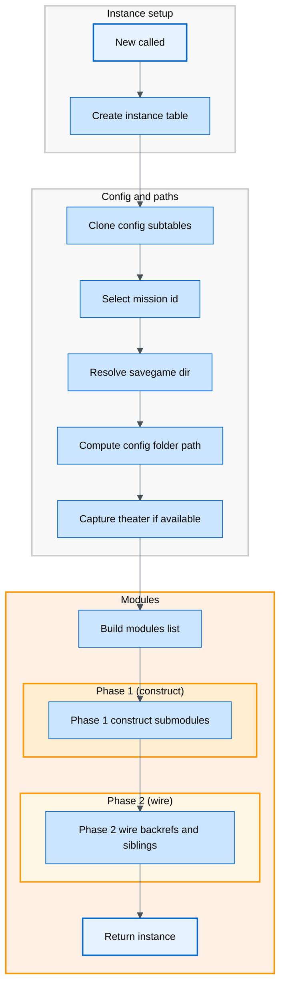
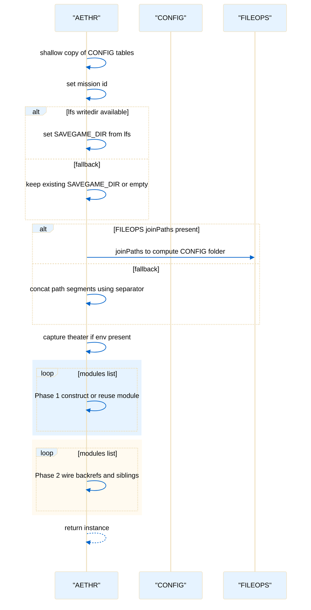

# AETHR instance creation and configuration

Primary anchors
- [AETHR:New()](../../dev/AETHR.lua:65)
- [local function shallow_copy](../../dev/AETHR.lua:73)
- [local id assignment](../../dev/AETHR.lua:80)
- [SAVEGAME_DIR resolve](../../dev/AETHR.lua:111)
- [CONFIG_FOLDER path compute](../../dev/AETHR.lua:121)
- [Theater capture](../../dev/AETHR.lua:140)
- [Build modulesList](../../dev/AETHR.lua:148)
- [Phase 1 module construction](../../dev/AETHR.lua:155)
- [Phase 2 backrefs and siblings](../../dev/AETHR.lua:172)

Overview
The constructor [AETHR:New()](../../dev/AETHR.lua:65) creates an instance table with metatable inheritance, clones mutable config subtables, applies mission id, resolves a writable directory, computes config paths, optionally captures current theater, and wires modules for the instance.

Instance creation flow

Sequence details

Notes and edge cases
- If [self.CONFIG](../../dev/AETHR.lua:86) is not a table, a minimal structure is created to avoid nil indexing.
- When [FILEOPS joinPaths](../../dev/AETHR.lua:121) is not available, a separator from [package.config](../../dev/AETHR.lua:132) is used for a safe fallback.
- Module wiring is two-pass to allow submodules to reference siblings without order constraints; see [Phase 1](../../dev/AETHR.lua:155) and [Phase 2](../../dev/AETHR.lua:172).

Source anchors
- [AETHR:New()](../../dev/AETHR.lua:65)
- [shallow_copy](../../dev/AETHR.lua:73)
- [mission id select](../../dev/AETHR.lua:80)
- [SAVEGAME_DIR resolve](../../dev/AETHR.lua:111)
- [CONFIG folder path compute](../../dev/AETHR.lua:121)
- [theater capture](../../dev/AETHR.lua:140)
- [modules list build](../../dev/AETHR.lua:148)
- [Phase 1 loop](../../dev/AETHR.lua:155)
- [Phase 2 loop](../../dev/AETHR.lua:172)