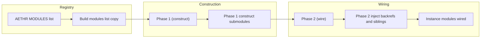
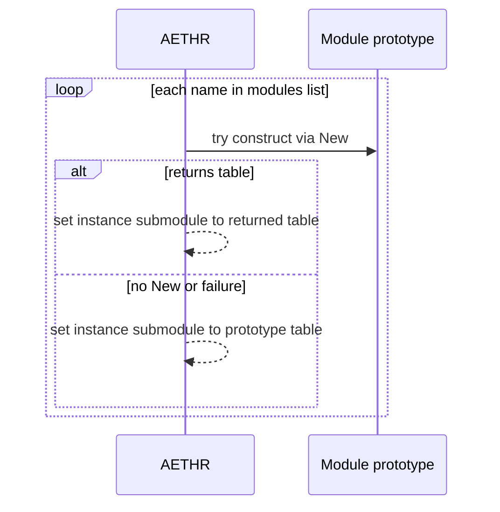
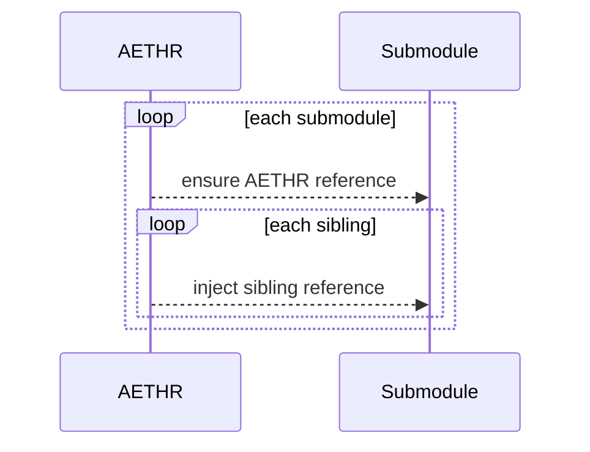

# AETHR modules wiring and auto registration

## Primary anchors
- [AETHR.MODULES](../../dev/AETHR.lua:40)
- [Build modulesList](../../dev/AETHR.lua:148)
- [Phase 1 construct submodules](../../dev/AETHR.lua:155)
- [pcall mod New and fallback](../../dev/AETHR.lua:160)
- [Phase 2 wire backrefs](../../dev/AETHR.lua:172)
- [Ensure sub AETHR ref](../../dev/AETHR.lua:178)
- [Inject sibling refs](../../dev/AETHR.lua:181)

# Overview
AETHR uses a simple registry [AETHR.MODULES](../../dev/AETHR.lua:40) to determine which prototype tables to attach to each instance. Modules are constructed in two phases to avoid ordering constraints and to ensure sibling access within submodules.

# Flow of module wiring

# Phase 1 construction
- Iterate list from [modulesList](../../dev/AETHR.lua:148)
- If prototype field is a table and instance slot is empty, try `:New(instance)` via protected call
- On success with table result, assign returned submodule
- On failure or non table return, assign the prototype table directly

# Phase 2 backrefs and sibling injection
- Ensure each submodule has `AETHR` pointer to parent
- For each submodule, shallow inject references to all other submodules for direct calls

# Edge cases and notes
- If a module table does not expose `New`, the prototype table is used as the instance submodule
- If `New` throws or returns non table, fallback assigns the prototype table to keep system operable
- The two pass strategy avoids initialization order coupling between sibling modules

## Related pages
- [AETHR instance creation](./instance_creation.md)
- [AETHR overview](./README.md)

## Source anchors
- [modules list build](../../dev/AETHR.lua:148)
- [Phase 1 loop](../../dev/AETHR.lua:155)
- [pcall to New](../../dev/AETHR.lua:160)
- [Phase 2 loop](../../dev/AETHR.lua:172)
- [assign AETHR ref](../../dev/AETHR.lua:178)
- [inject sibling refs](../../dev/AETHR.lua:181)