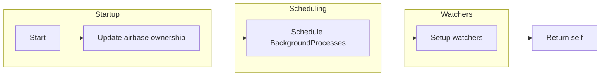
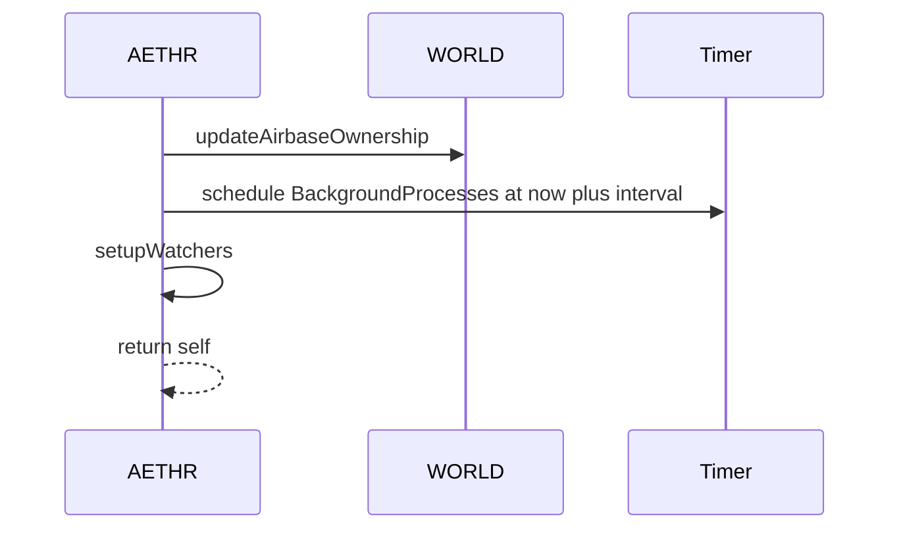
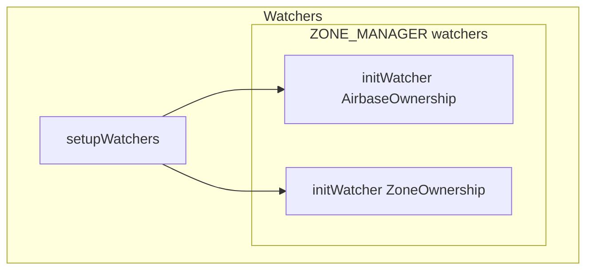

# AETHR startup and watchers

## Primary anchors
- [AETHR:Start()](https://github.com/Gh0st352/AETHR/blob/main/dev/AETHR.lua#L252)
- [WORLD updateAirbaseOwnership call site](https://github.com/Gh0st352/AETHR/blob/main/dev/AETHR.lua#L254)
- [timer.scheduleFunction for BackgroundProcesses](https://github.com/Gh0st352/AETHR/blob/main/dev/AETHR.lua#L255)
- [setupWatchers invocation](https://github.com/Gh0st352/AETHR/blob/main/dev/AETHR.lua#L257)
- [AETHR:setupWatchers()](https://github.com/Gh0st352/AETHR/blob/main/dev/AETHR.lua#L334)
- [initWatcher_AirbaseOwnership](https://github.com/Gh0st352/AETHR/blob/main/dev/AETHR.lua#L335)
- [initWatcher_ZoneOwnership](https://github.com/Gh0st352/AETHR/blob/main/dev/AETHR.lua#L336)

# Overview

[AETHR:Start()](https://github.com/Gh0st352/AETHR/blob/main/dev/AETHR.lua#L252) performs an immediate ownership update, schedules the recurring background loop, and registers event watchers via [AETHR:setupWatchers()](https://github.com/Gh0st352/AETHR/blob/main/dev/AETHR.lua#L334).

# Flowchart

# Sequence timeline

# Watchers registered

# Notes
- The immediate ownership update at [call site](https://github.com/Gh0st352/AETHR/blob/main/dev/AETHR.lua#L254) ensures initial world state is consistent before the first background loop.
- Scheduling uses [timer.scheduleFunction](https://github.com/Gh0st352/AETHR/blob/main/dev/AETHR.lua#L255) to run [AETHR:BackgroundProcesses()](https://github.com/Gh0st352/AETHR/blob/main/dev/AETHR.lua#L267) on cadence managed by [AETHR.BRAIN.DATA.BackgroundLoopInterval](https://github.com/Gh0st352/AETHR/blob/main/dev/AETHR.lua#L255).
- For watcher details and event lifecycles see [ZONE_MANAGER Watchers](../zone_manager/watchers.md).

# Source anchors
- [AETHR:Start()](https://github.com/Gh0st352/AETHR/blob/main/dev/AETHR.lua#L252)
- [WORLD ownership update call](https://github.com/Gh0st352/AETHR/blob/main/dev/AETHR.lua#L254)
- [scheduleFunction](https://github.com/Gh0st352/AETHR/blob/main/dev/AETHR.lua#L255)
- [setupWatchers call](https://github.com/Gh0st352/AETHR/blob/main/dev/AETHR.lua#L257)
- [AETHR:setupWatchers()](https://github.com/Gh0st352/AETHR/blob/main/dev/AETHR.lua#L334)
- [initWatcher_AirbaseOwnership](https://github.com/Gh0st352/AETHR/blob/main/dev/AETHR.lua#L335)
- [initWatcher_ZoneOwnership](https://github.com/Gh0st352/AETHR/blob/main/dev/AETHR.lua#L336)