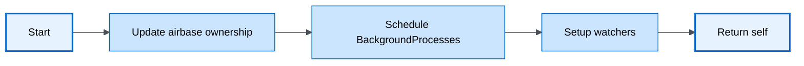
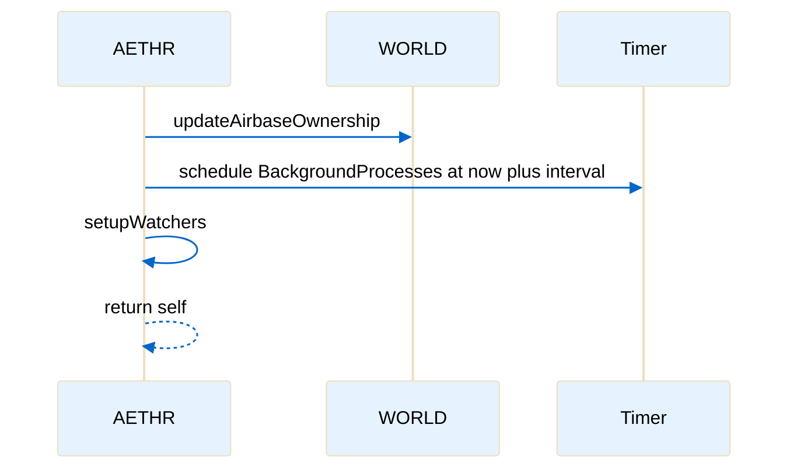
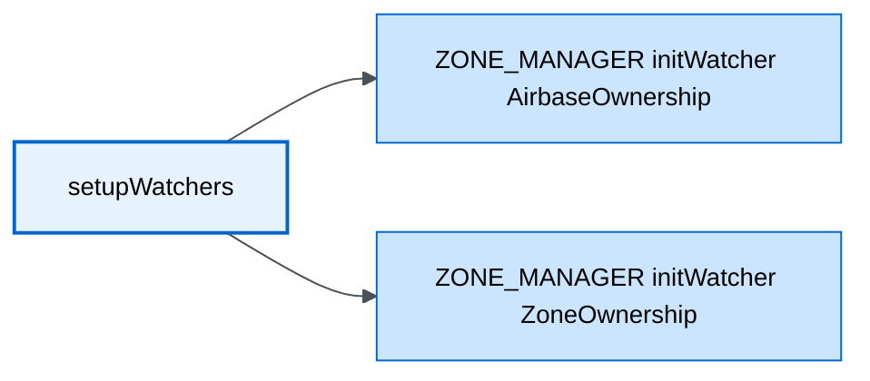

# AETHR startup and watchers

Primary anchors
- [AETHR:Start()](../../dev/AETHR.lua:252)
- [WORLD updateAirbaseOwnership call site](../../dev/AETHR.lua:254)
- [timer.scheduleFunction for BackgroundProcesses](../../dev/AETHR.lua:255)
- [setupWatchers invocation](../../dev/AETHR.lua:257)
- [AETHR:setupWatchers()](../../dev/AETHR.lua:334)
- [initWatcher_AirbaseOwnership](../../dev/AETHR.lua:335)
- [initWatcher_ZoneOwnership](../../dev/AETHR.lua:336)

Overview
[AETHR:Start()](../../dev/AETHR.lua:252) performs an immediate ownership update, schedules the recurring background loop, and registers event watchers via [AETHR:setupWatchers()](../../dev/AETHR.lua:334).

Flowchart

Sequence timeline

Watchers registered

Notes
- The immediate ownership update at [call site](../../dev/AETHR.lua:254) ensures initial world state is consistent before the first background loop.
- Scheduling uses [timer.scheduleFunction](../../dev/AETHR.lua:255) to run [AETHR:BackgroundProcesses()](../../dev/AETHR.lua:267) on cadence managed by [AETHR.BRAIN.DATA.BackgroundLoopInterval](../../dev/AETHR.lua:255).
- For watcher details and event lifecycles see [ZONE_MANAGER Watchers](../zone_manager/watchers.md).

Source anchors
- [AETHR:Start()](../../dev/AETHR.lua:252)
- [WORLD ownership update call](../../dev/AETHR.lua:254)
- [scheduleFunction](../../dev/AETHR.lua:255)
- [setupWatchers call](../../dev/AETHR.lua:257)
- [AETHR:setupWatchers()](../../dev/AETHR.lua:334)
- [initWatcher_AirbaseOwnership](../../dev/AETHR.lua:335)
- [initWatcher_ZoneOwnership](../../dev/AETHR.lua:336)