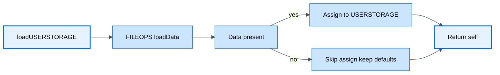
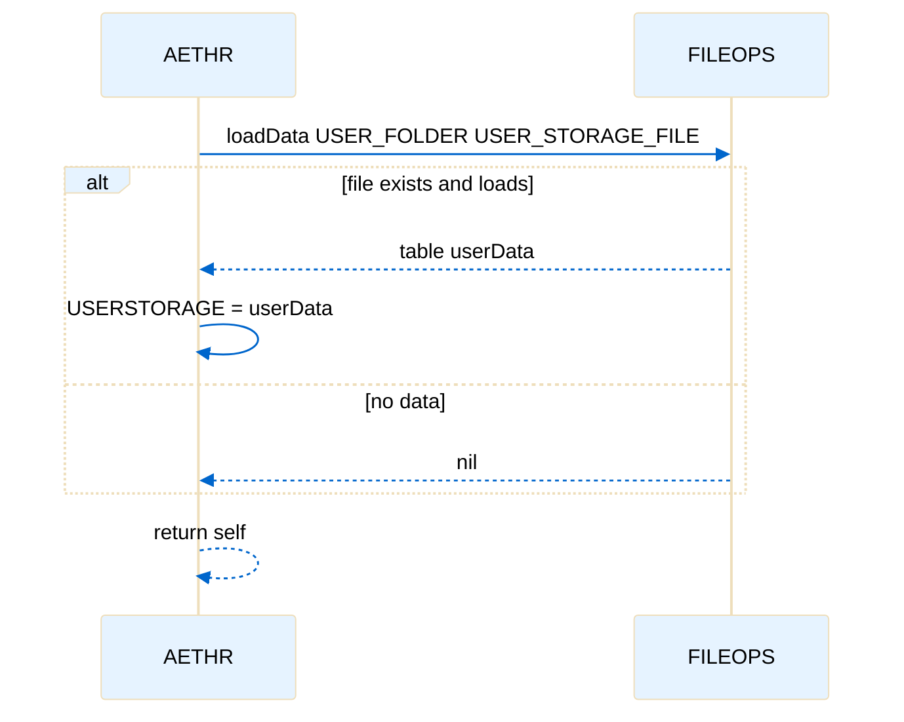
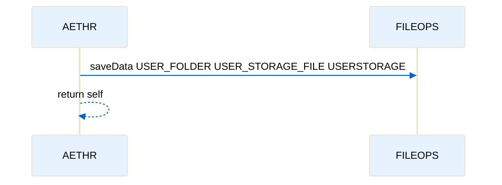

# AETHR user storage lifecycle

Primary anchors
- [AETHR:loadUSERSTORAGE()](../../dev/AETHR.lua:344)
- [AETHR:saveUSERSTORAGE()](../../dev/AETHR.lua:361)
- [FILEOPS loadData call site](../../dev/AETHR.lua:347)
- [FILEOPS saveData call site](../../dev/AETHR.lua:362)
- [USER_FOLDER path reference](../../dev/AETHR.lua:348)
- [USER_STORAGE_FILE name reference](../../dev/AETHR.lua:349)
- [USERSTORAGE assignment](../../dev/AETHR.lua:352)

Overview
User specific data is persisted to and loaded from a configured folder and filename using FILEOPS helpers. On init the framework loads data into memory and immediately saves back to ensure structures exist and paths are created.

Flowchart

Sequence timeline

Save flow

Sequence timeline for save

Paths and filenames
- Folder path from [self.CONFIG.MAIN.STORAGE.PATHS.USER_FOLDER](../../dev/AETHR.lua:348)
- Filename from [self.CONFIG.MAIN.STORAGE.FILENAMES.USER_STORAGE_FILE](../../dev/AETHR.lua:349)
- Data table is [self.USERSTORAGE](../../dev/AETHR.lua:56) assigned on load at [assignment site](../../dev/AETHR.lua:352)

Notes
- Calls are safe to invoke even when files do not exist; load will return nil and save will create files as needed
- Ensure upstream init created user folder PATHS entry during [AETHR:Init() paths caching](./init.md)
- FILEOPS implementation details and error handling are documented in [docs/fileops/README.md](../fileops/README.md)

Source anchors
- [loadUSERSTORAGE entry](../../dev/AETHR.lua:344)
- [FILEOPS loadData](../../dev/AETHR.lua:347)
- [USER_FOLDER path read](../../dev/AETHR.lua:348)
- [USER_STORAGE_FILE name read](../../dev/AETHR.lua:349)
- [assign USERSTORAGE](../../dev/AETHR.lua:352)
- [saveUSERSTORAGE entry](../../dev/AETHR.lua:361)
- [FILEOPS saveData](../../dev/AETHR.lua:362)