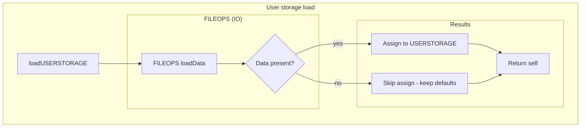
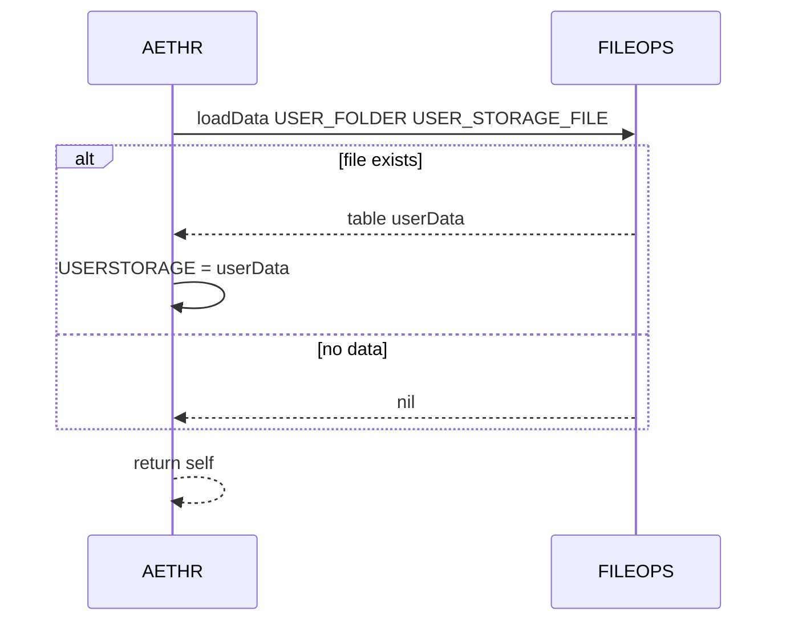
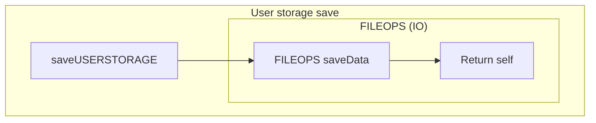
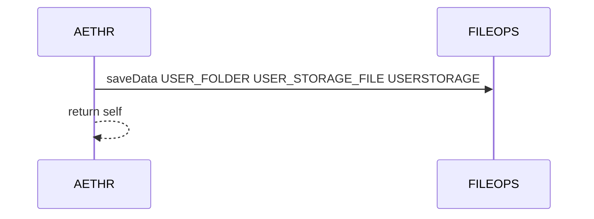

# AETHR user storage lifecycle

## Primary anchors
- [AETHR:loadUSERSTORAGE()](https://github.com/Gh0st352/AETHR/blob/main/dev/AETHR.lua#L344)
- [AETHR:saveUSERSTORAGE()](https://github.com/Gh0st352/AETHR/blob/main/dev/AETHR.lua#L361)
- [FILEOPS loadData call site](https://github.com/Gh0st352/AETHR/blob/main/dev/AETHR.lua#L347)
- [FILEOPS saveData call site](https://github.com/Gh0st352/AETHR/blob/main/dev/AETHR.lua#L362)
- [USER_FOLDER path reference](https://github.com/Gh0st352/AETHR/blob/main/dev/AETHR.lua#L348)
- [USER_STORAGE_FILE name reference](https://github.com/Gh0st352/AETHR/blob/main/dev/AETHR.lua#L349)
- [USERSTORAGE assignment](https://github.com/Gh0st352/AETHR/blob/main/dev/AETHR.lua#L352)

# Overview
User specific data is persisted to and loaded from a configured folder and filename using FILEOPS helpers. On init the framework loads data into memory and immediately saves back to ensure structures exist and paths are created.

# Flowchart

# Sequence timeline

# Save flow

# Sequence timeline for save

# Paths and filenames
- Folder path from [self.CONFIG.MAIN.STORAGE.PATHS.USER_FOLDER](https://github.com/Gh0st352/AETHR/blob/main/dev/AETHR.lua#L348)
- Filename from [self.CONFIG.MAIN.STORAGE.FILENAMES.USER_STORAGE_FILE](https://github.com/Gh0st352/AETHR/blob/main/dev/AETHR.lua#L349)
- Data table is [self.USERSTORAGE](https://github.com/Gh0st352/AETHR/blob/main/dev/AETHR.lua#L56) assigned on load at [assignment site](https://github.com/Gh0st352/AETHR/blob/main/dev/AETHR.lua#L352)

# Notes
- Calls are safe to invoke even when files do not exist; load will return nil and save will create files as needed
- Ensure upstream init created user folder PATHS entry during [AETHR:Init() paths caching](./init.md)
- FILEOPS implementation details and error handling are documented in [docs/fileops/README.md](../fileops/README.md)

# Source anchors
- [loadUSERSTORAGE entry](https://github.com/Gh0st352/AETHR/blob/main/dev/AETHR.lua#L344)
- [FILEOPS loadData](https://github.com/Gh0st352/AETHR/blob/main/dev/AETHR.lua#L347)
- [USER_FOLDER path read](https://github.com/Gh0st352/AETHR/blob/main/dev/AETHR.lua#L348)
- [USER_STORAGE_FILE name read](https://github.com/Gh0st352/AETHR/blob/main/dev/AETHR.lua#L349)
- [assign USERSTORAGE](https://github.com/Gh0st352/AETHR/blob/main/dev/AETHR.lua#L352)
- [saveUSERSTORAGE entry](https://github.com/Gh0st352/AETHR/blob/main/dev/AETHR.lua#L361)
- [FILEOPS saveData](https://github.com/Gh0st352/AETHR/blob/main/dev/AETHR.lua#L362)