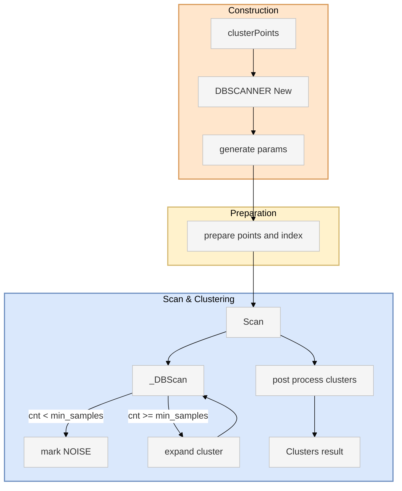
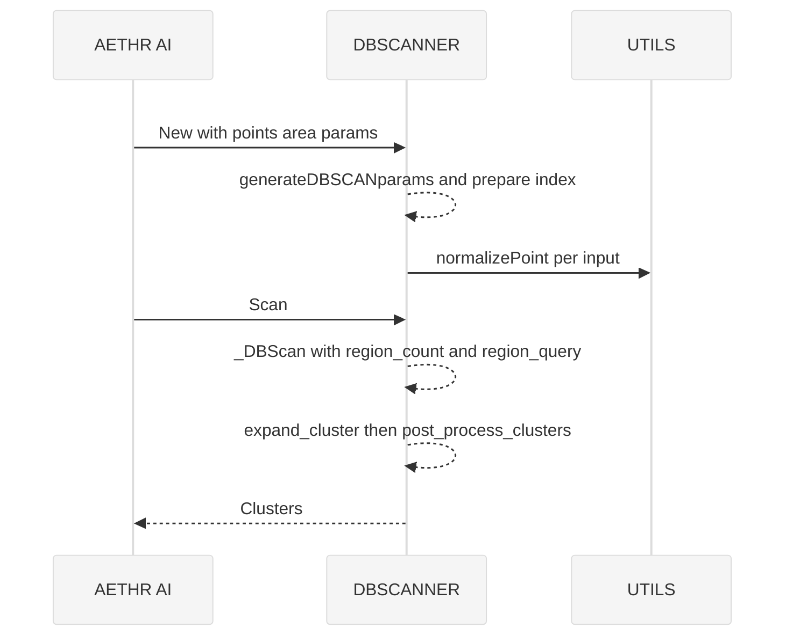

# AETHR AI diagrams index

Primary module anchors
- [AETHR.AI:clusterPoints()](../../dev/_AI.lua:530)
- [AETHR.AI.DBSCANNER:New()](../../dev/_AI.lua:123)
- [AETHR.AI.DBSCANNER:generateDBSCANparams()](../../dev/_AI.lua:186)
- [AETHR.AI.DBSCANNER:_prepare_points_and_index()](../../dev/_AI.lua:224)
- [AETHR.AI.DBSCANNER:Scan()](../../dev/_AI.lua:319)
- [AETHR.AI.DBSCANNER:_DBScan()](../../dev/_AI.lua:333)
- [AETHR.AI.DBSCANNER:region_count()](../../dev/_AI.lua:275)
- [AETHR.AI.DBSCANNER:region_query()](../../dev/_AI.lua:370)
- [AETHR.AI.DBSCANNER:expand_cluster()](../../dev/_AI.lua:424)
- [AETHR.AI.DBSCANNER:post_process_clusters()](../../dev/_AI.lua:466)

Documents
- DBSCAN logic: [docs/ai/dbscan.md](docs/ai/dbscan.md)
- Data structures: [docs/ai/data_structures.md](docs/ai/data_structures.md)

End to end relationship

Runtime sequence overview

Key anchors
- Construction and parameterization
  - [AETHR.AI.DBSCANNER:New()](../../dev/_AI.lua:123)
  - [AETHR.AI.DBSCANNER:generateDBSCANparams()](../../dev/_AI.lua:186)
  - [AETHR.AI.DBSCANNER:_prepare_points_and_index()](../../dev/_AI.lua:224)
- Core scanning and outputs
  - [AETHR.AI.DBSCANNER:Scan()](../../dev/_AI.lua:319)
  - [AETHR.AI.DBSCANNER:_DBScan()](../../dev/_AI.lua:333)
  - [AETHR.AI.DBSCANNER:expand_cluster()](../../dev/_AI.lua:424)
  - [AETHR.AI.DBSCANNER:post_process_clusters()](../../dev/_AI.lua:466)
- Neighbor queries
  - [AETHR.AI.DBSCANNER:region_count()](../../dev/_AI.lua:275)
  - [AETHR.AI.DBSCANNER:region_query()](../../dev/_AI.lua:370)
- Facade entry
  - [AETHR.AI:clusterPoints()](../../dev/_AI.lua:530)

Cross-module indexes
- SPAWNER: [docs/spawner/README.md](docs/spawner/README.md)
- WORLD: [docs/world/README.md](docs/world/README.md)
- ZONE_MANAGER: [docs/zone_manager/README.md](docs/zone_manager/README.md)
- BRAIN: [docs/brain/README.md](docs/brain/README.md)

Notes
- Mermaid node labels avoid double quotes and parentheses to reduce syntax issues.
- Diagrams follow the project Mermaid Rules: subgraphs for logical areas, classDef styles, and a contrast-friendly background rect for sequence diagrams.
- All diagrams use GitHub Mermaid fenced blocks.
- See detailed diagram implementations: [`docs/ai/dbscan.md`](docs/ai/dbscan.md:1) and [`docs/ai/data_structures.md`](docs/ai/data_structures.md:1)