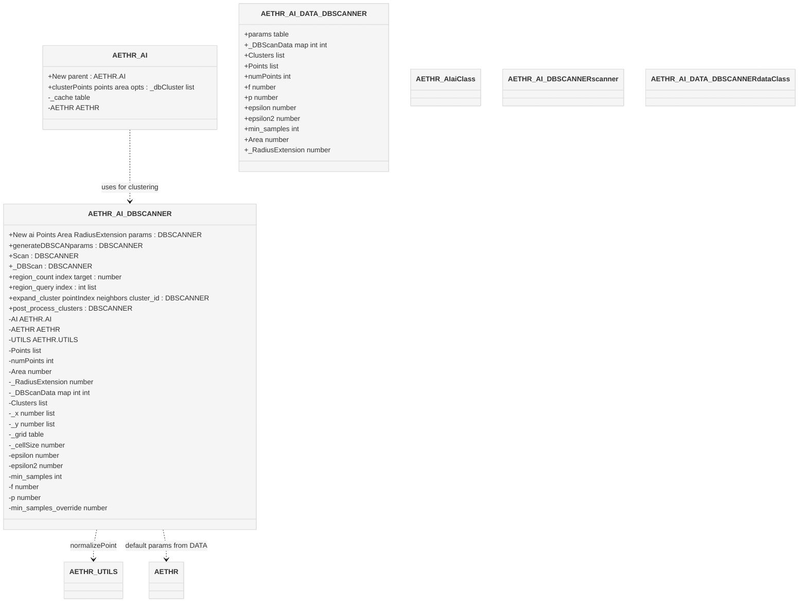

# AETHR AI data structures

Overview of classes and fields backing the DBSCAN logic in [dev/_AI.lua](../../dev/_AI.lua).

Key anchors
- [AETHR.AI](../../dev/_AI.lua:34)
- [AETHR.AI.DBSCANNER](../../dev/_AI.lua:90)
- [AETHR.AI.DATA.DBSCANNER](../../dev/_AI.lua:71)

Class diagram

Field sources
- DBSCANNER constructor and fields: [AETHR.AI.DBSCANNER:New()](../../dev/_AI.lua:123)
- DATA defaults: [AETHR.AI.DATA](../../dev/_AI.lua:70)
- Parameterization: [AETHR.AI.DBSCANNER:generateDBSCANparams()](../../dev/_AI.lua:186)

Method anchors
- Facade: [AETHR.AI:clusterPoints()](../../dev/_AI.lua:530)
- Scan: [AETHR.AI.DBSCANNER:Scan()](../../dev/_AI.lua:319)
- Core: [AETHR.AI.DBSCANNER:_DBScan()](../../dev/_AI.lua:333)
- Neighbors: [region_count](../../dev/_AI.lua:275), [region_query](../../dev/_AI.lua:370)
- Expansion: [expand_cluster](../../dev/_AI.lua:424)
- Post process: [post_process_clusters](../../dev/_AI.lua:466)

Notes
- Types in this diagram are descriptive and align with Lua usage in source.
- Diagrams use GitHub Mermaid fenced blocks.