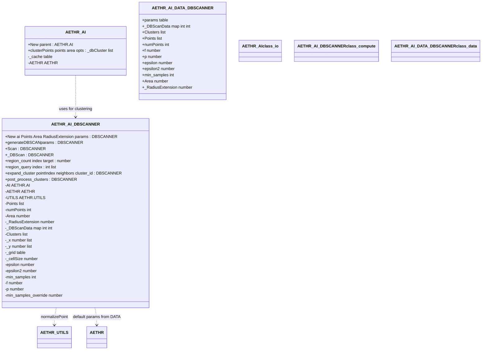

# AETHR AI data structures

Overview of classes and fields backing the DBSCAN logic in [dev/_AI.lua](../../dev/_AI.lua).

## Key anchors
- [AETHR.AI](https://github.com/Gh0st352/AETHR/blob/main/dev/_AI.lua#L34)
- [AETHR.AI.DBSCANNER](https://github.com/Gh0st352/AETHR/blob/main/dev/_AI.lua#L90)
- [AETHR.AI.DATA.DBSCANNER](https://github.com/Gh0st352/AETHR/blob/main/dev/_AI.lua#L71)

# Class diagram

## Field sources
- DBSCANNER constructor and fields: [AETHR.AI.DBSCANNER:New()](https://github.com/Gh0st352/AETHR/blob/main/dev/_AI.lua#L123)
- DATA defaults: [AETHR.AI.DATA](https://github.com/Gh0st352/AETHR/blob/main/dev/_AI.lua#L70)
- Parameterization: [AETHR.AI.DBSCANNER:generateDBSCANparams()](https://github.com/Gh0st352/AETHR/blob/main/dev/_AI.lua#L186)

## Method anchors
- Facade: [AETHR.AI:clusterPoints()](https://github.com/Gh0st352/AETHR/blob/main/dev/_AI.lua#L530)
- Scan: [AETHR.AI.DBSCANNER:Scan()](https://github.com/Gh0st352/AETHR/blob/main/dev/_AI.lua#L319)
- Core: [AETHR.AI.DBSCANNER:_DBScan()](https://github.com/Gh0st352/AETHR/blob/main/dev/_AI.lua#L333)
- Neighbors: [region_count](https://github.com/Gh0st352/AETHR/blob/main/dev/_AI.lua#L275), [region_query](https://github.com/Gh0st352/AETHR/blob/main/dev/_AI.lua#L370)
- Expansion: [expand_cluster](https://github.com/Gh0st352/AETHR/blob/main/dev/_AI.lua#L424)
- Post process: [post_process_clusters](https://github.com/Gh0st352/AETHR/blob/main/dev/_AI.lua#L466)

## Notes
- Types in this diagram are descriptive and align with Lua usage in source.
- Diagrams use GitHub Mermaid fenced blocks.