# AETHR AI DBSCAN logic

Logic coverage for [AETHR.AI:clusterPoints()](https://github.com/Gh0st352/AETHR/blob/main/dev/_AI.lua#L530), [AETHR.AI.DBSCANNER:New()](https://github.com/Gh0st352/AETHR/blob/main/dev/_AI.lua#L123), [AETHR.AI.DBSCANNER:generateDBSCANparams()](https://github.com/Gh0st352/AETHR/blob/main/dev/_AI.lua#L186), [AETHR.AI.DBSCANNER:_prepare_points_and_index()](https://github.com/Gh0st352/AETHR/blob/main/dev/_AI.lua#L224), [AETHR.AI.DBSCANNER:Scan()](https://github.com/Gh0st352/AETHR/blob/main/dev/_AI.lua#L319), [AETHR.AI.DBSCANNER:_DBScan()](https://github.com/Gh0st352/AETHR/blob/main/dev/_AI.lua#L333), [AETHR.AI.DBSCANNER:region_count()](https://github.com/Gh0st352/AETHR/blob/main/dev/_AI.lua#L275), [AETHR.AI.DBSCANNER:region_query()](https://github.com/Gh0st352/AETHR/blob/main/dev/_AI.lua#L370), [AETHR.AI.DBSCANNER:expand_cluster()](https://github.com/Gh0st352/AETHR/blob/main/dev/_AI.lua#L424), [AETHR.AI.DBSCANNER:post_process_clusters()](https://github.com/Gh0st352/AETHR/blob/main/dev/_AI.lua#L466).

## Notes:
- Node labels in Mermaid diagrams avoid double quotes and parentheses.
- Diagrams use GitHub Mermaid fenced blocks and follow project Mermaid Rules (subgraphs, styles, legends).

## Overview

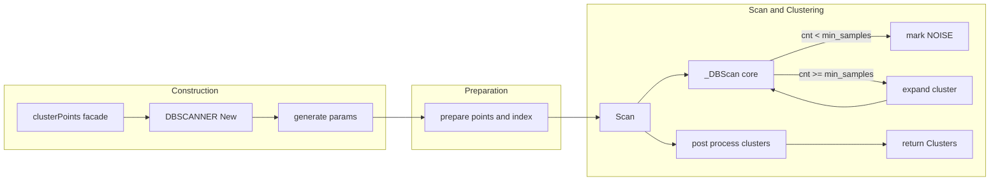

# Facade [AETHR.AI:clusterPoints()](https://github.com/Gh0st352/AETHR/blob/main/dev/_AI.lua#L530)

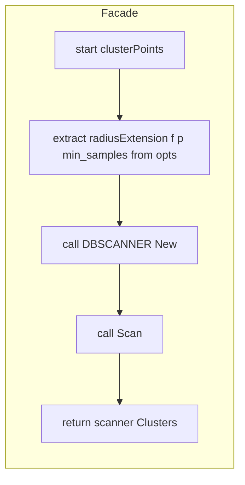

# Constructor [AETHR.AI.DBSCANNER:New()](https://github.com/Gh0st352/AETHR/blob/main/dev/_AI.lua#L123)

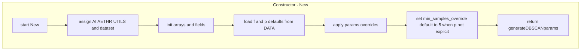

# Parameterization [AETHR.AI.DBSCANNER:generateDBSCANparams()](https://github.com/Gh0st352/AETHR/blob/main/dev/_AI.lua#L186)

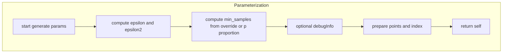

# Pre normalize and index [AETHR.AI.DBSCANNER:_prepare_points_and_index()](https://github.com/Gh0st352/AETHR/blob/main/dev/_AI.lua#L224)

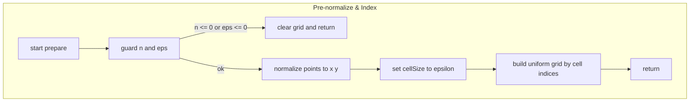

# Scan wrapper [AETHR.AI.DBSCANNER:Scan()](https://github.com/Gh0st352/AETHR/blob/main/dev/_AI.lua#L319)

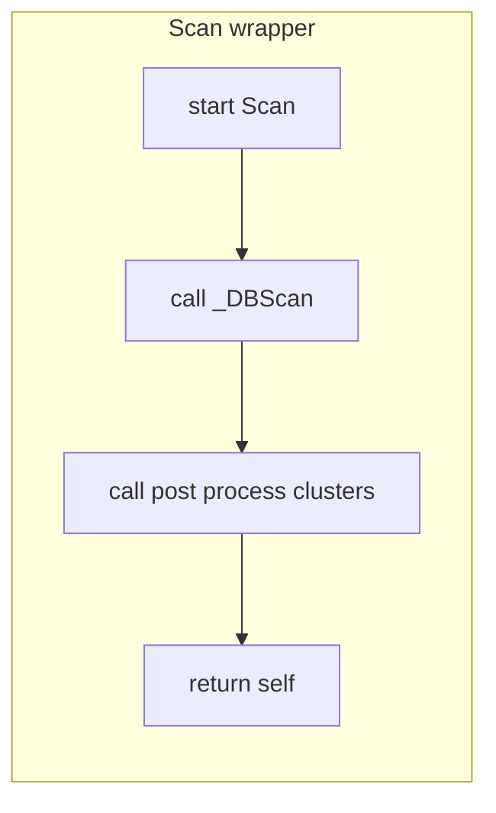

# Core clustering [AETHR.AI.DBSCANNER:_DBScan()](https://github.com/Gh0st352/AETHR/blob/main/dev/_AI.lua#L333)

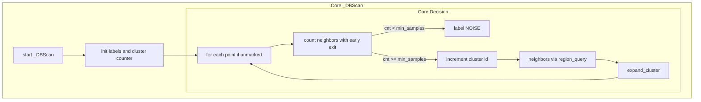

# Neighbor count [AETHR.AI.DBSCANNER:region_count()](https://github.com/Gh0st352/AETHR/blob/main/dev/_AI.lua#L275)

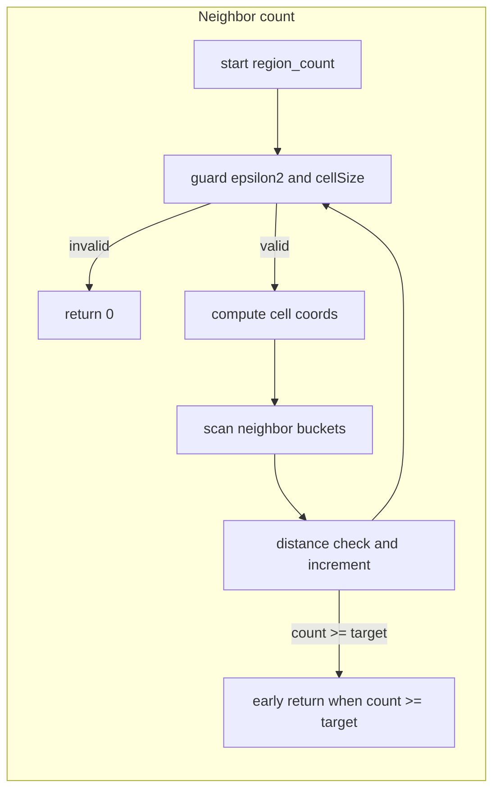

# Neighbor query [AETHR.AI.DBSCANNER:region_query()](https://github.com/Gh0st352/AETHR/blob/main/dev/_AI.lua#L370)

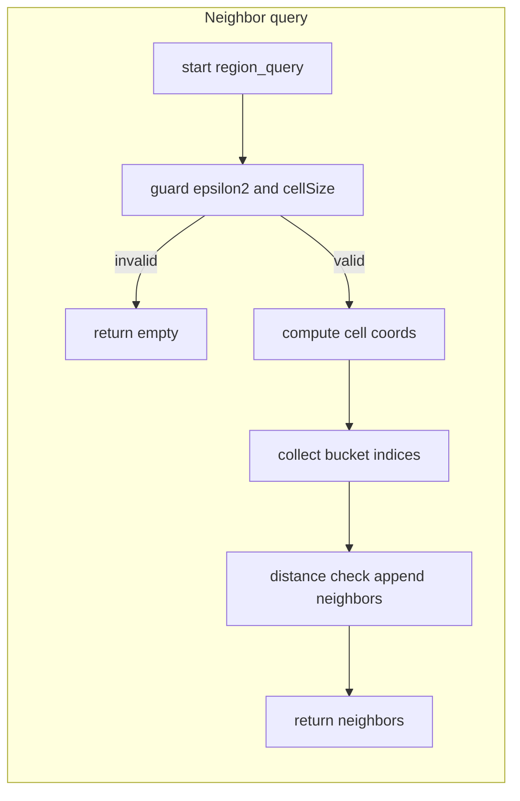

# Cluster expansion [AETHR.AI.DBSCANNER:expand_cluster()](https://github.com/Gh0st352/AETHR/blob/main/dev/_AI.lua#L424)

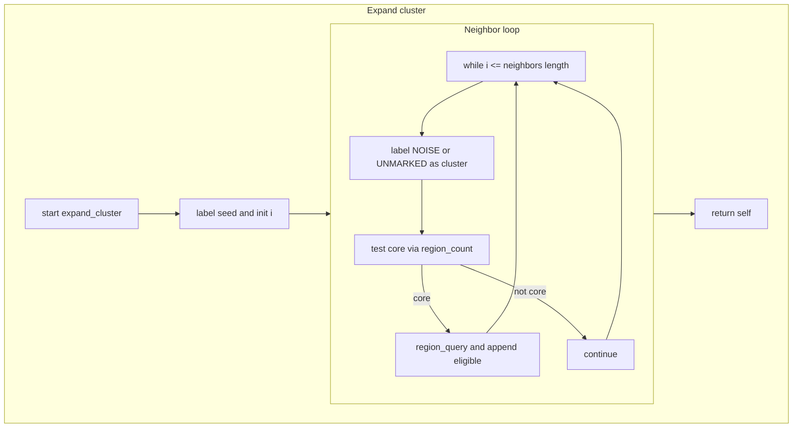

# Post processing [AETHR.AI.DBSCANNER:post_process_clusters()](https://github.com/Gh0st352/AETHR/blob/main/dev/_AI.lua#L466)

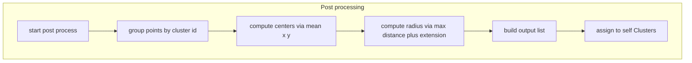

# Sequence overview

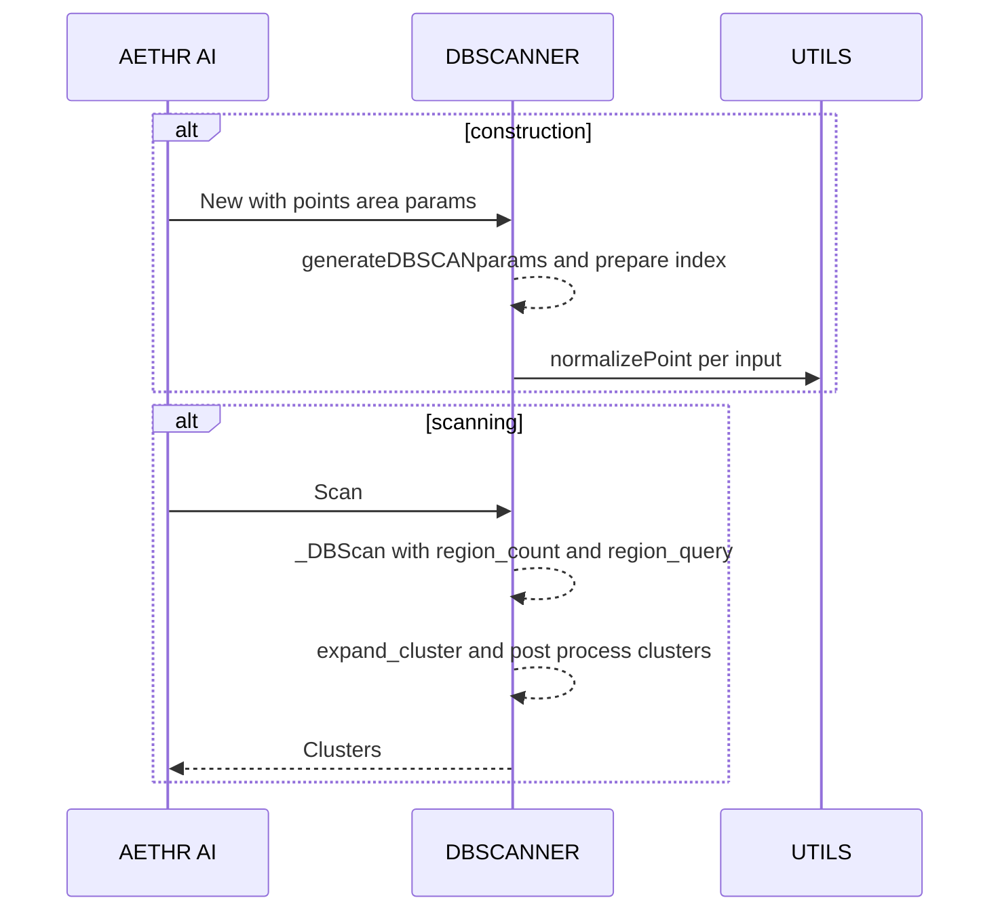

# References

- Source: [dev/_AI.lua](../../dev/_AI.lua)
- Facade: [AETHR.AI:clusterPoints()](https://github.com/Gh0st352/AETHR/blob/main/dev/_AI.lua#L530)
- Core: [AETHR.AI.DBSCANNER:_DBScan()](https://github.com/Gh0st352/AETHR/blob/main/dev/_AI.lua#L333), [AETHR.AI.DBSCANNER:expand_cluster()](https://github.com/Gh0st352/AETHR/blob/main/dev/_AI.lua#L424)
- Utilities: [AETHR.AI.DBSCANNER:region_count()](https://github.com/Gh0st352/AETHR/blob/main/dev/_AI.lua#L275), [AETHR.AI.DBSCANNER:region_query()](https://github.com/Gh0st352/AETHR/blob/main/dev/_AI.lua#L370)