# AETHR AI DBSCAN logic

Logic coverage for [AETHR.AI:clusterPoints()](../../dev/_AI.lua:530), [AETHR.AI.DBSCANNER:New()](../../dev/_AI.lua:123), [AETHR.AI.DBSCANNER:generateDBSCANparams()](../../dev/_AI.lua:186), [AETHR.AI.DBSCANNER:_prepare_points_and_index()](../../dev/_AI.lua:224), [AETHR.AI.DBSCANNER:Scan()](../../dev/_AI.lua:319), [AETHR.AI.DBSCANNER:_DBScan()](../../dev/_AI.lua:333), [AETHR.AI.DBSCANNER:region_count()](../../dev/_AI.lua:275), [AETHR.AI.DBSCANNER:region_query()](../../dev/_AI.lua:370), [AETHR.AI.DBSCANNER:expand_cluster()](../../dev/_AI.lua:424), [AETHR.AI.DBSCANNER:post_process_clusters()](../../dev/_AI.lua:466).

Notes:
- Node labels in Mermaid diagrams avoid double quotes and parentheses.
- Diagrams use GitHub Mermaid fenced blocks.

Overview

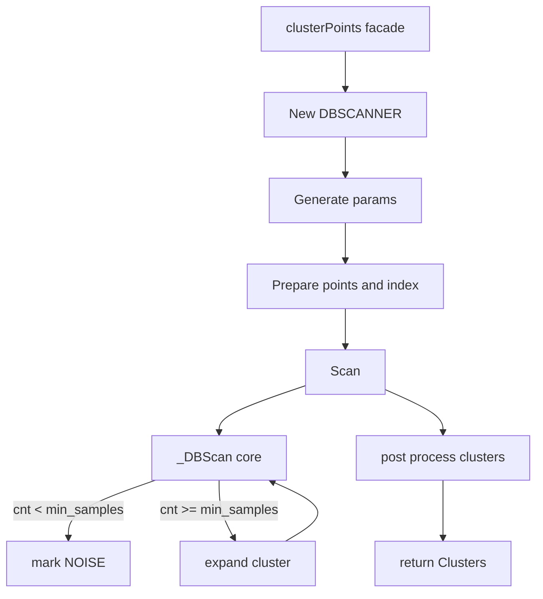

Facade [AETHR.AI:clusterPoints()](../../dev/_AI.lua:530)

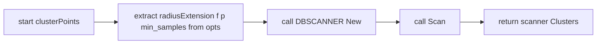

Constructor [AETHR.AI.DBSCANNER:New()](../../dev/_AI.lua:123)

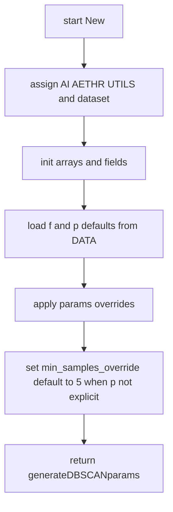

Parameterization [AETHR.AI.DBSCANNER:generateDBSCANparams()](../../dev/_AI.lua:186)

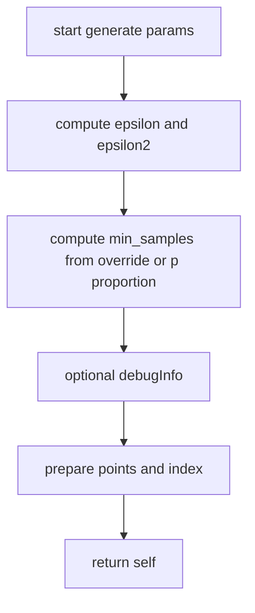

Pre normalize and index [AETHR.AI.DBSCANNER:_prepare_points_and_index()](../../dev/_AI.lua:224)

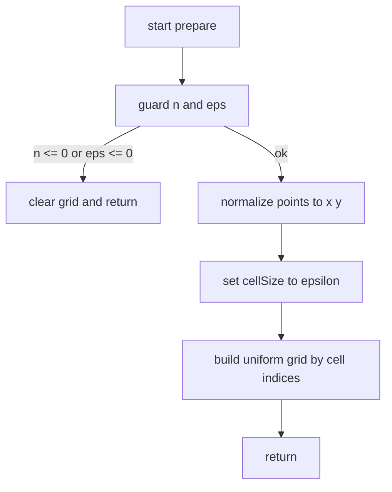

Scan wrapper [AETHR.AI.DBSCANNER:Scan()](../../dev/_AI.lua:319)

Core clustering [AETHR.AI.DBSCANNER:_DBScan()](../../dev/_AI.lua:333)

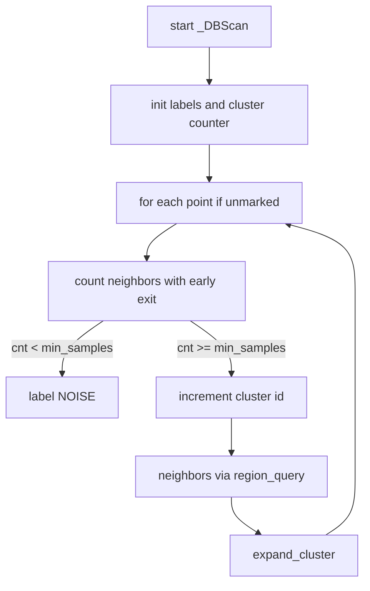

Neighbor count [AETHR.AI.DBSCANNER:region_count()](../../dev/_AI.lua:275)

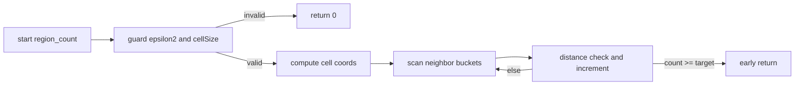

Neighbor query [AETHR.AI.DBSCANNER:region_query()](../../dev/_AI.lua:370)

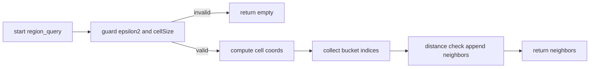

Cluster expansion [AETHR.AI.DBSCANNER:expand_cluster()](../../dev/_AI.lua:424)

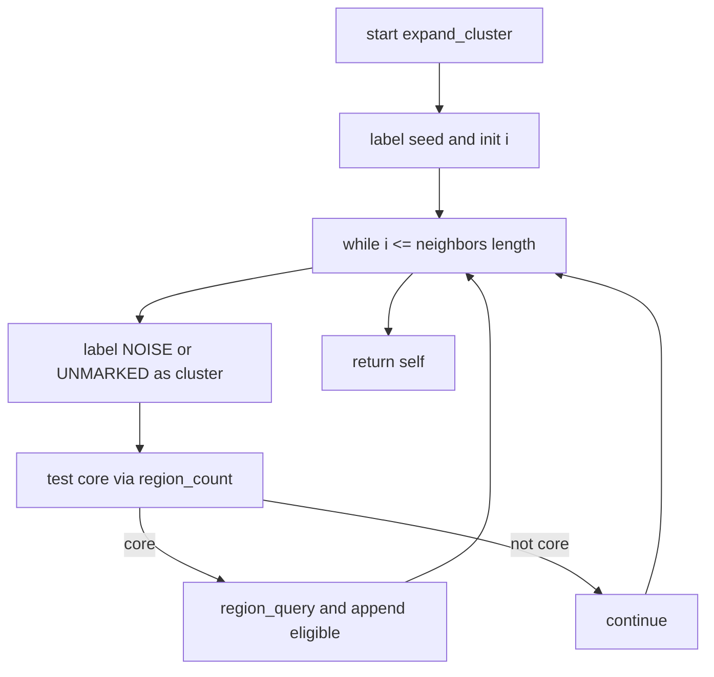

Post processing [AETHR.AI.DBSCANNER:post_process_clusters()](../../dev/_AI.lua:466)

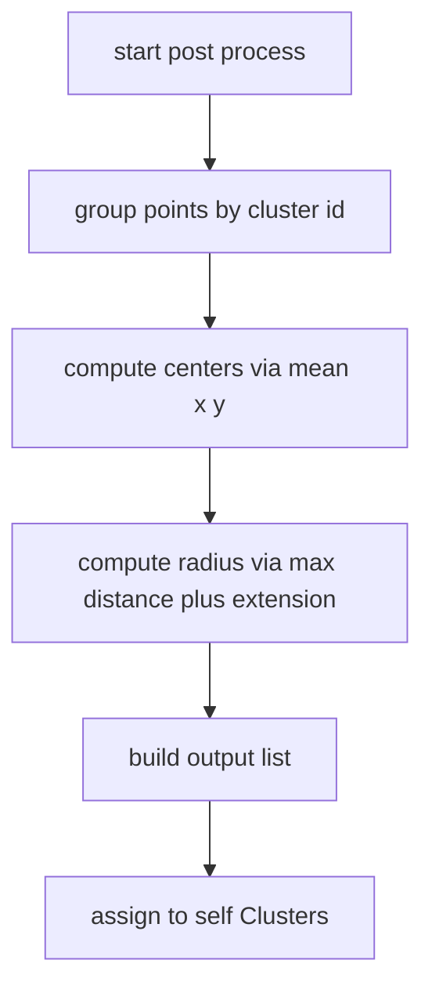

Sequence overview

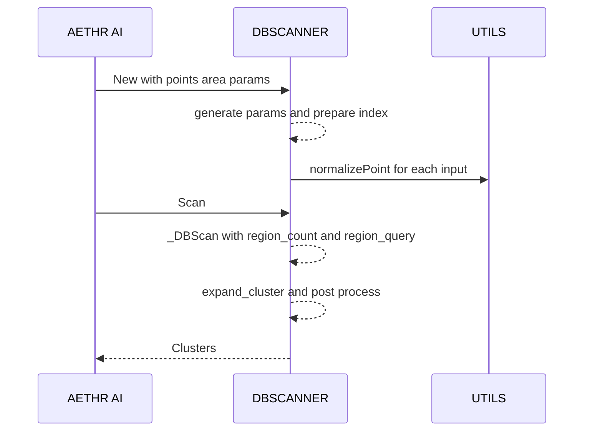

References

- Source: [dev/_AI.lua](../../dev/_AI.lua)
- Facade: [AETHR.AI:clusterPoints()](../../dev/_AI.lua:530)
- Core: [AETHR.AI.DBSCANNER:_DBScan()](../../dev/_AI.lua:333), [AETHR.AI.DBSCANNER:expand_cluster()](../../dev/_AI.lua:424)
- Utilities: [AETHR.AI.DBSCANNER:region_count()](../../dev/_AI.lua:275), [AETHR.AI.DBSCANNER:region_query()](../../dev/_AI.lua:370)