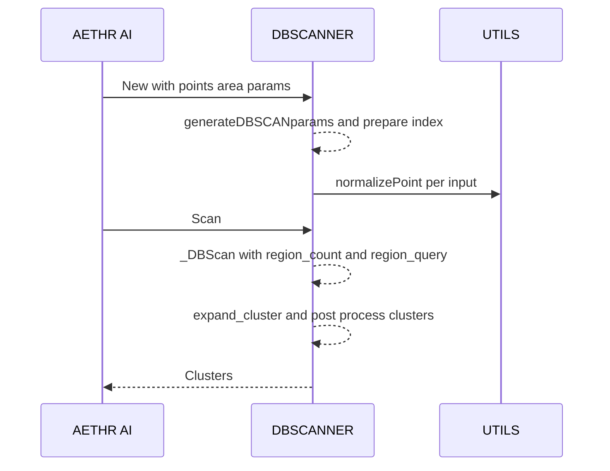

# AETHR AI DBSCAN logic

Logic coverage for [AETHR.AI:clusterPoints()](../../dev/_AI.lua:530), [AETHR.AI.DBSCANNER:New()](../../dev/_AI.lua:123), [AETHR.AI.DBSCANNER:generateDBSCANparams()](../../dev/_AI.lua:186), [AETHR.AI.DBSCANNER:_prepare_points_and_index()](../../dev/_AI.lua:224), [AETHR.AI.DBSCANNER:Scan()](../../dev/_AI.lua:319), [AETHR.AI.DBSCANNER:_DBScan()](../../dev/_AI.lua:333), [AETHR.AI.DBSCANNER:region_count()](../../dev/_AI.lua:275), [AETHR.AI.DBSCANNER:region_query()](../../dev/_AI.lua:370), [AETHR.AI.DBSCANNER:expand_cluster()](../../dev/_AI.lua:424), [AETHR.AI.DBSCANNER:post_process_clusters()](../../dev/_AI.lua:466).

Notes:
- Node labels in Mermaid diagrams avoid double quotes and parentheses.
- Diagrams use GitHub Mermaid fenced blocks and follow project Mermaid Rules (subgraphs, styles, legends).

Overview

```mermaid
%% shared theme: docs/_mermaid/theme.json %%
flowchart LR
  subgraph CONSTR [Construction]
    CP[clusterPoints facade]
    NW[DBSCANNER New]
    CP --> NW
    NW --> GP[generate params]
  end

  subgraph PREP [Preparation]
    GP --> PR[prepare points and index]
  end

  subgraph SCAN [Scan and Clustering]
    PR --> SC[Scan]
    SC --> DB[_DBScan core]
    DB -- "cnt < min_samples" --> NS[mark NOISE]
    DB -- "cnt >= min_samples" --> EX[expand cluster]
    EX --> DB
    SC --> PP[post process clusters]
    PP --> OUT[return Clusters]
  end

  class CP,NW,GP,PR,SC,DB,EX class-compute;
  class NS,OUT class-result;
```

Facade [AETHR.AI:clusterPoints()](../../dev/_AI.lua:530)

```mermaid
%% shared theme: docs/_mermaid/theme.json %%
flowchart LR
  subgraph FACADE [Facade]
    F0[start clusterPoints]
    F1[extract radiusExtension f p min_samples from opts]
    F2[call DBSCANNER New]
    F3[call Scan]
    F4[return scanner Clusters]
    F0 --> F1 --> F2 --> F3 --> F4
  end
  class F0,F1,F2,F3,F4 class-step;
```

Constructor [AETHR.AI.DBSCANNER:New()](../../dev/_AI.lua:123)

```mermaid
%% shared theme: docs/_mermaid/theme.json %%
flowchart TD
  subgraph NEW [Constructor - New]
    N0[start New]
    N1[assign AI AETHR UTILS and dataset]
    N2[init arrays and fields]
    N3[load f and p defaults from DATA]
    N4[apply params overrides]
    N5[set min_samples_override default to 5 when p not explicit]
    N6[return generateDBSCANparams]
    N0 --> N1 --> N2 --> N3 --> N4 --> N5 --> N6
  end
  class N0,N1,N2,N3,N4,N5,N6 class-step;
```

Parameterization [AETHR.AI.DBSCANNER:generateDBSCANparams()](../../dev/_AI.lua:186)

```mermaid
%% shared theme: docs/_mermaid/theme.json %%
flowchart TD
  subgraph PARAM [Parameterization]
    G0[start generate params]
    G1[compute epsilon and epsilon2]
    G2[compute min_samples from override or p proportion]
    G3[optional debugInfo]
    G4[prepare points and index]
    G5[return self]
    G0 --> G1 --> G2 --> G3 --> G4 --> G5
  end
  class G0,G1,G2,G3,G4,G5 class-step;
```

Pre normalize and index [AETHR.AI.DBSCANNER:_prepare_points_and_index()](../../dev/_AI.lua:224)

```mermaid
%% shared theme: docs/_mermaid/theme.json %%
flowchart TB
  subgraph PREP2 [Pre-normalize & Index]
    P0[start prepare]
    P1[guard n and eps]
    P2[clear grid and return]
    P3[normalize points to x y]
    P4[set cellSize to epsilon]
    P5[build uniform grid by cell indices]
    P6[return]
    P0 --> P1
    P1 -->|n <= 0 or eps <= 0| P2
    P1 -->|ok| P3 --> P4 --> P5 --> P6
  end
  class P0,P1,P2,P3,P4,P5,P6 class-step;
```

Scan wrapper [AETHR.AI.DBSCANNER:Scan()](../../dev/_AI.lua:319)

```mermaid
%% shared theme: docs/_mermaid/theme.json %%
flowchart LR
  subgraph SCANWRAP [Scan wrapper]
    S0[start Scan] --> S1[call _DBScan]
    S1 --> S2[call post process clusters]
    S2 --> S3[return self]
  end
  class S0,S1,S2,S3 class-compute;
```

Core clustering [AETHR.AI.DBSCANNER:_DBScan()](../../dev/_AI.lua:333)

```mermaid
%% shared theme: docs/_mermaid/theme.json %%
flowchart TB
  subgraph CORE [Core _DBScan]
    D0[start _DBScan]
    D1[init labels and cluster counter]
    D2[for each point if unmarked]
    D3[count neighbors with early exit]
    D4[label NOISE]
    D5[increment cluster id]
    D6[neighbors via region_query]
    D7[expand_cluster]
    D0 --> D1 --> D2 --> D3
    D3 -->|cnt < min_samples| D4
    D3 -->|cnt >= min_samples| D5 --> D6 --> D7 --> D2
  end
  class D0,D1,D2,D3,D4,D5,D6,D7 class-compute;
```

Neighbor count [AETHR.AI.DBSCANNER:region_count()](../../dev/_AI.lua:275)

```mermaid
%% shared theme: docs/_mermaid/theme.json %%
flowchart LR
  subgraph RCOUNT [Neighbor count]
    RC0[start region_count]
    RC1[guard epsilon2 and cellSize]
    RC2[return 0]
    RC3[compute cell coords]
    RC4[scan neighbor buckets]
    RC5[distance check and increment]
    RC6[early return when count >= target]
    RC0 --> RC1
    RC1 -->|invalid| RC2
    RC1 -->|valid| RC3 --> RC4 --> RC5 --> RC1
    RC5 -->|count >= target| RC6
  end
  class RC0,RC1,RC2,RC3,RC4,RC5,RC6 class-step;
```

Neighbor query [AETHR.AI.DBSCANNER:region_query()](../../dev/_AI.lua:370)

```mermaid
%% shared theme: docs/_mermaid/theme.json %%
flowchart LR
  subgraph RQUERY [Neighbor query]
    RQ0[start region_query]
    RQ1[guard epsilon2 and cellSize]
    RQ2[return empty]
    RQ3[compute cell coords]
    RQ4[collect bucket indices]
    RQ5[distance check append neighbors]
    RQ6[return neighbors]
    RQ0 --> RQ1
    RQ1 -->|invalid| RQ2
    RQ1 -->|valid| RQ3 --> RQ4 --> RQ5 --> RQ6
  end
  class RQ0,RQ1,RQ2,RQ3,RQ4,RQ5,RQ6 class-step;
```

Cluster expansion [AETHR.AI.DBSCANNER:expand_cluster()](../../dev/_AI.lua:424)

```mermaid
%% shared theme: docs/_mermaid/theme.json %%
flowchart TB
  subgraph EXPAND [Expand cluster]
    E0[start expand_cluster]
    E1[label seed and init i]
    E2[while i <= neighbors length]
    E3[label NOISE or UNMARKED as cluster]
    E4[test core via region_count]
    E5[region_query and append eligible]
    E6[continue]
    E7[return self]
    E0 --> E1 --> E2
    E2 --> E3 --> E4
    E4 -->|core| E5 --> E2
    E4 -->|not core| E6 --> E2
    E2 --> E7
  end
  class E0,E1,E2,E3,E4,E5,E6,E7 class-step;
```

Post processing [AETHR.AI.DBSCANNER:post_process_clusters()](../../dev/_AI.lua:466)

```mermaid
%% shared theme: docs/_mermaid/theme.json %%
flowchart TB
  subgraph POST [Post processing]
    PP0[start post process]
    PP1[group points by cluster id]
    PP2[compute centers via mean x y]
    PP3[compute radius via max distance plus extension]
    PP4[build output list]
    PP5[assign to self Clusters]
    PP0 --> PP1 --> PP2 --> PP3 --> PP4 --> PP5
  end
  class PP0,PP1,PP2,PP3,PP4,PP5 class-step;
```

Sequence overview



References

- Source: [dev/_AI.lua](../../dev/_AI.lua)
- Facade: [AETHR.AI:clusterPoints()](../../dev/_AI.lua:530)
- Core: [AETHR.AI.DBSCANNER:_DBScan()](../../dev/_AI.lua:333), [AETHR.AI.DBSCANNER:expand_cluster()](../../dev/_AI.lua:424)
- Utilities: [AETHR.AI.DBSCANNER:region_count()](../../dev/_AI.lua:275), [AETHR.AI.DBSCANNER:region_query()](../../dev/_AI.lua:370)