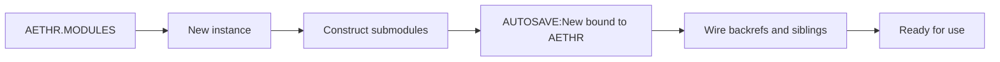
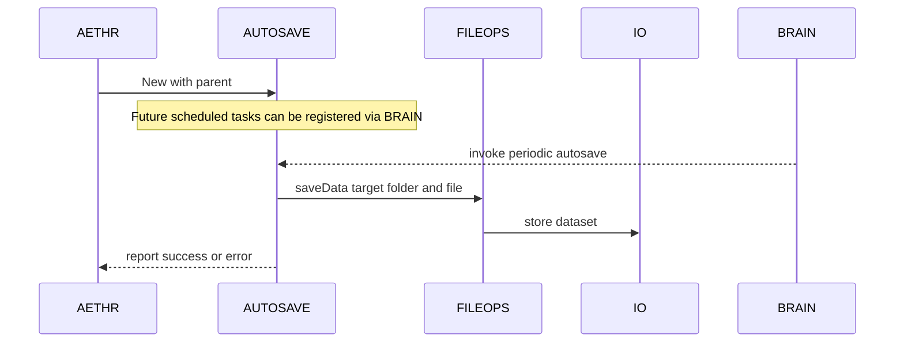
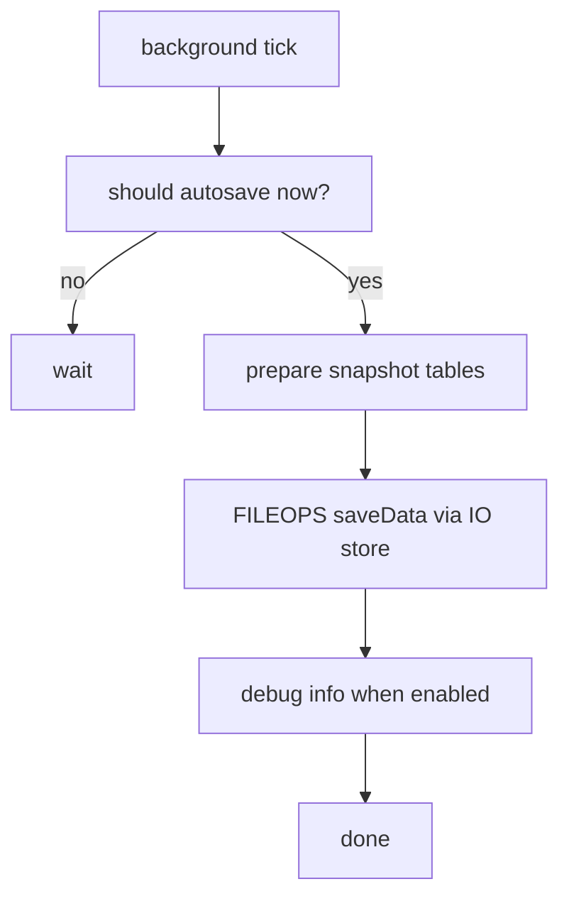

# AETHR AUTOSAVE diagrams and flows

Primary anchors
- [AETHR.AUTOSAVE:New()](dev/autosave.lua:19)

Related anchors
- Module injection during instance creation: [AETHR:New() Phase 1 construct submodules](dev/AETHR.lua:155)
- Module backrefs wiring: [AETHR:New() Phase 2 wire back references](dev/AETHR.lua:172)
- File persistence helpers used across modules: [AETHR.FILEOPS:saveData()](dev/FILEOPS_.lua:155), [AETHR.FILEOPS:loadData()](dev/FILEOPS_.lua:173)

Documents and indices
- Master diagrams index: [docs/README.md](../README.md)
- AETHR overview: [docs/aethr/README.md](../aethr/README.md)
- FILEOPS: [docs/fileops/README.md](../fileops/README.md)
- WORLD: [docs/world/README.md](../world/README.md)

Purpose
- AUTOSAVE is a dedicated submodule entry point for persistence oriented tasks. It is injected into the AETHR instance and can orchestrate save and restore operations leveraging FILEOPS and IO routines.
- Current code exposes the constructor. Scheduling and hooks can be added through BRAIN or WORLD watchers in future iterations.

Injection lifecycle

Where in code
- [AETHR:New() construct loop](dev/AETHR.lua:155)
- [AETHR:New() wire loop](dev/AETHR.lua:172)
- [AETHR.AUTOSAVE:New()](dev/autosave.lua:19)

Runtime interactions (planned)

High level autosave concept flow

Notes
- Mermaid labels avoid double quotes and parentheses.
- All diagrams use GitHub Mermaid fenced blocks.
- This page documents the current constructor entry point and the intended orchestration patterns to keep parity with other module docs. When implementation expands, update anchors and add specific flows for each autosave operation.