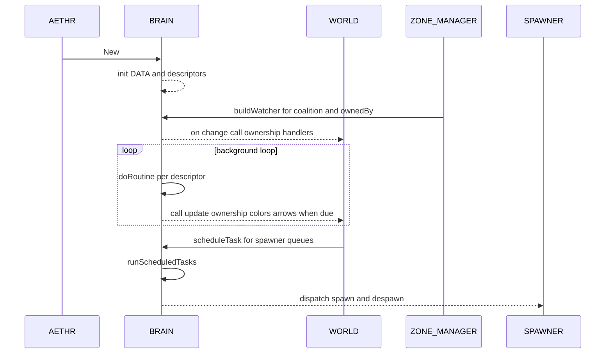

# AETHR BRAIN diagrams index

Primary module anchors
- [AETHR.BRAIN:New()](../../dev/BRAIN.lua:158)
- [AETHR.BRAIN:doRoutine()](../../dev/BRAIN.lua:176)
- [AETHR.BRAIN:buildWatcher()](../../dev/BRAIN.lua:242)
- [AETHR.BRAIN:scheduleTask()](../../dev/BRAIN.lua:277)
- [AETHR.BRAIN:runScheduledTasks()](../../dev/BRAIN.lua:306)

Documents
- [docs/brain/scheduler.md](docs/brain/scheduler.md)
- [docs/brain/coroutines.md](docs/brain/coroutines.md)
- [docs/brain/watchers.md](docs/brain/watchers.md)
- [docs/brain/data_structures.md](docs/brain/data_structures.md)

Overview relationships

```mermaid
%% shared theme: docs/_mermaid/theme.json %%
flowchart LR
  subgraph CORE [BRAIN core areas]
    BR[BRAIN module]
    SC[Scheduler]
    CO[Coroutines]
    WT[Watchers]
    BR --> SC
    BR --> CO
    BR --> WT
  end

  subgraph EFFECTS [Runtime effects]
    ST[Scheduled tasks]
    WL[WORLD updates]
    SP[Spawner jobs]
    ZM[Zone manager reactions]
    SC --> ST
    CO --> WL
    WT -.-> WL
    WL -.-> SP
    WL -.-> ZM
    ZM -.-> WT
  end

  class BR,SC,CO,WT class-compute;
  class ST,WL,SP,ZM class-step;
```

Runtime sequence overview



Cross-module indexes
- SPAWNER: [docs/spawner/README.md](docs/spawner/README.md)
- WORLD: [docs/world/README.md](docs/world/README.md)
- ZONE_MANAGER: [docs/zone_manager/README.md](docs/zone_manager/README.md)

Key anchors
- Scheduler core: [AETHR.BRAIN:scheduleTask()](../../dev/BRAIN.lua:277), [AETHR.BRAIN:runScheduledTasks()](../../dev/BRAIN.lua:306)
- Coroutine runner: [AETHR.BRAIN:doRoutine()](../../dev/BRAIN.lua:176)
- Watcher utility: [AETHR.BRAIN:buildWatcher()](../../dev/BRAIN.lua:242)
- Constructor: [AETHR.BRAIN:New()](../../dev/BRAIN.lua:158)