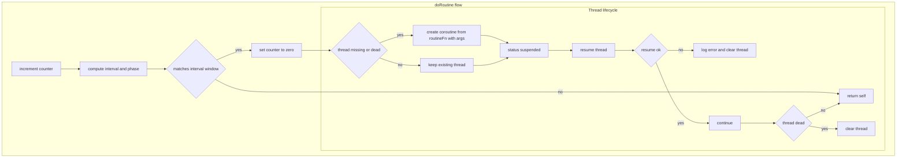
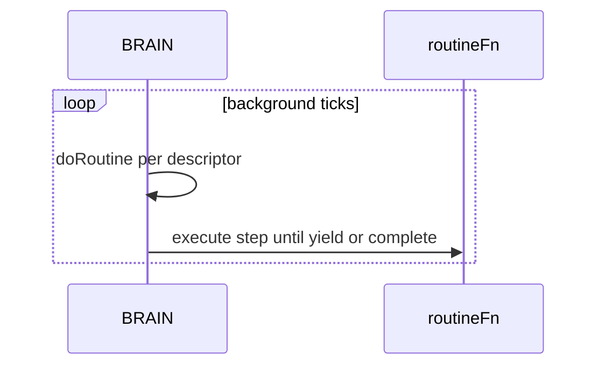

# AETHR BRAIN coroutines

## Entry anchors
- [AETHR.BRAIN:doRoutine()](https://github.com/Gh0st352/AETHR/blob/main/dev/BRAIN.lua#L176)
- [dev/BRAIN.lua](https://github.com/Gh0st352/AETHR/blob/main/dev/BRAIN.lua#L56) coroutines table
- [dev/BRAIN.lua](https://github.com/Gh0st352/AETHR/blob/main/dev/BRAIN.lua#L149) BackgroundLoopInterval

## Purpose
The coroutine runner executes periodic routines based on interval and phase with safe creation resume and cleanup. BackgroundLoopInterval controls tick cadence.

# Flow: doRoutine

# Sequence: background usage

# Configured descriptors
- [dev/BRAIN.lua](https://github.com/Gh0st352/AETHR/blob/main/dev/BRAIN.lua#L58) saveGroundUnits interval 10 phase 9 yield 5
- [dev/BRAIN.lua](https://github.com/Gh0st352/AETHR/blob/main/dev/BRAIN.lua#L67) updateZoneOwnership interval 10 phase 2 yield 5
- [dev/BRAIN.lua](https://github.com/Gh0st352/AETHR/blob/main/dev/BRAIN.lua#L76) updateAirfieldOwnership interval 10 phase 0 yield 5
- [dev/BRAIN.lua](https://github.com/Gh0st352/AETHR/blob/main/dev/BRAIN.lua#L85) updateZoneColors interval 10 phase 4 yield 5
- [dev/BRAIN.lua](https://github.com/Gh0st352/AETHR/blob/main/dev/BRAIN.lua#L94) updateZoneArrows interval 10 phase 6 yield 10
- [dev/BRAIN.lua](https://github.com/Gh0st352/AETHR/blob/main/dev/BRAIN.lua#L103) updateGroundUnitsDB interval 30 phase 8 yield 10
- [dev/BRAIN.lua](https://github.com/Gh0st352/AETHR/blob/main/dev/BRAIN.lua#L112) spawnGroundGroups interval 10 phase 3 yield 3
- [dev/BRAIN.lua](https://github.com/Gh0st352/AETHR/blob/main/dev/BRAIN.lua#L121) despawnGroundGroups interval 10 phase 1 yield 3
- [dev/BRAIN.lua](https://github.com/Gh0st352/AETHR/blob/main/dev/BRAIN.lua#L130) spawnerGenerationQueue interval 10 phase 12 yield 10
- [dev/BRAIN.lua](https://github.com/Gh0st352/AETHR/blob/main/dev/BRAIN.lua#L139) processFSMQueue interval 10 phase 5 yield 10

# Descriptors subgraph

```mermaid
%% shared theme: docs/_mermaid/theme.json %%
flowchart LR
  subgraph Descriptors ["Configured coroutine descriptors"]
    D1[saveGroundUnits int 10 phase 9 yield 5]
    D2[updateZoneOwnership int 10 phase 2 yield 5]
    D3[updateAirfieldOwnership int 10 phase 0 yield 5]
    D4[updateZoneColors int 10 phase 4 yield 5]
    D5[updateZoneArrows int 10 phase 6 yield 10]
    D6[updateGroundUnitsDB int 30 phase 8 yield 10]
    D7[spawnGroundGroups int 10 phase 3 yield 3]
    D8[despawnGroundGroups int 10 phase 1 yield 3]
    D9[spawnerGenerationQueue int 10 phase 12 yield 10]
    D10[processFSMQueue int 10 phase 5 yield 10]
  end
  class D1,D2,D3,D4,D5,D6,D7,D8,D9,D10 class_step;
```

# Cross links
- Module index: [docs/brain/README.md](docs/brain/README.md)
- Scheduler: [docs/brain/scheduler.md](docs/brain/scheduler.md)
- Data structures: [docs/brain/data_structures.md](docs/brain/data_structures.md)