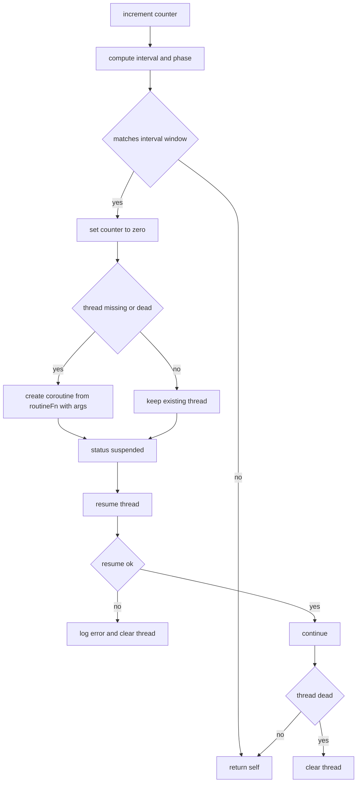
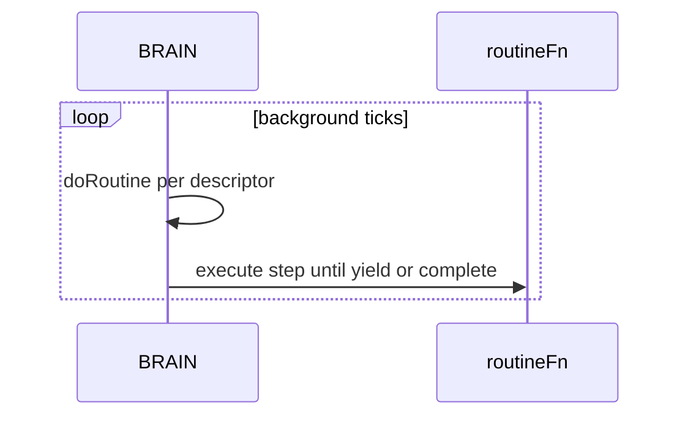

# AETHR BRAIN coroutines

Entry anchors
- [AETHR.BRAIN:doRoutine()](../../dev/BRAIN.lua:176)
- [dev/BRAIN.lua](../../dev/BRAIN.lua:56) coroutines table
- [dev/BRAIN.lua](../../dev/BRAIN.lua:149) BackgroundLoopInterval

Purpose
The coroutine runner executes periodic routines based on interval and phase with safe creation resume and cleanup. BackgroundLoopInterval controls tick cadence.

Flow: doRoutine

Sequence: background usage

Configured descriptors
- [dev/BRAIN.lua](../../dev/BRAIN.lua:58) saveGroundUnits interval 10 phase 9 yield 5
- [dev/BRAIN.lua](../../dev/BRAIN.lua:67) updateZoneOwnership interval 10 phase 2 yield 5
- [dev/BRAIN.lua](../../dev/BRAIN.lua:76) updateAirfieldOwnership interval 10 phase 0 yield 5
- [dev/BRAIN.lua](../../dev/BRAIN.lua:85) updateZoneColors interval 10 phase 4 yield 5
- [dev/BRAIN.lua](../../dev/BRAIN.lua:94) updateZoneArrows interval 10 phase 6 yield 10
- [dev/BRAIN.lua](../../dev/BRAIN.lua:103) updateGroundUnitsDB interval 30 phase 8 yield 10
- [dev/BRAIN.lua](../../dev/BRAIN.lua:112) spawnGroundGroups interval 10 phase 3 yield 3
- [dev/BRAIN.lua](../../dev/BRAIN.lua:121) despawnGroundGroups interval 10 phase 1 yield 3
- [dev/BRAIN.lua](../../dev/BRAIN.lua:130) spawnerGenerationQueue interval 10 phase 12 yield 10
- [dev/BRAIN.lua](../../dev/BRAIN.lua:139) processFSMQueue interval 10 phase 5 yield 10

Descriptors subgraph

```mermaid
flowchart LR
  subgraph Descriptors
    D1[saveGroundUnits int 10 phase 9 yield 5]
    D2[updateZoneOwnership int 10 phase 2 yield 5]
    D3[updateAirfieldOwnership int 10 phase 0 yield 5]
    D4[updateZoneColors int 10 phase 4 yield 5]
    D5[updateZoneArrows int 10 phase 6 yield 10]
    D6[updateGroundUnitsDB int 30 phase 8 yield 10]
    D7[spawnGroundGroups int 10 phase 3 yield 3]
    D8[despawnGroundGroups int 10 phase 1 yield 3]
    D9[spawnerGenerationQueue int 10 phase 12 yield 10]
    D10[processFSMQueue int 10 phase 5 yield 10]
  end
```

Cross links
- Module index: [docs/brain/README.md](docs/brain/README.md)
- Scheduler: [docs/brain/scheduler.md](docs/brain/scheduler.md)
- Data structures: [docs/brain/data_structures.md](docs/brain/data_structures.md)