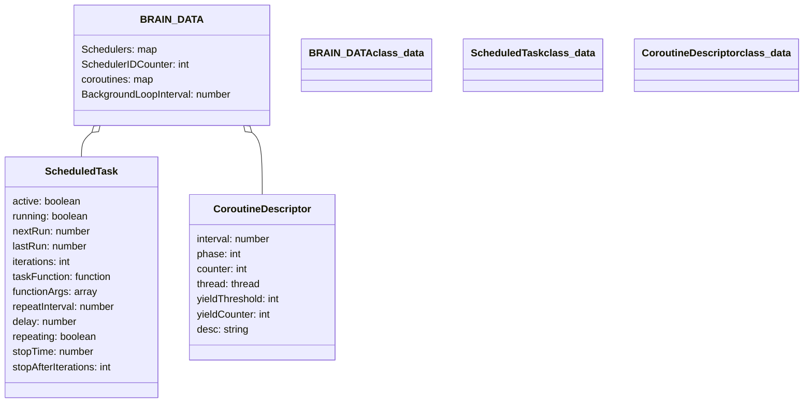
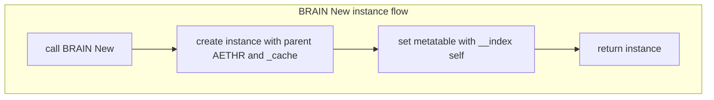

# AETHR BRAIN data structures

## Entry anchors
- [AETHR.ScheduledTask](https://github.com/Gh0st352/AETHR/blob/main/dev/BRAIN.lua#L22)
- [AETHR.CoroutineDescriptor](https://github.com/Gh0st352/AETHR/blob/main/dev/BRAIN.lua#L37)
- [AETHR.BRAIN.DATA](https://github.com/Gh0st352/AETHR/blob/main/dev/BRAIN.lua#L52)
- [BackgroundLoopInterval](https://github.com/Gh0st352/AETHR/blob/main/dev/BRAIN.lua#L149)

# Class model

# Default coroutine descriptors
- saveGroundUnits: interval 10, phase 9, yield 5 [dev/BRAIN.lua](https://github.com/Gh0st352/AETHR/blob/main/dev/BRAIN.lua#L58)
- updateZoneOwnership: interval 10, phase 2, yield 5 [dev/BRAIN.lua](https://github.com/Gh0st352/AETHR/blob/main/dev/BRAIN.lua#L67)
- updateAirfieldOwnership: interval 10, phase 0, yield 5 [dev/BRAIN.lua](https://github.com/Gh0st352/AETHR/blob/main/dev/BRAIN.lua#L76)
- updateZoneColors: interval 10, phase 4, yield 5 [dev/BRAIN.lua](https://github.com/Gh0st352/AETHR/blob/main/dev/BRAIN.lua#L85)
- updateZoneArrows: interval 10, phase 6, yield 10 [dev/BRAIN.lua](https://github.com/Gh0st352/AETHR/blob/main/dev/BRAIN.lua#L94)
- updateGroundUnitsDB: interval 30, phase 8, yield 10 [dev/BRAIN.lua](https://github.com/Gh0st352/AETHR/blob/main/dev/BRAIN.lua#L103)
- spawnGroundGroups: interval 10, phase 3, yield 3 [dev/BRAIN.lua](https://github.com/Gh0st352/AETHR/blob/main/dev/BRAIN.lua#L112)
- despawnGroundGroups: interval 10, phase 1, yield 3 [dev/BRAIN.lua](https://github.com/Gh0st352/AETHR/blob/main/dev/BRAIN.lua#L121)
- spawnerGenerationQueue: interval 10, phase 12, yield 10 [dev/BRAIN.lua](https://github.com/Gh0st352/AETHR/blob/main/dev/BRAIN.lua#L130)
- processFSMQueue: interval 10, phase 5, yield 10 [dev/BRAIN.lua](https://github.com/Gh0st352/AETHR/blob/main/dev/BRAIN.lua#L139)

# Flow: New instance

# Cross links
- Module index: [docs/brain/README.md](docs/brain/README.md)
- Scheduler: [docs/brain/scheduler.md](docs/brain/scheduler.md)
- Coroutines: [docs/brain/coroutines.md](docs/brain/coroutines.md)
- Watchers: [docs/brain/watchers.md](docs/brain/watchers.md)