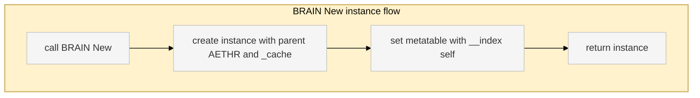

# AETHR BRAIN data structures

Entry anchors
- [AETHR.ScheduledTask](../../dev/BRAIN.lua:22)
- [AETHR.CoroutineDescriptor](../../dev/BRAIN.lua:37)
- [AETHR.BRAIN.DATA](../../dev/BRAIN.lua:52)
- [BackgroundLoopInterval](../../dev/BRAIN.lua:149)

Class model

```mermaid
%%{init: {"theme":"base", "themeVariables":{"primaryColor":"#f5f5f5"}}}%%
classDiagram
  %% Quote class identifiers to avoid issues with special characters
  class "BRAIN_DATA" {
    Schedulers : map<int, ScheduledTask>
    SchedulerIDCounter : integer
    coroutines : map<string, CoroutineDescriptor>
    BackgroundLoopInterval : number
  }
  class "ScheduledTask" {
    active : boolean
    running : boolean
    nextRun : number
    lastRun : number
    iterations : integer
    taskFunction : fun(...)
    functionArgs : any[]
    repeatInterval : number
    delay : number
    repeating : boolean
    stopTime : number
    stopAfterIterations : integer
  }
  class "CoroutineDescriptor" {
    interval : number
    phase : integer
    counter : integer
    thread : thread
    yieldThreshold : integer
    yieldCounter : integer
    desc : string
  }
  "BRAIN_DATA" o-- "ScheduledTask"
  "BRAIN_DATA" o-- "CoroutineDescriptor"

  classDef data fill:#f5f5f5,stroke:#bfbfbf,stroke-width:1px
  class "BRAIN_DATA","ScheduledTask","CoroutineDescriptor" data
```

Default coroutine descriptors
- saveGroundUnits: interval 10, phase 9, yield 5 [dev/BRAIN.lua](../../dev/BRAIN.lua:58)
- updateZoneOwnership: interval 10, phase 2, yield 5 [dev/BRAIN.lua](../../dev/BRAIN.lua:67)
- updateAirfieldOwnership: interval 10, phase 0, yield 5 [dev/BRAIN.lua](../../dev/BRAIN.lua:76)
- updateZoneColors: interval 10, phase 4, yield 5 [dev/BRAIN.lua](../../dev/BRAIN.lua:85)
- updateZoneArrows: interval 10, phase 6, yield 10 [dev/BRAIN.lua](../../dev/BRAIN.lua:94)
- updateGroundUnitsDB: interval 30, phase 8, yield 10 [dev/BRAIN.lua](../../dev/BRAIN.lua:103)
- spawnGroundGroups: interval 10, phase 3, yield 3 [dev/BRAIN.lua](../../dev/BRAIN.lua:112)
- despawnGroundGroups: interval 10, phase 1, yield 3 [dev/BRAIN.lua](../../dev/BRAIN.lua:121)
- spawnerGenerationQueue: interval 10, phase 12, yield 10 [dev/BRAIN.lua](../../dev/BRAIN.lua:130)
- processFSMQueue: interval 10, phase 5, yield 10 [dev/BRAIN.lua](../../dev/BRAIN.lua:139)

Flow: New instance



Cross links
- Module index: [docs/brain/README.md](docs/brain/README.md)
- Scheduler: [docs/brain/scheduler.md](docs/brain/scheduler.md)
- Coroutines: [docs/brain/coroutines.md](docs/brain/coroutines.md)
- Watchers: [docs/brain/watchers.md](docs/brain/watchers.md)