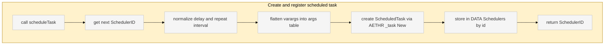
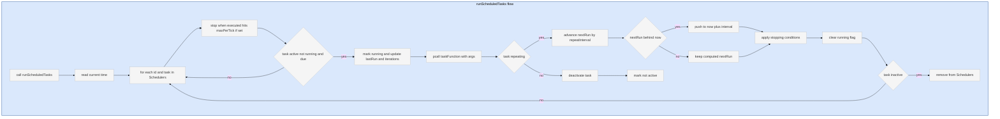
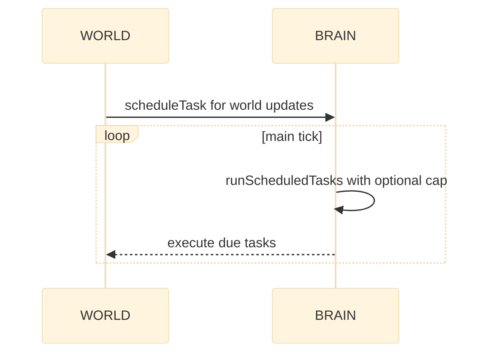

# AETHR BRAIN scheduler

Entry anchors
- [AETHR.BRAIN:scheduleTask()](../../dev/BRAIN.lua:277)
- [AETHR.BRAIN:runScheduledTasks()](../../dev/BRAIN.lua:306)

Purpose
The scheduler manages delayed and repeating work using a drift resistant next run calculation and safe execution with pcall.

Flow: scheduleTask

Flow: runScheduledTasks

Sequence: typical scheduling usage

Notes and guarantees
- No drift on repeating tasks by computing nextRun from previous nextRun when possible [AETHR.BRAIN:runScheduledTasks()](../../dev/BRAIN.lua:331)
- Overdue protection pushes nextRun forward when behind [AETHR.BRAIN:runScheduledTasks()](../../dev/BRAIN.lua:336)
- Safe execution via pcall and debug logging where available [AETHR.BRAIN:runScheduledTasks()](../../dev/BRAIN.lua:322)
- Removal of inactive tasks frees memory [AETHR.BRAIN:runScheduledTasks()](../../dev/BRAIN.lua:356)
- Identifier handle allows external cancel or inspection [AETHR.BRAIN:scheduleTask()](../../dev/BRAIN.lua:300)

Cross links
- Data structures: [docs/brain/data_structures.md](docs/brain/data_structures.md)
- Module index: [docs/brain/README.md](docs/brain/README.md)