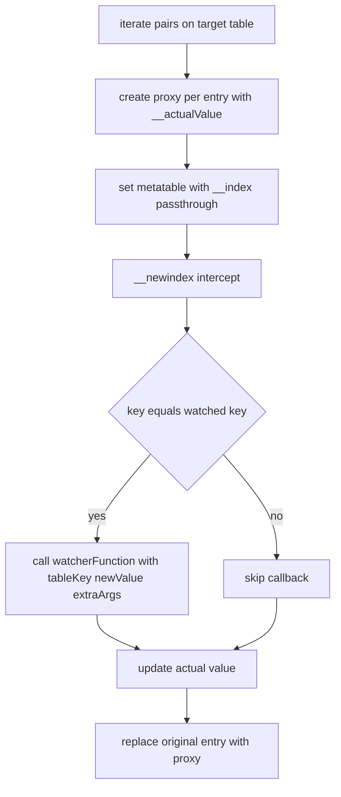
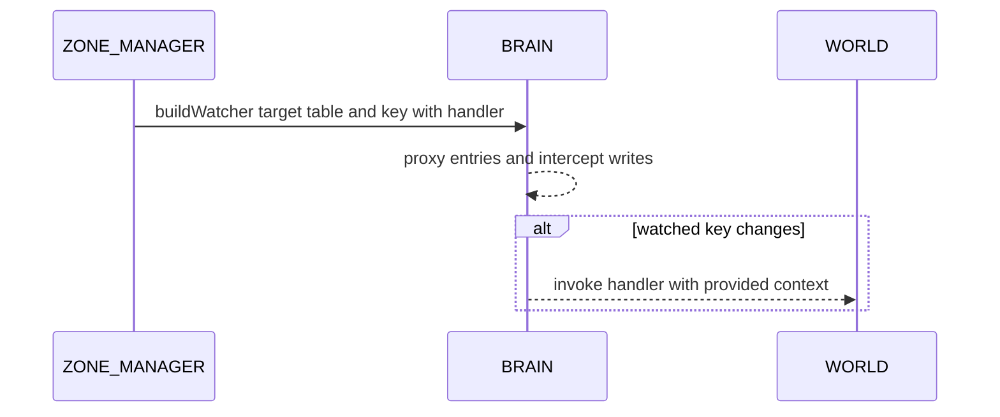

# AETHR BRAIN watchers

Entry anchor
- [AETHR.BRAIN:buildWatcher()](../../dev/BRAIN.lua:242)

Purpose
BRAIN provides a lightweight table proxy that intercepts writes to a specific key across a collection, invoking a watcher callback with optional extra arguments. This is used to react to ownership changes and other state transitions.

Flow: buildWatcher

Sequence: wiring watchers to WORLD

Behavior notes mapped to code
- Proxy stores original value under __actualValue and forwards reads via __index [AETHR.BRAIN:buildWatcher()](../../dev/BRAIN.lua:250)
- __newindex checks for the watched field and invokes the callback before assigning [AETHR.BRAIN:buildWatcher()](../../dev/BRAIN.lua:255)
- Extra args are captured once and passed to each callback invocation [AETHR.BRAIN:buildWatcher()](../../dev/BRAIN.lua:243)

Typical usage
- Airbase coalition change watcher in ZONE_MANAGER: [docs/zone_manager/watchers.md](docs/zone_manager/watchers.md)
- Zone ownership change watcher in ZONE_MANAGER: [docs/zone_manager/watchers.md](docs/zone_manager/watchers.md)

Cross links
- Module index: [docs/brain/README.md](docs/brain/README.md)
- Scheduler: [docs/brain/scheduler.md](docs/brain/scheduler.md)
- Coroutines: [docs/brain/coroutines.md](docs/brain/coroutines.md)
- Data structures: [docs/brain/data_structures.md](docs/brain/data_structures.md)