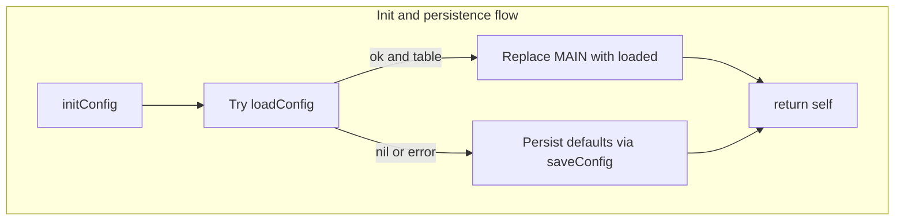
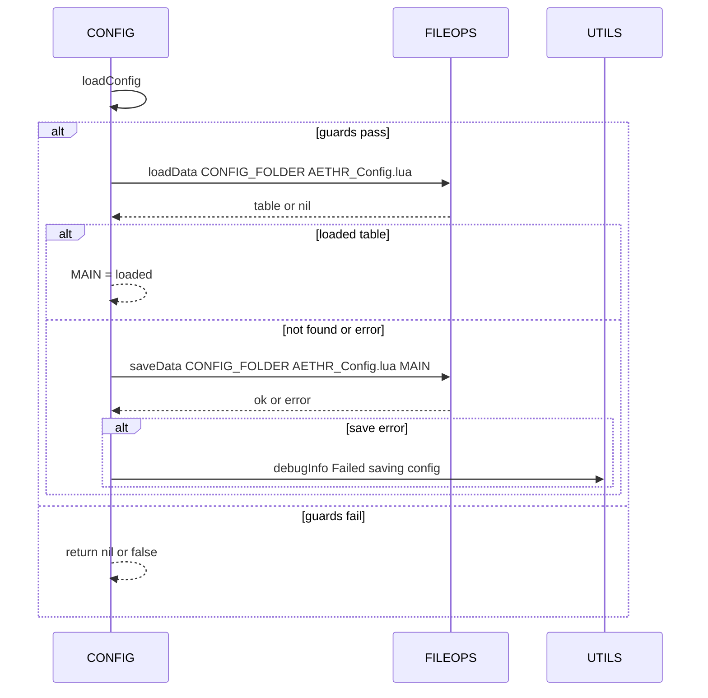
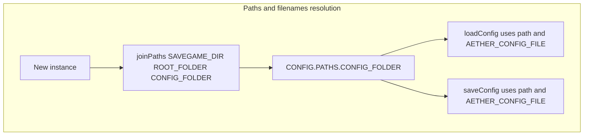
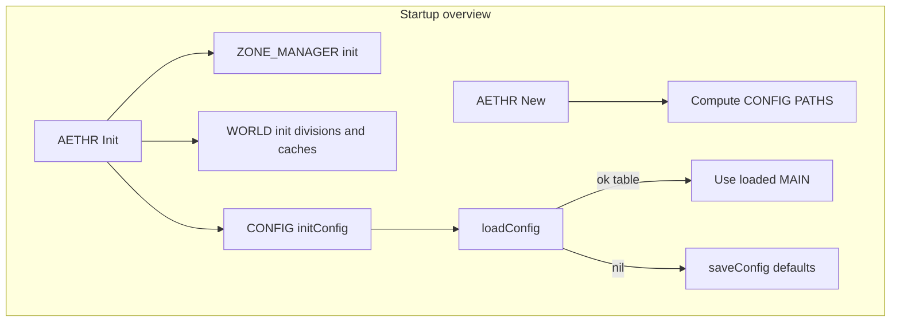

# AETHR CONFIG diagrams and flows

# Primary anchors
- [AETHR.CONFIG:initConfig()](https://github.com/Gh0st352/AETHR/blob/main/dev/CONFIG_.lua#L364)
- [AETHR.CONFIG:loadConfig()](https://github.com/Gh0st352/AETHR/blob/main/dev/CONFIG_.lua#L380)
- [AETHR.CONFIG:saveConfig()](https://github.com/Gh0st352/AETHR/blob/main/dev/CONFIG_.lua#L404)

# Related code anchors
- AETHR paths at creation: [AETHR:New()](https://github.com/Gh0st352/AETHR/blob/main/dev/AETHR.lua#L65), [dev/AETHR.lua](https://github.com/Gh0st352/AETHR/blob/main/dev/AETHR.lua#L125)
- FILE I/O: [AETHR.FILEOPS:loadData()](https://github.com/Gh0st352/AETHR/blob/main/dev/FILEOPS_.lua#L173), [AETHR.FILEOPS:saveData()](https://github.com/Gh0st352/AETHR/blob/main/dev/FILEOPS_.lua#L155)
- Debug logging: [AETHR.UTILS:debugInfo()](https://github.com/Gh0st352/AETHR/blob/main/dev/UTILS.lua#L79)

# Documents and indices
- Master diagrams index: [docs/README.md](../README.md)
- AETHR overview: [docs/aethr/README.md](../aethr/README.md)

# Init and persistence flow

# Storage guards and calls

# Paths and filenames resolution

# Source anchors
- [AETHR.CONFIG:initConfig()](https://github.com/Gh0st352/AETHR/blob/main/dev/CONFIG_.lua#L364)
- [AETHR.CONFIG:loadConfig()](https://github.com/Gh0st352/AETHR/blob/main/dev/CONFIG_.lua#L380)
- [AETHR.CONFIG:saveConfig()](https://github.com/Gh0st352/AETHR/blob/main/dev/CONFIG_.lua#L404)
- [AETHR:New()](https://github.com/Gh0st352/AETHR/blob/main/dev/AETHR.lua#L65)
- [AETHR.FILEOPS:joinPaths()](https://github.com/Gh0st352/AETHR/blob/main/dev/FILEOPS_.lua#L37)
- [AETHR.FILEOPS:loadData()](https://github.com/Gh0st352/AETHR/blob/main/dev/FILEOPS_.lua#L173)
- [AETHR.FILEOPS:saveData()](https://github.com/Gh0st352/AETHR/blob/main/dev/FILEOPS_.lua#L155)
- [AETHR.UTILS:debugInfo()](https://github.com/Gh0st352/AETHR/blob/main/dev/UTILS.lua#L79)

# Notes
- Mermaid labels avoid double quotes and parentheses.
- All diagrams use GitHub Mermaid fenced blocks.
## Breakout documents

Detailed CONFIG analysis pages with Mermaid diagrams and sequence charts.

- Init and persistence: [init_and_persistence.md](./init_and_persistence.md)
- Paths and filenames: [paths_and_filenames.md](./paths_and_filenames.md)
- Main schema: [main_schema.md](./main_schema.md)
- Flags and counters: [flags_counters.md](./flags_counters.md)
- Zone paint and bounds: [zone_paint_and_bounds.md](./zone_paint_and_bounds.md)
- World bounds and divisions: [world_bounds_and_divisions.md](./world_bounds_and_divisions.md)
- OutText settings: [out_text.md](./out_text.md)
- Save chunks strategy: [save_chunks.md](./save_chunks.md)

# High-level overview

