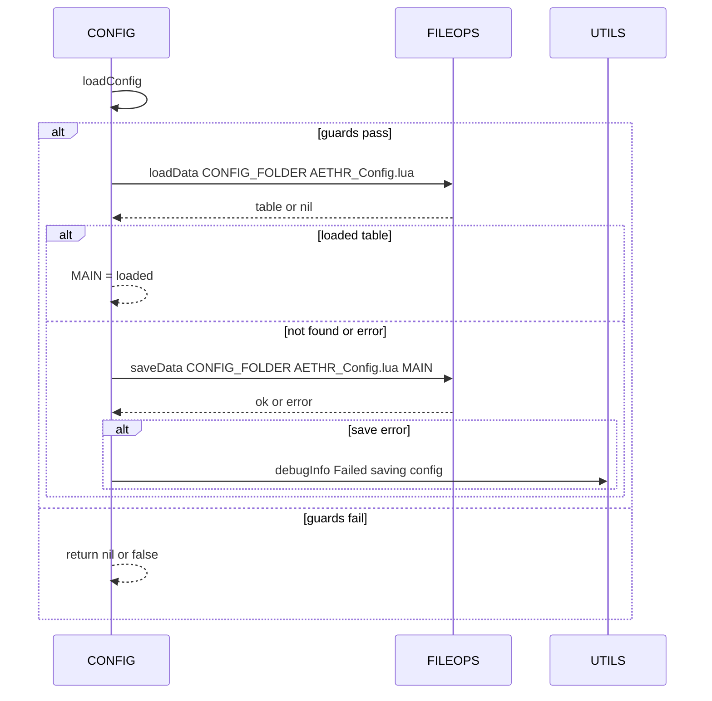
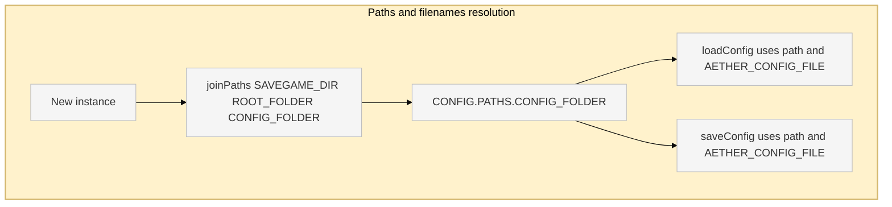

# AETHR CONFIG diagrams and flows

Primary anchors
- [AETHR.CONFIG:initConfig()](../../dev/CONFIG_.lua:364)
- [AETHR.CONFIG:loadConfig()](../../dev/CONFIG_.lua:380)
- [AETHR.CONFIG:saveConfig()](../../dev/CONFIG_.lua:404)

Related code anchors
- AETHR paths at creation: [AETHR:New()](../../dev/AETHR.lua:65), [dev/AETHR.lua](../../dev/AETHR.lua:125)
- FILE I/O: [AETHR.FILEOPS:loadData()](../../dev/FILEOPS_.lua:173), [AETHR.FILEOPS:saveData()](../../dev/FILEOPS_.lua:155)
- Debug logging: [AETHR.UTILS:debugInfo()](../../dev/UTILS.lua:79)

Documents and indices
- Master diagrams index: [docs/README.md](../README.md)
- AETHR overview: [docs/aethr/README.md](../aethr/README.md)

Init and persistence flow

```mermaid
%% shared theme: docs/_mermaid/theme.json %%
flowchart TB
  subgraph INIT_FLOW [Init and persistence flow]
    I[initConfig] --> T[Try loadConfig]
    T -- "ok and table" --> R[Replace MAIN with loaded]
    T -- "nil or error" --> P[Persist defaults via saveConfig]
    R --> RET[return self]
    P --> RET
  end

  class I,T,R,P class-step;
  class RET class-result;
```

Storage guards and calls



Paths and filenames resolution



Source anchors
- [AETHR.CONFIG:initConfig()](../../dev/CONFIG_.lua:364)
- [AETHR.CONFIG:loadConfig()](../../dev/CONFIG_.lua:380)
- [AETHR.CONFIG:saveConfig()](../../dev/CONFIG_.lua:404)
- [AETHR:New()](../../dev/AETHR.lua:65)
- [AETHR.FILEOPS:joinPaths()](../../dev/FILEOPS_.lua:37)
- [AETHR.FILEOPS:loadData()](../../dev/FILEOPS_.lua:173)
- [AETHR.FILEOPS:saveData()](../../dev/FILEOPS_.lua:155)
- [AETHR.UTILS:debugInfo()](../../dev/UTILS.lua:79)

Notes
- Mermaid labels avoid double quotes and parentheses.
- All diagrams use GitHub Mermaid fenced blocks.
## Breakout documents

Detailed CONFIG analysis pages with Mermaid diagrams and sequence charts.

- Init and persistence: [init_and_persistence.md](./init_and_persistence.md)
- Paths and filenames: [paths_and_filenames.md](./paths_and_filenames.md)
- Main schema: [main_schema.md](./main_schema.md)
- Flags and counters: [flags_counters.md](./flags_counters.md)
- Zone paint and bounds: [zone_paint_and_bounds.md](./zone_paint_and_bounds.md)
- World bounds and divisions: [world_bounds_and_divisions.md](./world_bounds_and_divisions.md)
- OutText settings: [out_text.md](./out_text.md)
- Save chunks strategy: [save_chunks.md](./save_chunks.md)

High-level overview

```mermaid
%% shared theme: docs/_mermaid/theme.json %%
flowchart TB
  subgraph START [Startup overview]
    New[AETHR New] --> Paths[Compute CONFIG PATHS]
    Init[AETHR Init] --> Zones[ZONE_MANAGER init]
    Init --> World[WORLD init divisions and caches]
    Init --> Config[CONFIG initConfig]
    Config --> Load[loadConfig]
    Load -- "ok table" --> Use[Use loaded MAIN]
    Load -- "nil" --> Save[saveConfig defaults]
  end

  class New,Paths,Init,Zones,World,Config,Load class-step;
  class Use,Save class-result;
```