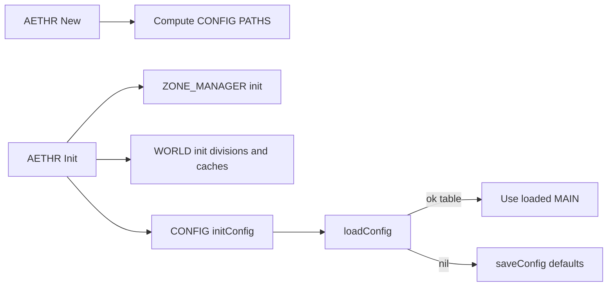

# AETHR CONFIG diagrams and flows

Primary anchors
- [AETHR.CONFIG:initConfig()](../../dev/CONFIG_.lua:364)
- [AETHR.CONFIG:loadConfig()](../../dev/CONFIG_.lua:380)
- [AETHR.CONFIG:saveConfig()](../../dev/CONFIG_.lua:404)

Related code anchors
- AETHR paths at creation: [AETHR:New()](../../dev/AETHR.lua:65), [dev/AETHR.lua](../../dev/AETHR.lua:125)
- FILE I/O: [AETHR.FILEOPS:loadData()](../../dev/FILEOPS_.lua:173), [AETHR.FILEOPS:saveData()](../../dev/FILEOPS_.lua:155)
- Debug logging: [AETHR.UTILS:debugInfo()](../../dev/UTILS.lua:79)

Documents and indices
- Master diagrams index: [docs/README.md](../README.md)
- AETHR overview: [docs/aethr/README.md](../aethr/README.md)

Init and persistence flow


Storage guards and calls

```mermaid
sequenceDiagram
  participant C as CONFIG
  participant F as FILEOPS
  participant U as UTILS
  C->>C: loadConfig
  alt guards pass
    C->>F: loadData CONFIG_FOLDER AETHR_Config.lua
    F-->>C: table or nil
    opt success path
      C-->>C: MAIN = loaded
    end
    opt failure path
      C->>F: saveData CONFIG_FOLDER AETHR_Config.lua MAIN
      F-->>C: ok or error
      opt error
        C->>U: debugInfo Failed saving config
      end
  else guards fail
    C-->>C: return nil or false
  end
```

Paths and filenames resolution


Source anchors
- [AETHR.CONFIG:initConfig()](../../dev/CONFIG_.lua:364)
- [AETHR.CONFIG:loadConfig()](../../dev/CONFIG_.lua:380)
- [AETHR.CONFIG:saveConfig()](../../dev/CONFIG_.lua:404)
- [AETHR:New()](../../dev/AETHR.lua:65)
- [AETHR.FILEOPS:joinPaths()](../../dev/FILEOPS_.lua:37)
- [AETHR.FILEOPS:loadData()](../../dev/FILEOPS_.lua:173)
- [AETHR.FILEOPS:saveData()](../../dev/FILEOPS_.lua:155)
- [AETHR.UTILS:debugInfo()](../../dev/UTILS.lua:79)

Notes
- Mermaid labels avoid double quotes and parentheses.
- All diagrams use GitHub Mermaid fenced blocks.
## Breakout documents

Detailed CONFIG analysis pages with Mermaid diagrams and sequence charts.

- Init and persistence: [init_and_persistence.md](./init_and_persistence.md)
- Paths and filenames: [paths_and_filenames.md](./paths_and_filenames.md)
- Main schema: [main_schema.md](./main_schema.md)
- Flags and counters: [flags_counters.md](./flags_counters.md)
- Zone paint and bounds: [zone_paint_and_bounds.md](./zone_paint_and_bounds.md)
- World bounds and divisions: [world_bounds_and_divisions.md](./world_bounds_and_divisions.md)
- OutText settings: [out_text.md](./out_text.md)
- Save chunks strategy: [save_chunks.md](./save_chunks.md)

High-level overview

