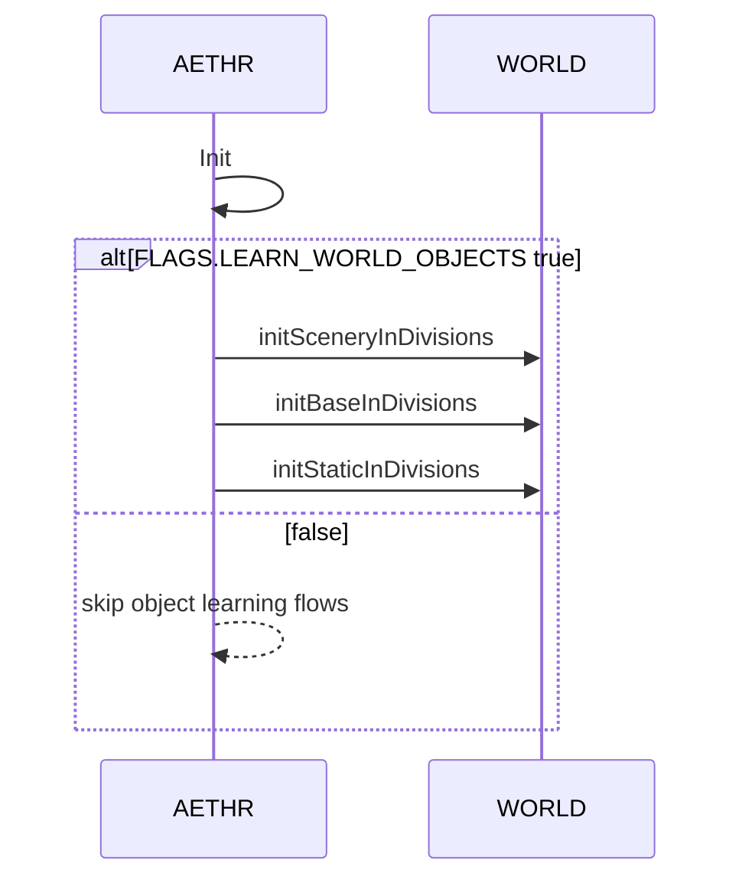
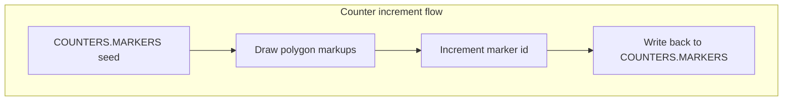

# AETHR CONFIG flags and counters

 Operational semantics for feature flags and monotonic counters in CONFIG. Explains where they are read and how they influence runtime behavior.

## Source anchors

- Flags schema and defaults
  - [AETHR.CONFIG.Flags](../../dev/CONFIG_.lua:92)
  - [FLAGS defaults in MAIN](../../dev/CONFIG_.lua:185)
- Counters schema and defaults
  - [AETHR.CONFIG.Counters](../../dev/CONFIG_.lua:98)
  - [COUNTERS defaults in MAIN](../../dev/CONFIG_.lua:191)
- Debug behavior
  - [AETHR.UTILS:isDebug()](../../dev/UTILS.lua:70)
- Flag usage during init
  - [AETHR:Init() gating LEARN_WORLD_OBJECTS](../../dev/AETHR.lua:225)
- Counter usage example
  - [AETHR.WORLD:markWorldDivisions()](../../dev/WORLD.lua:279)

## Flags overview

- AETHR_FIRST_RUN
- AETHR_LEARNING_MODE
- AETHR_DEBUG_MODE
- LEARN_WORLD_OBJECTS

Note: UTILS checks debug via MAIN.DEBUG_ENABLED rather than FLAGS.AETHR_DEBUG_MODE; see [AETHR.UTILS:isDebug()](../../dev/UTILS.lua:70). Keep FLAGS.AETHR_DEBUG_MODE available for mission-level toggles while using MAIN.DEBUG_ENABLED to activate logging.

# Gating flows

LEARN_WORLD_OBJECTS controls whether world object discovery and per-division caches are initialized.

- Gate location: [AETHR:Init()](../../dev/AETHR.lua:225)

Debug controls

- Set MAIN.DEBUG_ENABLED to true to enable UTILS debug emissions; see [AETHR.UTILS:isDebug()](../../dev/UTILS.lua:70)
- FILEOPS and WORLD guard debug log lines with MAIN.DEBUG_ENABLED checks in their code paths

# Counters lifecycle

COUNTERS provide monotonic seeds for IDs such as map markers. Example usage increments the MARKERS counter during world division rendering.

# Example path

- Start: COUNTERS.MARKERS provided by [COUNTERS defaults](../../dev/CONFIG_.lua:191)
- Consumed in [AETHR.WORLD:markWorldDivisions()](../../dev/WORLD.lua:279) where polygons are emitted and the counter is incremented at the end

# Ownership and visualization interactions

Flags and counters indirectly affect zone visuals:
- Counters ensure unique IDs when rendering divisions and zone assets
- Paint settings are separate and covered in [zone_paint_and_bounds.md](./zone_paint_and_bounds.md)
- Ownership updates do not directly use FLAGS, but messages and visuals use MAIN settings

# Flag and counter change management

- Persisted via [AETHR.CONFIG:saveConfig()](../../dev/CONFIG_.lua:404) when configuration is saved
- Safe to adjust between runs; flags are read on each Init
- Prefer changing MAIN.DEBUG_ENABLED for logging rather than FLAGS.AETHR_DEBUG_MODE to align with current UTILS behavior

# Validation checklist

- LEARN_WORLD_OBJECTS gating present at [AETHR:Init()](../../dev/AETHR.lua:225)
- Counter increment pattern present in [AETHR.WORLD:markWorldDivisions()](../../dev/WORLD.lua:279)
- Debug checks use [AETHR.UTILS:isDebug()](../../dev/UTILS.lua:70)

# Related breakouts

- Init and persistence: [init_and_persistence.md](./init_and_persistence.md)
- Zone paint and bounds: [zone_paint_and_bounds.md](./zone_paint_and_bounds.md)
- Paths and filenames: [paths_and_filenames.md](./paths_and_filenames.md)