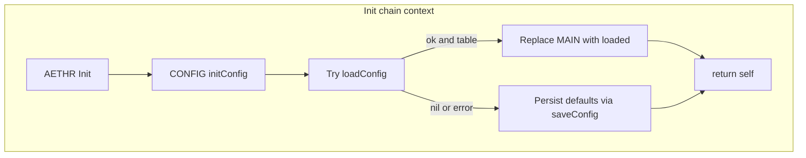
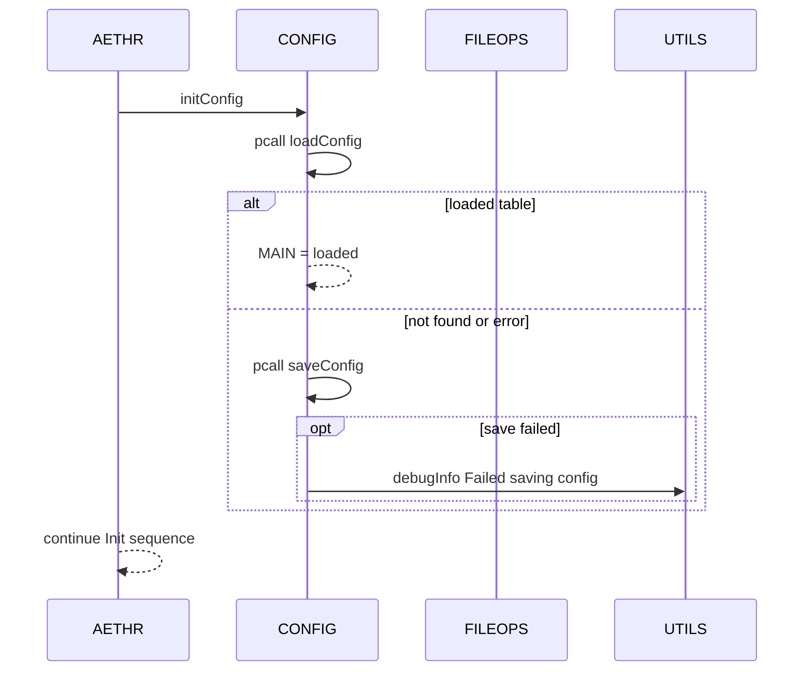
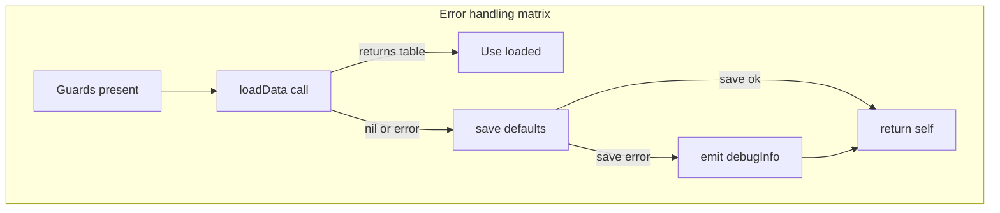

# AETHR CONFIG init and persistence

Deep-dive breakout for initialization, load and save logic in CONFIG. Targets stability, guards, and interactions with FILEOPS and UTILS.

## Source anchors

- [AETHR.CONFIG:initConfig()](https://github.com/Gh0st352/AETHR/blob/main/dev/CONFIG_.lua#L364)
- [AETHR.CONFIG:loadConfig()](https://github.com/Gh0st352/AETHR/blob/main/dev/CONFIG_.lua#L380)
- [AETHR.CONFIG:saveConfig()](https://github.com/Gh0st352/AETHR/blob/main/dev/CONFIG_.lua#L404)
- [AETHR:Init()](https://github.com/Gh0st352/AETHR/blob/main/dev/AETHR.lua#L199)
- [AETHR.FILEOPS:loadData()](https://github.com/Gh0st352/AETHR/blob/main/dev/FILEOPS_.lua#L173), [AETHR.FILEOPS:saveData()](https://github.com/Gh0st352/AETHR/blob/main/dev/FILEOPS_.lua#L155)
- [AETHR.UTILS:debugInfo()](https://github.com/Gh0st352/AETHR/blob/main/dev/UTILS.lua#L79)

## Overview

initConfig performs a best effort load of persisted MAIN configuration and falls back to persisting defaults when not present. All operations are guarded to avoid nil dereferences and sandbox issues.

# Init chain context

# Sequence of calls

# Guarding and failure modes

- loadConfig returns nil when STORAGE or PATHS or filenames are missing
- saveConfig returns false on guard failure or FILEOPS save error
- Both load and save are wrapped in pcall to avoid breaking mission startup flow
- Debug logging is conditional via DEBUG_ENABLED and routed through UTILS

# Data resolved at AETHR construction

- [AETHR:New()](https://github.com/Gh0st352/AETHR/blob/main/dev/AETHR.lua#L65) resolves SAVEGAME_DIR and computes CONFIG_FOLDER path using [AETHR.FILEOPS:joinPaths()](https://github.com/Gh0st352/AETHR/blob/main/dev/FILEOPS_.lua#L37)
- [AETHR:Init()](https://github.com/Gh0st352/AETHR/blob/main/dev/AETHR.lua#L199) ensures subfolder directories exist via [AETHR.FILEOPS:ensureDirectory()](https://github.com/Gh0st352/AETHR/blob/main/dev/FILEOPS_.lua#L46) and caches PATHS

# Detailed logic per function

[AETHR.CONFIG:initConfig()](https://github.com/Gh0st352/AETHR/blob/main/dev/CONFIG_.lua#L364)
- Calls loadConfig in protected mode
- On table result, replaces self.MAIN with persisted data
- Otherwise attempts to persist current defaults
- Returns self for chaining

[AETHR.CONFIG:loadConfig()](https://github.com/Gh0st352/AETHR/blob/main/dev/CONFIG_.lua#L380)
- Guards against missing self.MAIN.STORAGE.PATHS
- Resolves mapPath and filename from PATHS.CONFIG_FOLDER and FILENAMES.AETHER_CONFIG_FILE
- Delegates to [AETHR.FILEOPS:loadData()](https://github.com/Gh0st352/AETHR/blob/main/dev/FILEOPS_.lua#L173)
- Returns table on success or nil on failure

[AETHR.CONFIG:saveConfig()](https://github.com/Gh0st352/AETHR/blob/main/dev/CONFIG_.lua#L404)
- Guards against missing self.MAIN.STORAGE.PATHS
- Resolves mapPath and filename as above
- Delegates to [AETHR.FILEOPS:saveData()](https://github.com/Gh0st352/AETHR/blob/main/dev/FILEOPS_.lua#L155) inside pcall
- On error, logs via [AETHR.UTILS:debugInfo()](https://github.com/Gh0st352/AETHR/blob/main/dev/UTILS.lua#L79) when available
- Returns true on success, false on error

# Error handling matrix

# Persistence file and directory

- Directory resolution: PATHS.CONFIG_FOLDER built from SAVEGAME_DIR ROOT_FOLDER CONFIG_FOLDER
- Filename: FILENAMES.AETHER_CONFIG_FILE set to AETHR_Config.lua
- Files are Lua-serialized via IO helpers behind FILEOPS

# Notes on design decisions

- Treat missing config as first run and seed disk with stable defaults
- Prefer minimal deps inside CONFIG; all file logic is in FILEOPS
- Use shallow instance copies to avoid prototype mutation during [AETHR:New()](https://github.com/Gh0st352/AETHR/blob/main/dev/AETHR.lua#L65)

# Related breakouts

- Paths and filenames: [paths_and_filenames.md](./paths_and_filenames.md)
- Main schema: [main_schema.md](./main_schema.md)
- Save chunks strategy: [save_chunks.md](./save_chunks.md)

# Validation checklist

- Code anchors verified against current HEAD
  - [AETHR.CONFIG:initConfig()](https://github.com/Gh0st352/AETHR/blob/main/dev/CONFIG_.lua#L364)
  - [AETHR.CONFIG:loadConfig()](https://github.com/Gh0st352/AETHR/blob/main/dev/CONFIG_.lua#L380)
  - [AETHR.CONFIG:saveConfig()](https://github.com/Gh0st352/AETHR/blob/main/dev/CONFIG_.lua#L404)
  - [AETHR:Init()](https://github.com/Gh0st352/AETHR/blob/main/dev/AETHR.lua#L199)

# Conventions

- Mermaid fenced blocks with GitHub parser
- Labels avoid double quotes and parentheses inside brackets
- All links use relative paths for portability