# AETHR CONFIG main schema

Structure and relationships for AETHR.CONFIG.MAIN and its nested types.

# Source anchors

- Types and schema definitions
  - [AETHR.CONFIG.Color](../../dev/CONFIG_.lua:33)
  - [AETHR.CONFIG.SubFolders](../../dev/CONFIG_.lua:39)
  - [AETHR.CONFIG.Paths](../../dev/CONFIG_.lua:46)
  - [AETHR.CONFIG.Filenames](../../dev/CONFIG_.lua:54)
  - [AETHR.CONFIG.Storage](../../dev/CONFIG_.lua:71)
  - [AETHR.CONFIG.AxisRange](../../dev/CONFIG_.lua:79)
  - [AETHR.CONFIG.BoundsCoord](../../dev/CONFIG_.lua:83)
  - [AETHR.CONFIG.MizZones](../../dev/CONFIG_.lua:87)
  - [AETHR.CONFIG.Flags](../../dev/CONFIG_.lua:92)
  - [AETHR.CONFIG.Counters](../../dev/CONFIG_.lua:98)
  - [AETHR.CONFIG.PaintColors](../../dev/CONFIG_.lua:107)
  - [AETHR.CONFIG.GameBoundsSettings](../../dev/CONFIG_.lua:116)
  - [AETHR.CONFIG.ZoneSettings](../../dev/CONFIG_.lua:124)
  - [AETHR.CONFIG.OutTextSection](../../dev/CONFIG_.lua:130)
  - [AETHR.CONFIG.OutTextSettings](../../dev/CONFIG_.lua:134)
  - [AETHR.CONFIG.MAIN class doc](../../dev/CONFIG_.lua:138)
  - [AETHR.CONFIG.MAIN.saveChunks](../../dev/CONFIG_.lua:159)
- MAIN defaults table
  - [AETHR.CONFIG.MAIN = { ... }](../../dev/CONFIG_.lua:164)

# Overview

The MAIN config table defines user facing defaults, storage layout, visualization settings, world bounds, saving behavior and runtime toggles. Submodules consume specific parts of MAIN during AETHR initialization and at runtime.

# High level relationships

# Class diagram

```mermaid
%% shared theme: docs/_mermaid/theme.json %%
classDiagram
  %% Simplified member type annotations to ensure GitHub Mermaid compatibility.
  class CONFIG_MAIN {
    VERSION : string
    AUTHOR : string
    GITHUB : string
    THEATER : string
    DESCRIPTION : stringArray
    MISSION_ID : string
    DEBUG_ENABLED : boolean
    DefaultRedCountry : number
    DefaultBlueCountry : number
    spawnTemplateSearchString : string
    MIZ_ZONES : MizZones
    FLAGS : Flags
    COUNTERS : Counters
    STORAGE : Storage
    worldDivisionArea : number
    worldBounds : map
    Zone : ZoneSettings
    saveChunks : SaveChunks
    outTextSettings : OutTextSettings
  }

  class MizZones {
    ALL : stringArray
    REDSTART : stringArray
    BLUESTART : stringArray
  }

  class Flags {
    AETHR_FIRST_RUN : boolean
    AETHR_LEARNING_MODE : boolean
    AETHR_DEBUG_MODE : boolean
    LEARN_WORLD_OBJECTS : boolean
  }

  class Counters {
    MARKERS : number
    UNITS : number
    GROUPS : number
    OBJECTS : number
    SCENERY_OBJECTS : number
    STATIC_OBJECTS : number
    DYNAMIC_SPAWNERS : number
  }

  class Storage {
    SAVEGAME_DIR : string
    ROOT_FOLDER : string
    CONFIG_FOLDER : string
    SUB_FOLDERS : SubFolders
    PATHS : Paths
    FILENAMES : Filenames
  }

  class SubFolders {
    LEARNING_FOLDER : string
    MAP_FOLDER : string
    UNITS_FOLDER : string
    OBJECTS_FOLDER : string
    USER_FOLDER : string
  }

  class Paths {
    LEARNING_FOLDER : string
    CONFIG_FOLDER : string
    MAP_FOLDER : string
    UNITS_FOLDER : string
    OBJECTS_FOLDER : string
    USER_FOLDER : string
  }

  class Filenames {
    AETHER_CONFIG_FILE : string
    WORLD_DIVISIONS_AABB : string
    WORLD_DIVISIONS_FILE : string
    USER_STORAGE_FILE : string
    AIRBASES_FILE : string
    MIZ_ZONES_FILE : string
    SAVE_DIVS_FILE : string
    OBJECTS_FILE : string
    SCENERY_OBJECTS_FILE : string
    STATIC_OBJECTS_FILE : string
    BASE_OBJECTS_FILE : string
    GAME_BOUNDS_FILE : string
    MIZ_CACHE_DB : string
    TOWN_CLUSTERS_FILE : string
    SPAWNER_TEMPLATE_DB : string
    SPAWNER_ATTRIBUTE_DB : string
    _SPAWNER_ATTRIBUTE_DB : string
    SPAWNER_UNIT_CACHE_DB : string
  }

  class AxisRange {
    min : number
    max : number
  }

  class BoundsCoord {
    X : AxisRange
    Z : AxisRange
  }

  class Color {
    r : number
    g : number
    b : number
    a : number
  }

  class PaintColors {
    LineColors : map
    FillColors : map
    ArrowColors : map
    CircleColors : map
    FillAlpha : number
    LineAlpha : number
    lineType : number
  }

  class GameBoundsSettings {
    LineColors : Color
    FillColors : Color
    FillAlpha : number
    LineAlpha : number
    lineType : number
    getOutOfBounds : table
  }

  class ZoneSettings {
    paintColors : PaintColors
    gameBounds : GameBoundsSettings
    BorderOffsetThreshold : number
    ArrowLength : number
  }

  class OutTextSection {
    displayTime : number
    clearView : boolean
  }

  class OutTextSettings {
    airbaseOwnershipChange : OutTextSection
    zoneOwnershipChange : OutTextSection
  }

  class SaveChunks {
    divObjects : number
    townDB : number
  }

  %% Relationships
  CONFIG_MAIN --> MizZones
  CONFIG_MAIN --> Flags
  CONFIG_MAIN --> Counters
  CONFIG_MAIN --> Storage
  CONFIG_MAIN --> ZoneSettings
  CONFIG_MAIN --> OutTextSettings
  CONFIG_MAIN --> SaveChunks
  Storage --> SubFolders
  Storage --> Paths
  Storage --> Filenames
  BoundsCoord --> AxisRange
  ZoneSettings --> PaintColors
  ZoneSettings --> GameBoundsSettings
  PaintColors --> Color
  GameBoundsSettings --> Color

  %% Visual styling via shared class buckets (no inline styling)
  class CONFIG_MAIN class_data
  class MizZones class_data
  class Flags class_data
  class Counters class_data
  class Storage class_data
  class SubFolders class_data
  class Paths class_data
  class Filenames class_data
  class AxisRange class_data
  class BoundsCoord class_data
  class GameBoundsSettings class_data
  class class_data class_data
  class Color class_data
  class PaintColors class_data
  class ZoneSettings class_data
  class OutTextSection class_data
  class OutTextSettings class_data
  class SaveChunks class_data
```

# Consumption by modules

Key usage links

- WORLD uses bounds and division sizing
  - [AETHR.WORLD:generateWorldDivisions()](../../dev/WORLD.lua:1156)
  - [AETHR.WORLD:initWorldDivisions()](../../dev/WORLD.lua:1176)
- ZONE_MANAGER uses paint and arrow settings
  - See zone pages: [markers_and_arrows.md](../zone_manager/markers_and_arrows.md), [game_bounds.md](../zone_manager/game_bounds.md)
- FILEOPS and AETHR wiring compute paths and ensure directories
  - [AETHR:New() path join](../../dev/AETHR.lua:125)
  - [AETHR:Init() path ensure](../../dev/AETHR.lua:199)
  - [AETHR.FILEOPS:joinPaths()](../../dev/FILEOPS_.lua:37), [AETHR.FILEOPS:ensureDirectory()](../../dev/FILEOPS_.lua:46)

Notes

- worldBounds is a map of supported theaters to coordinate ranges X Z as AxisRange
- Zone.paintColors index 0 1 2 aligns with coalition mapping used by WORLD update flows
- saveChunks guides chunk sizes used in FILEOPS split and join helpers

Related breakouts

- Init and persistence: [init_and_persistence.md](./init_and_persistence.md)
- Paths and filenames: [paths_and_filenames.md](./paths_and_filenames.md)
- Flags and counters: [flags_counters.md](./flags_counters.md)
- Zone paint and bounds: [zone_paint_and_bounds.md](./zone_paint_and_bounds.md)
- World bounds and divisions: [world_bounds_and_divisions.md](./world_bounds_and_divisions.md)
- Out text settings: [out_text.md](./out_text.md)
- Save chunks: [save_chunks.md](./save_chunks.md)

Conventions

- GitHub Mermaid fenced blocks
- Avoid double quotes and parentheses inside bracket labels
- Relative anchors to source with stable line references