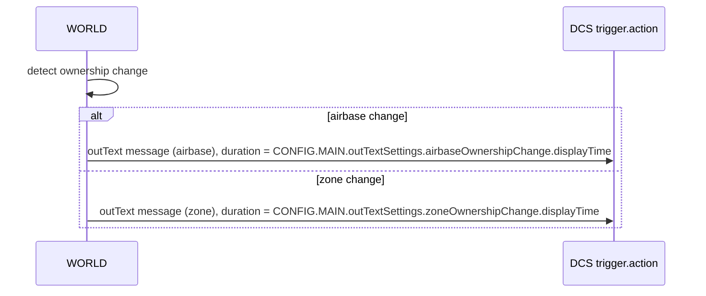

# AETHR CONFIG outText settings

Display timings and view-clearing behavior for ownership change messages.

## Source anchors

- Types and schema
  - [AETHR.CONFIG.OutTextSection](../../dev/CONFIG_.lua:130)
  - [AETHR.CONFIG.OutTextSettings](../../dev/CONFIG_.lua:134)
- Defaults block
  - outTextSettings defaults: [dev/CONFIG_.lua](../../dev/CONFIG_.lua:336)
- Runtime consumers
  - [AETHR.WORLD.airbaseOwnershipChanged()](../../dev/WORLD.lua:970)
  - [AETHR.WORLD.zoneOwnershipChanged()](../../dev/WORLD.lua:1006)

# Overview

The outText settings define how long messages appear and whether prior messages are cleared when airbase or zone ownership changes. WORLD emits outText in those change handlers using the configured durations and clearView flags.

# Structure

- OutTextSection
  - displayTime number
  - clearView boolean
- OutTextSettings
  - airbaseOwnershipChange OutTextSection
  - zoneOwnershipChange OutTextSection

# Defaults

```text
airbaseOwnershipChange:
  displayTime = 10
  clearView   = false
zoneOwnershipChange:
  displayTime = 10
  clearView   = false
```

# Ownership change flow



- Airbase flow in [AETHR.WORLD.airbaseOwnershipChanged()](../../dev/WORLD.lua:970)
  - Emits capture or contested text using enums and [trigger.action.outText](../../dev/WORLD.lua:994)
- Zone flow in [AETHR.WORLD.zoneOwnershipChanged()](../../dev/WORLD.lua:1006)
  - Emits capture or contested text at [dev/WORLD.lua](../../dev/WORLD.lua:1035)

# Message composition

- Uses enum text strings to build user-facing messages
- Duration and clearing behavior sourced directly from CONFIG.MAIN.outTextSettings

# Related breakouts

- Main schema: [main_schema.md](./main_schema.md)
- Init and persistence: [init_and_persistence.md](./init_and_persistence.md)

# Validation checklist

- OutTextSection defined at [dev/CONFIG_.lua](../../dev/CONFIG_.lua:130)
- OutTextSettings defined at [dev/CONFIG_.lua](../../dev/CONFIG_.lua:134)
- Defaults present at [dev/CONFIG_.lua](../../dev/CONFIG_.lua:336)
- Airbase handler at [AETHR.WORLD.airbaseOwnershipChanged()](../../dev/WORLD.lua:970)
- Zone handler at [AETHR.WORLD.zoneOwnershipChanged()](../../dev/WORLD.lua:1006)

# Conventions

- Mermaid fenced blocks with GitHub parser
- Labels avoid double quotes and parentheses inside bracket labels
- Relative links with line anchors to source