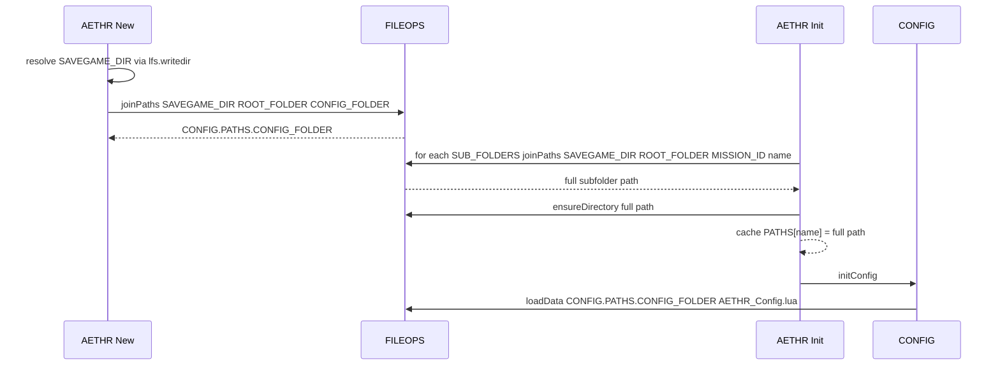

# AETHR CONFIG paths and filenames

How writable paths and filenames are computed and used during initialization and persistence.

Source anchors

- [AETHR:New()](../../dev/AETHR.lua:65)
- [Path join in AETHR:New](../../dev/AETHR.lua:125)
- [AETHR:Init()](../../dev/AETHR.lua:199)
- [AETHR.FILEOPS:joinPaths()](../../dev/FILEOPS_.lua:37)
- [AETHR.FILEOPS:ensureDirectory()](../../dev/FILEOPS_.lua:46)
- [AETHR.FILEOPS:ensureFile()](../../dev/FILEOPS_.lua:120)
- [AETHR.CONFIG.MAIN STORAGE defaults in dev/CONFIG_.lua](../../dev/CONFIG_.lua:200)

Context

- SAVEGAME_DIR is resolved at instance construction in [AETHR:New()](../../dev/AETHR.lua:65)
- CONFIG_FOLDER path is assembled via [AETHR.FILEOPS:joinPaths()](../../dev/FILEOPS_.lua:37)
- Subfolder paths are constructed during [AETHR:Init()](../../dev/AETHR.lua:199) and ensured via [AETHR.FILEOPS:ensureDirectory()](../../dev/FILEOPS_.lua:46)
- CONFIG persistence reads and writes use PATHS.CONFIG_FOLDER and FILENAMES.AETHER_CONFIG_FILE

Path assembly overview

```mermaid
%% shared theme: docs/_mermaid/theme.json %%
flowchart TB
  subgraph PATH_ASSEMBLY [Path assembly overview]
    S[SAVEGAME_DIR] --> R[ROOT_FOLDER]
    R --> C[CONFIG_FOLDER name]
    C --> CFG_PATH[CONFIG.PATHS.CONFIG_FOLDER]
    S --> MISSION[MISSION_ID]
    MISSION --> SUBS[SUB_FOLDERS]
    SUBS --> PATHS_CACHED[Populate PATHS per subfolder]
    PATHS_CACHED --> ENSURE[ensureDirectory per path]
  end

  class S,R,C,CFG_PATH,MISSION,SUBS,PATHS_CACHED,ENSURE class-step;
```

Sequence across construction and init



Subfolders to PATHS mapping

- SUB_FOLDERS.LEARNING_FOLDER -> PATHS.LEARNING_FOLDER
- SUB_FOLDERS.MAP_FOLDER -> PATHS.MAP_FOLDER
- SUB_FOLDERS.UNITS_FOLDER -> PATHS.UNITS_FOLDER
- SUB_FOLDERS.OBJECTS_FOLDER -> PATHS.OBJECTS_FOLDER
- SUB_FOLDERS.USER_FOLDER -> PATHS.USER_FOLDER
- Additionally CONFIG_FOLDER is a separate top level folder under ROOT_FOLDER used for persisted configuration

CONFIG persistence filenames

- AETHER_CONFIG_FILE: AETHR_Config.lua
- WORLD_DIVISIONS_AABB: worldDivisionsAABB.lua
- WORLD_DIVISIONS_FILE: worldDivisions.lua
- USER_STORAGE_FILE: userStorage.lua
- AIRBASES_FILE: airbases.lua
- MIZ_ZONES_FILE: mizZones.lua
- SAVE_DIVS_FILE: saveDivs.lua
- OBJECTS_FILE: objects.lua
- SCENERY_OBJECTS_FILE: sceneryObjects.lua
- STATIC_OBJECTS_FILE: staticObjects.lua
- BASE_OBJECTS_FILE: baseObjects.lua
- GAME_BOUNDS_FILE: gameBounds.lua
- MIZ_CACHE_DB: mizCacheDB.lua
- TOWN_CLUSTERS_FILE: townClusters.lua
- SPAWNER_TEMPLATE_DB: spawnerTemplateDB.lua
- SPAWNER_ATTRIBUTE_DB: spawnerAttributesDB.lua
- _SPAWNER_ATTRIBUTE_DB: _spawnerAttributesDB.lua
- SPAWNER_UNIT_CACHE_DB: spawnerUnitInfoCache.lua

CONFIG folder vs mission subfolders

```mermaid
%% shared theme: docs/_mermaid/theme.json %%
flowchart TB
  subgraph CFG_VS_MISSION [CONFIG folder vs mission subfolders]
    WD[Writable root SAVEGAME_DIR] --> RF[ROOT_FOLDER AETHR]
    RF --> CFGN[CONFIG folder name]
    CFGN --> CFGP[PATHS.CONFIG_FOLDER]
    RF --> MID[MISSION_ID]
    MID --> SUBS[SUB_FOLDERS names]
    SUBS --> M1[PATHS.LEARNING_FOLDER]
    SUBS --> M2[PATHS.MAP_FOLDER]
    SUBS --> M3[PATHS.UNITS_FOLDER]
    SUBS --> M4[PATHS.OBJECTS_FOLDER]
    SUBS --> M5[PATHS.USER_FOLDER]
  end

  class WD,RF,CFGN,CFGP,MID,SUBS,M1,M2,M3,M4,M5 class-step;
```

Edge cases and guards

- If lfs is not available, SAVEGAME_DIR remains fallback value; joins still occur using system separator
- ensureDirectory tolerates sandboxed environments and attempts OS mkdir fallback
- loadData and saveData are guarded with pcall in CONFIG to avoid hard failures

Validation checklist

- [AETHR:New()](../../dev/AETHR.lua:65) constructs CONFIG.PATHS.CONFIG_FOLDER using [AETHR.FILEOPS:joinPaths()](../../dev/FILEOPS_.lua:37) at [path join in AETHR:New](../../dev/AETHR.lua:125)
- [AETHR:Init()](../../dev/AETHR.lua:199) iterates SUB_FOLDERS and calls [AETHR.FILEOPS:ensureDirectory()](../../dev/FILEOPS_.lua:46) after join
- CONFIG persistence uses PATHS.CONFIG_FOLDER and [AETHR.CONFIG:loadConfig()](../../dev/CONFIG_.lua:380) and [AETHR.CONFIG:saveConfig()](../../dev/CONFIG_.lua:404)

Related breakouts

- Init and persistence: [init_and_persistence.md](./init_and_persistence.md)
- Main schema: [main_schema.md](./main_schema.md)
- Save chunks: [save_chunks.md](./save_chunks.md)

Conventions

- Mermaid fenced blocks with GitHub parser
- Labels avoid double quotes and parentheses inside brackets
- All links use relative paths and line anchors where applicable