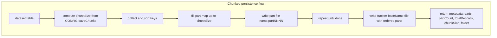
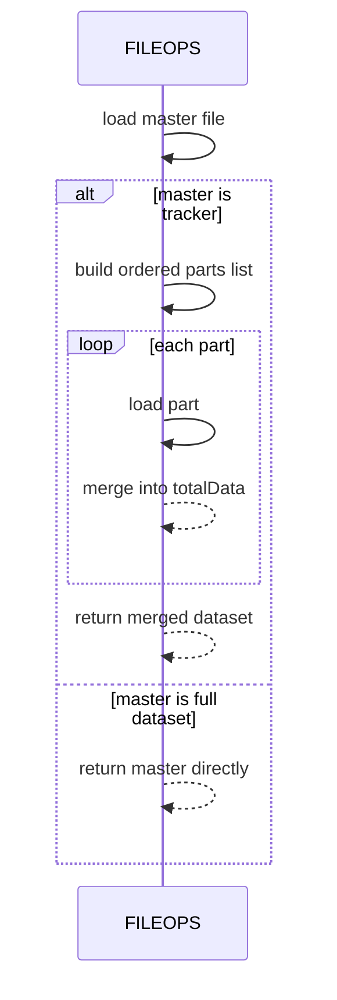
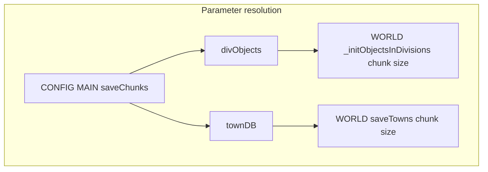

# AETHR CONFIG save chunks

Chunked persistence strategy for large datasets using FILEOPS split and tracker files. Covers configuration knobs and runtime usage sites.

# Source anchors

- Config schema and defaults
  - [AETHR.CONFIG.MAIN.saveChunks](https://github.com/Gh0st352/AETHR/blob/main/dev/CONFIG_.lua#L240)
  - [AETHR.CONFIG.MAIN.saveChunks class doc](https://github.com/Gh0st352/AETHR/blob/main/dev/CONFIG_.lua#L159)
- FILEOPS implementations
  - [AETHR.FILEOPS:splitAndSaveData()](https://github.com/Gh0st352/AETHR/blob/main/dev/FILEOPS_.lua#L246)
  - [AETHR.FILEOPS:loadandJoinData()](https://github.com/Gh0st352/AETHR/blob/main/dev/FILEOPS_.lua#L329)
- WORLD usage sites
  - Division objects init helper: [AETHR.WORLD:_initObjectsInDivisions()](https://github.com/Gh0st352/AETHR/blob/main/dev/WORLD.lua#L1395)
  - Towns persistence: [AETHR.WORLD:saveTowns()](https://github.com/Gh0st352/AETHR/blob/main/dev/WORLD.lua#L1541)
  - Towns load: [AETHR.WORLD:loadTowns()](https://github.com/Gh0st352/AETHR/blob/main/dev/WORLD.lua#L1529)

# Overview

When datasets are large, AETHR writes them in deterministic parts with a tracker file listing the parts. Chunk sizes are configured in CONFIG.MAIN.saveChunks. FILEOPS merges parts transparently on reads using the tracker or returns the full dataset when no tracker is used.

# Configuration

- saveChunks.divObjects: number of objects per part when writing per-division object maps
- saveChunks.townDB: number of town clusters per part

# Flow overview

# Read sequence

# WORLD integrations

- Division objects per active division
  - Helper: [AETHR.WORLD:_initObjectsInDivisions()](https://github.com/Gh0st352/AETHR/blob/main/dev/WORLD.lua#L1395)
  - Uses [AETHR.FILEOPS:loadandJoinData()](https://github.com/Gh0st352/AETHR/blob/main/dev/FILEOPS_.lua#L329) to read existing parts
  - Falls back to computing found objects and persists via [AETHR.FILEOPS:splitAndSaveData()](https://github.com/Gh0st352/AETHR/blob/main/dev/FILEOPS_.lua#L246) with chunk size from CONFIG.MAIN.saveChunks.divObjects

- Town cluster database
  - Save: [AETHR.WORLD:saveTowns()](https://github.com/Gh0st352/AETHR/blob/main/dev/WORLD.lua#L1541) uses splitAndSaveData with CONFIG.MAIN.saveChunks.townDB
  - Load: [AETHR.WORLD:loadTowns()](https://github.com/Gh0st352/AETHR/blob/main/dev/WORLD.lua#L1529) uses loadandJoinData

# Parameter resolution

# Determinism

- Keys are sorted numerically when all keys are numbers; otherwise lexicographically by tostring
- Part filenames are stable name.partNNNN
- Merging preserves last-part-wins on duplicate keys

# Error handling

- splitAndSaveData and loadandJoinData log debug information when MAIN.DEBUG_ENABLED is true
- Directory creation and file I/O use best effort semantics via FILEOPS and IO helpers

# Related breakouts

- Paths and filenames: [paths_and_filenames.md](./paths_and_filenames.md)
- World bounds and divisions: [world_bounds_and_divisions.md](./world_bounds_and_divisions.md)

# Validation checklist

- saveChunks defaults present at [dev/CONFIG_.lua](https://github.com/Gh0st352/AETHR/blob/main/dev/CONFIG_.lua#L240)
- Division objects save path uses CONFIG.MAIN.STORAGE.PATHS.OBJECTS_FOLDER per division at [AETHR.WORLD:_initObjectsInDivisions()](https://github.com/Gh0st352/AETHR/blob/main/dev/WORLD.lua#L1395)
- Towns save path uses CONFIG.MAIN.STORAGE.PATHS.LEARNING_FOLDER at [AETHR.WORLD:saveTowns()](https://github.com/Gh0st352/AETHR/blob/main/dev/WORLD.lua#L1543)
- FILEOPS chunked write and read functions implemented at [dev/FILEOPS_.lua](https://github.com/Gh0st352/AETHR/blob/main/dev/FILEOPS_.lua#L246) and [dev/FILEOPS_.lua](https://github.com/Gh0st352/AETHR/blob/main/dev/FILEOPS_.lua#L329)

# Conventions

- GitHub Mermaid fenced blocks
- Labels avoid double quotes and parentheses inside bracket labels
- Relative links with line anchors to source