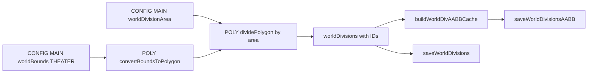
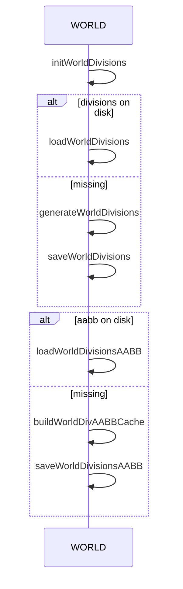
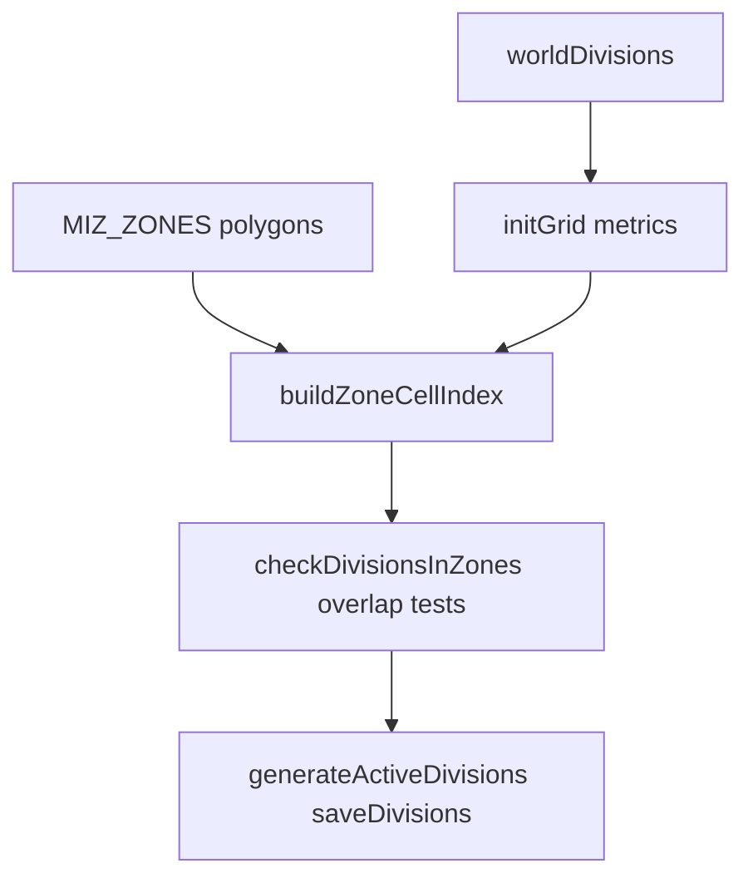

# AETHR CONFIG world bounds and divisions

How worldBounds and worldDivisionArea drive grid generation, AABB caching, activation against zones, and persistence.

Source anchors

- Config fields
  - worldDivisionArea default at [dev/CONFIG_.lua](../../dev/CONFIG_.lua:244)
  - worldBounds theaters at [dev/CONFIG_.lua](../../dev/CONFIG_.lua:245)
- World generation and activation
  - [AETHR.WORLD:generateWorldDivisions()](../../dev/WORLD.lua:1156)
  - [AETHR.WORLD:initWorldDivisions()](../../dev/WORLD.lua:1176)
  - [AETHR.WORLD:buildWorldDivAABBCache()](../../dev/WORLD.lua:1206)
  - [AETHR.WORLD:checkDivisionsInZones()](../../dev/WORLD.lua:1328)
  - [AETHR.WORLD:generateActiveDivisions()](../../dev/WORLD.lua:1067)
- Persistence
  - [AETHR.WORLD:loadWorldDivisions()](../../dev/WORLD.lua:1096)
  - [AETHR.WORLD:saveWorldDivisions()](../../dev/WORLD.lua:1112)
  - [AETHR.WORLD:loadWorldDivisionsAABB()](../../dev/WORLD.lua:1126)
  - [AETHR.WORLD:saveWorldDivisionsAABB()](../../dev/WORLD.lua:1140)

Overview

- worldBounds selects theater coordinate ranges for X and Z
- worldDivisionArea determines target area per grid division in square meters
- WORLD converts bounds to a polygon, divides it into rectangular divisions, assigns IDs, and caches AABB for fast spatial tests
- Divisions are marked active when they overlap mission zones

Generation pipeline

Initialization and reuse

Activation against zones

Key logic details

- [AETHR.WORLD:generateWorldDivisions()](../../dev/WORLD.lua:1156)
  - Uses POLY helpers to convert config bounds to a polygon and divide it by area
  - Assigns numeric ID and sets active to false

- [AETHR.WORLD:buildWorldDivAABBCache()](../../dev/WORLD.lua:1206)
  - Computes minX maxX minZ maxZ for each division corners and stores in DATA.worldDivAABB

- [AETHR.WORLD:checkDivisionsInZones()](../../dev/WORLD.lua:1328)
  - Builds a zone cell index from zone polygons using grid metrics
  - Performs bounding box rejection then polygon overlap to set div.active

- [AETHR.WORLD:generateActiveDivisions()](../../dev/WORLD.lua:1067)
  - Populates DATA.saveDivisions with active divisions

Persistence locations

- Divisions file: [CONFIG.MAIN.STORAGE.FILENAMES.WORLD_DIVISIONS_FILE](../../dev/CONFIG_.lua:222) under PATHS.CONFIG_FOLDER
- AABB file: [CONFIG.MAIN.STORAGE.FILENAMES.WORLD_DIVISIONS_AABB](../../dev/CONFIG_.lua:221) under PATHS.CONFIG_FOLDER

Theater configuration

- Supported theaters are listed at [dev/CONFIG_.lua](../../dev/CONFIG_.lua:246)
- THEATER is set at instance creation when available in env.mission; see [AETHR:New()](../../dev/AETHR.lua:141)

Validation checklist

- worldDivisionArea defined at [dev/CONFIG_.lua](../../dev/CONFIG_.lua:244)
- worldBounds theaters block at [dev/CONFIG_.lua](../../dev/CONFIG_.lua:246)
- Generation function at [AETHR.WORLD:generateWorldDivisions()](../../dev/WORLD.lua:1156)
- Activation and zone overlap at [AETHR.WORLD:checkDivisionsInZones()](../../dev/WORLD.lua:1328)
- AABB cache at [AETHR.WORLD:buildWorldDivAABBCache()](../../dev/WORLD.lua:1206)
- Persistence methods at [dev/WORLD.lua](../../dev/WORLD.lua:1096)

Related breakouts

- Paths and filenames: [paths_and_filenames.md](./paths_and_filenames.md)
- Zone paint and bounds: [zone_paint_and_bounds.md](./zone_paint_and_bounds.md)
- Init and persistence: [init_and_persistence.md](./init_and_persistence.md)