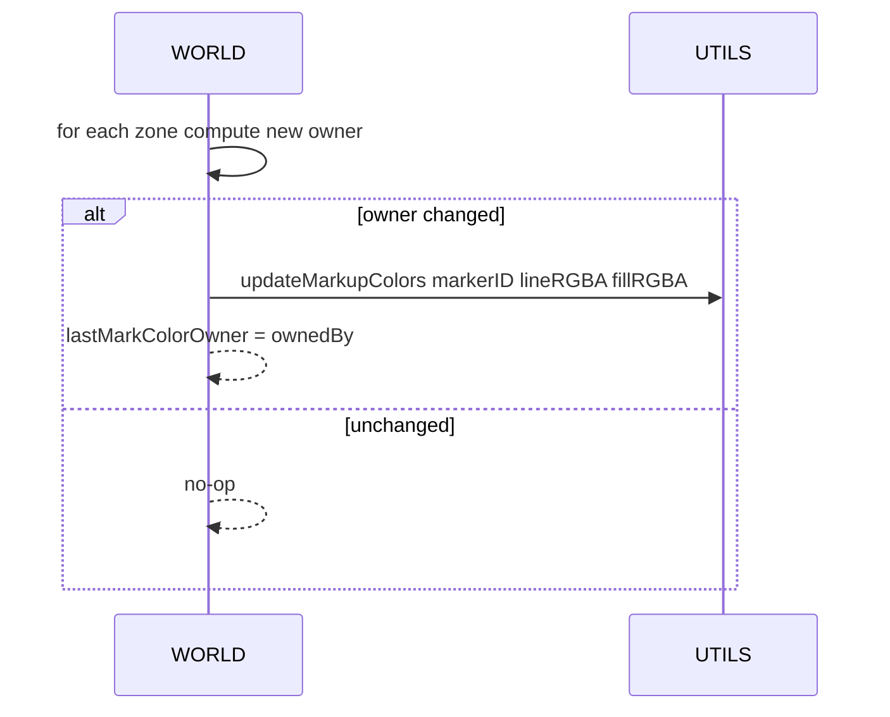
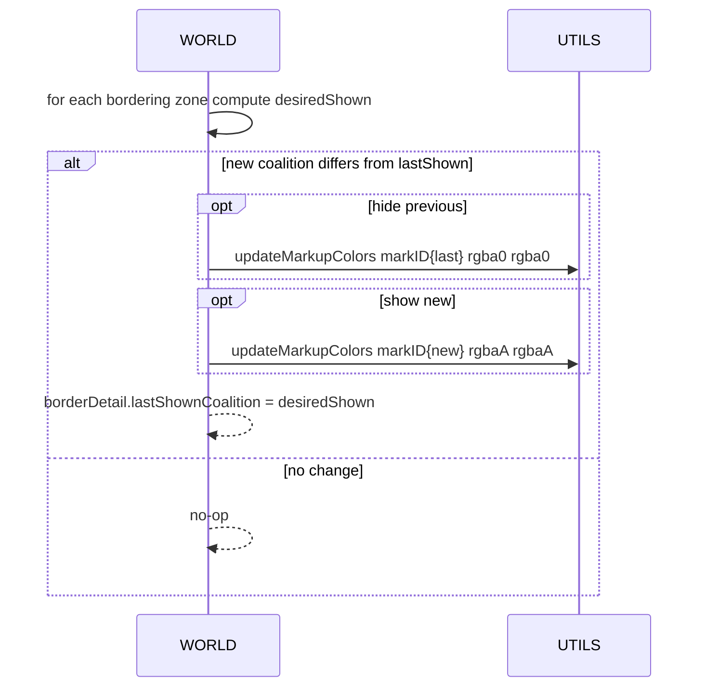
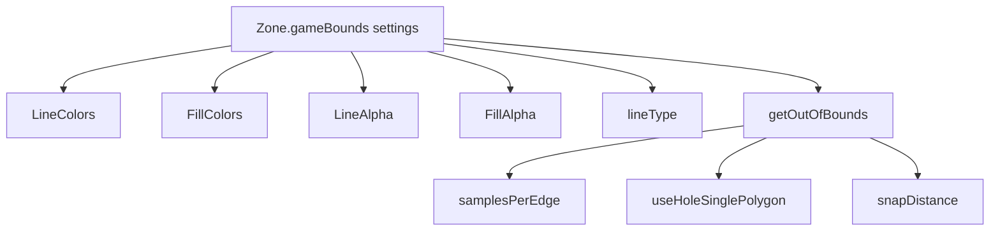

# AETHR CONFIG zone paint and bounds

Visualization settings for zones and world bounds. Explains how paint colors, alphas, and line types are used by runtime flows, and how game-bounds rendering is configured.

Source anchors

- Schema
  - [AETHR.CONFIG.ZoneSettings](../../dev/CONFIG_.lua:124)
  - [AETHR.CONFIG.PaintColors](../../dev/CONFIG_.lua:107)
  - [AETHR.CONFIG.GameBoundsSettings](../../dev/CONFIG_.lua:116)
- Defaults block
  - Zone defaults table start: [dev/CONFIG_.lua](../../dev/CONFIG_.lua:295)
- Runtime consumers
  - [AETHR.WORLD:updateZoneColors()](../../dev/WORLD.lua:683)
  - [AETHR.WORLD:updateZoneArrows()](../../dev/WORLD.lua:730)
  - [AETHR.UTILS:updateMarkupColors()](../../dev/UTILS.lua:188)

Overview

Zone paint settings provide indexed color sets for outline, fill, arrows and circles. Indices are aligned to coalition IDs used by WORLD ownership updates. Game bounds settings specialize rendering for world boundary polygons.

Paint settings structure

- Zone.paintColors
  - LineColors[number] -> Color
  - FillColors[number] -> Color
  - ArrowColors[number] -> Color (may include alpha)
  - CircleColors[number] -> Color (may include alpha)
  - FillAlpha number
  - LineAlpha number
  - lineType number
- Zone.gameBounds
  - LineColors Color
  - FillColors Color
  - FillAlpha number
  - LineAlpha number
  - lineType number
  - getOutOfBounds table settings

Color selection flow

```mermaid
flowchart LR
  OWN[zone.ownedBy] --> LC[Pick LineColors[ownedBy] or index 0]
  OWN --> FC[Pick FillColors[ownedBy] or index 0]
  LC --> LRGBA[Compose line RGBA using LineAlpha]
  FC --> FRGBA[Compose fill RGBA using FillAlpha]
  LRGBA --> APPLY[UTILS updateMarkupColors]
  FRGBA --> APPLY
```

- Implemented in [AETHR.WORLD:updateZoneColors()](../../dev/WORLD.lua:683)
- Fallback to index 0 when no specific coalition index is found

Sequence for zone color updates



Arrow visibility logic

- WORLD shows arrows on borders only when adjacent zones differ in ownership; it toggles visibility by setting arrow markup alpha to 0 or configured alpha.



- Implemented in [AETHR.WORLD:updateZoneArrows()](../../dev/WORLD.lua:730)
- Arrow colors sourced from Zone.paintColors.ArrowColors using coalition index, with alpha from color table or default 1

Game bounds rendering

Game bounds visuals are configured under Zone.gameBounds and consumed by zone-manager rendering flows. See detailed pages:
- [Markers and arrows](../zone_manager/markers_and_arrows.md)
- [Game bounds](../zone_manager/game_bounds.md)

Bounds rendering configuration



Key fields and defaults

- BorderOffsetThreshold: distance threshold for bordering detection
- ArrowLength: default arrow length in meters
- lineType values come from enums set in CONFIG defaults
  - See [dev/CONFIG_.lua](../../dev/CONFIG_.lua:319) and [dev/CONFIG_.lua](../../dev/CONFIG_.lua:326)

Validation checklist

- Paint colors present at [dev/CONFIG_.lua](../../dev/CONFIG_.lua:296)
- Arrow colors present at [dev/CONFIG_.lua](../../dev/CONFIG_.lua:307)
- Game bounds present at [dev/CONFIG_.lua](../../dev/CONFIG_.lua:321)
- WORLD color updates at [AETHR.WORLD:updateZoneColors()](../../dev/WORLD.lua:683)
- WORLD arrow updates at [AETHR.WORLD:updateZoneArrows()](../../dev/WORLD.lua:730)
- UTILS color setter at [AETHR.UTILS:updateMarkupColors()](../../dev/UTILS.lua:188)

Related breakouts

- Main schema: [main_schema.md](./main_schema.md)
- Init and persistence: [init_and_persistence.md](./init_and_persistence.md)
- Paths and filenames: [paths_and_filenames.md](./paths_and_filenames.md)