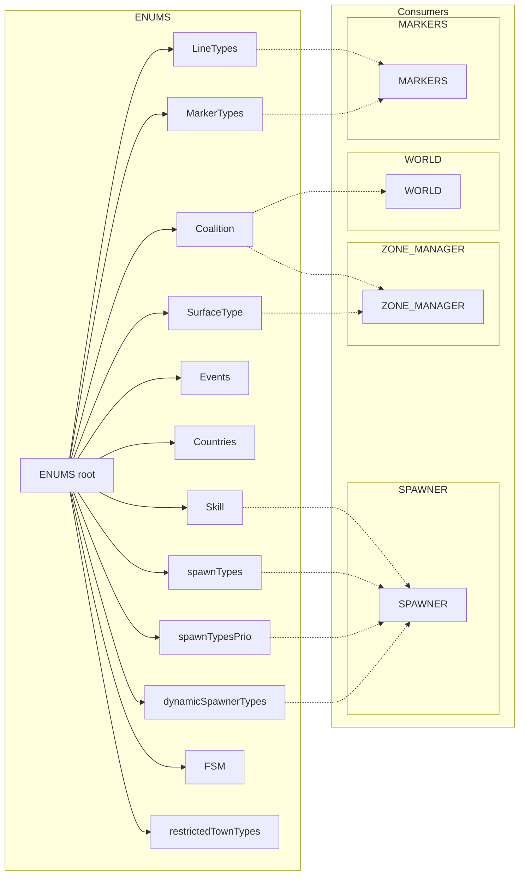
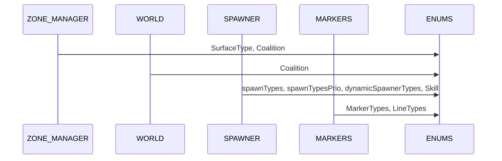
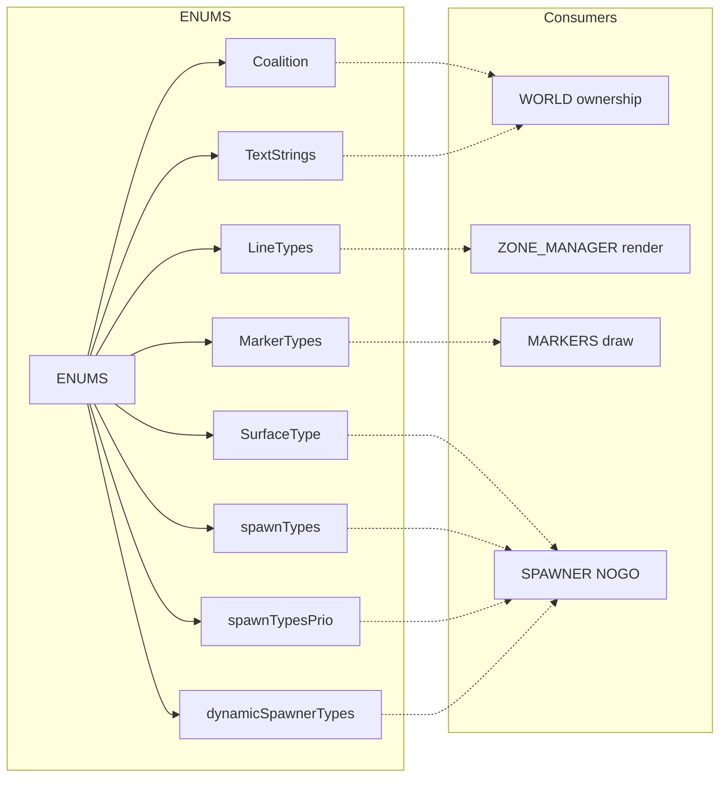

# AETHR ENUMS overview and usage diagrams

Primary anchors
- Root table initialization: [AETHR.ENUMS](https://github.com/Gh0st352/AETHR/blob/main/dev/ENUMS.lua#L337)
- Line styles: [AETHR.ENUMS.LineTypes](https://github.com/Gh0st352/AETHR/blob/main/dev/ENUMS.lua#L452)
- Marker shapes: [AETHR.ENUMS.MarkerTypes](https://github.com/Gh0st352/AETHR/blob/main/dev/ENUMS.lua#L461)
- Coalition constants: [AETHR.ENUMS.Coalition](https://github.com/Gh0st352/AETHR/blob/main/dev/ENUMS.lua#L418)
- Surface types: [AETHR.ENUMS.SurfaceType](https://github.com/Gh0st352/AETHR/blob/main/dev/ENUMS.lua#L365)
- DCS events: [AETHR.ENUMS.Events](https://github.com/Gh0st352/AETHR/blob/main/dev/ENUMS.lua#L374)
- Countries map: [AETHR.ENUMS.Countries](https://github.com/Gh0st352/AETHR/blob/main/dev/ENUMS.lua#L481)
- AI skill levels: [AETHR.ENUMS.Skill](https://github.com/Gh0st352/AETHR/blob/main/dev/ENUMS.lua#L483)
- Spawner categories: [AETHR.ENUMS.spawnTypes](https://github.com/Gh0st352/AETHR/blob/main/dev/ENUMS.lua#L490)
- Spawner category priority: [AETHR.ENUMS.spawnTypesPrio](https://github.com/Gh0st352/AETHR/blob/main/dev/ENUMS.lua#L562)
- Dynamic spawner types: [AETHR.ENUMS.dynamicSpawnerTypes](https://github.com/Gh0st352/AETHR/blob/main/dev/ENUMS.lua#L632)
- FSM sentinels: [AETHR.ENUMS.FSM](https://github.com/Gh0st352/AETHR/blob/main/dev/ENUMS.lua#L638)
- Restricted town types: [AETHR.ENUMS.restrictedTownTypes](https://github.com/Gh0st352/AETHR/blob/main/dev/ENUMS.lua#L650)

Documents and indices
- Master diagrams index: [docs/README.md](../README.md)
- AETHR overview: [docs/aethr/README.md](../aethr/README.md)
- SPAWNER: [docs/spawner/README.md](../spawner/README.md)
- ZONE_MANAGER: [docs/zone_manager/README.md](../zone_manager/README.md)
- WORLD: [docs/world/README.md](../world/README.md)
- MARKERS: [docs/markers/README.md](../markers/README.md)

# Overview relationships

# Lookup and usage sequence

# Anchors in consuming modules
- MARKERS uses shapes and lines: [AETHR.MARKERS:drawPolygon()](https://github.com/Gh0st352/AETHR/blob/main/dev/MARKERS.lua#L85), [AETHR.MARKERS:drawArrow()](https://github.com/Gh0st352/AETHR/blob/main/dev/MARKERS.lua#L176)
- ZONE_MANAGER ownership integration: [AETHR.ZONE_MANAGER:initWatcher_AirbaseOwnership()](https://github.com/Gh0st352/AETHR/blob/main/dev/ZONE_MANAGER.lua#L1103), [AETHR.ZONE_MANAGER:initWatcher_ZoneOwnership()](https://github.com/Gh0st352/AETHR/blob/main/dev/ZONE_MANAGER.lua#L1113)
- WORLD ownership texts and updates: [AETHR.WORLD:updateZoneArrows()](https://github.com/Gh0st352/AETHR/blob/main/dev/WORLD.lua#L730)
- SPAWNER types and priorities: [AETHR.SPAWNER:seedTypes()](https://github.com/Gh0st352/AETHR/blob/main/dev/SPAWNER.lua#L1804), [AETHR.SPAWNER:generateGroupTypes()](https://github.com/Gh0st352/AETHR/blob/main/dev/SPAWNER.lua#L1600)

### Notes
- ENUMS provides engine constant pass-throughs; when running outside DCS, ensure the environment provides required globals or inject stubs.
- Mermaid labels avoid double quotes and parentheses. All diagrams use GitHub Mermaid fenced blocks.
## Breakout documents

Focused ENUMS analysis pages with Mermaid diagrams and cross-module anchors.

- Categories: [categories.md](./categories.md)
- Lines and markers: [lines_and_markers.md](./lines_and_markers.md)
- Coalition and text strings: [coalition_and_text.md](./coalition_and_text.md)
- Surface types and NOGO: [surface_types.md](./surface_types.md)
- Spawn types and priority: [spawn_types.md](./spawn_types.md)

# High-level usage map

