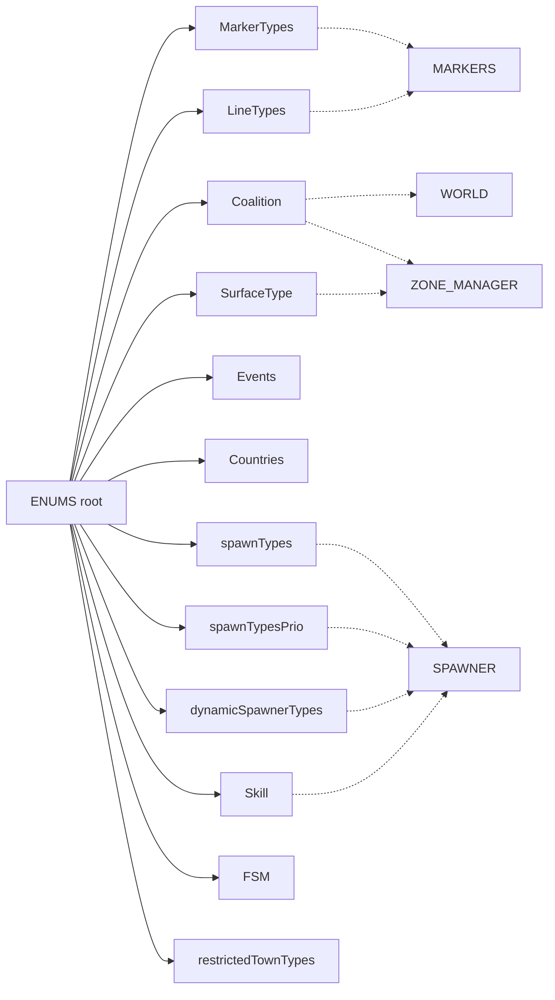
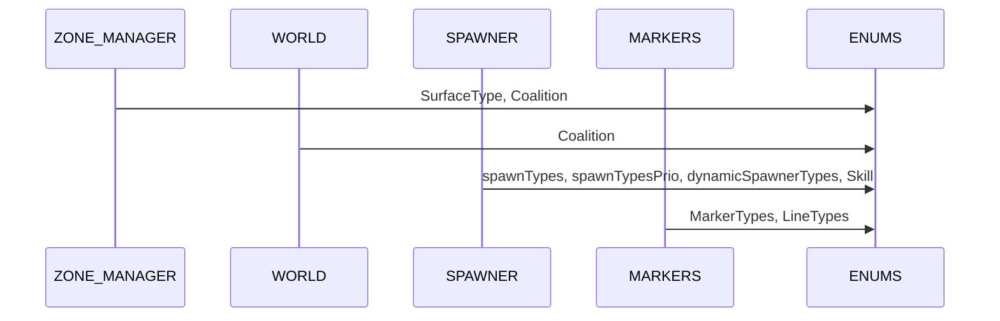

# AETHR ENUMS overview and usage diagrams

Primary anchors
- Root table initialization: [AETHR.ENUMS](../../dev/ENUMS.lua:337)
- Line styles: [AETHR.ENUMS.LineTypes](../../dev/ENUMS.lua:452)
- Marker shapes: [AETHR.ENUMS.MarkerTypes](../../dev/ENUMS.lua:461)
- Coalition constants: [AETHR.ENUMS.Coalition](../../dev/ENUMS.lua:418)
- Surface types: [AETHR.ENUMS.SurfaceType](../../dev/ENUMS.lua:365)
- DCS events: [AETHR.ENUMS.Events](../../dev/ENUMS.lua:374)
- Countries map: [AETHR.ENUMS.Countries](../../dev/ENUMS.lua:481)
- AI skill levels: [AETHR.ENUMS.Skill](../../dev/ENUMS.lua:483)
- Spawner categories: [AETHR.ENUMS.spawnTypes](../../dev/ENUMS.lua:490)
- Spawner category priority: [AETHR.ENUMS.spawnTypesPrio](../../dev/ENUMS.lua:562)
- Dynamic spawner types: [AETHR.ENUMS.dynamicSpawnerTypes](../../dev/ENUMS.lua:632)
- FSM sentinels: [AETHR.ENUMS.FSM](../../dev/ENUMS.lua:638)
- Restricted town types: [AETHR.ENUMS.restrictedTownTypes](../../dev/ENUMS.lua:650)

Documents and indices
- Master diagrams index: [docs/README.md](../README.md)
- AETHR overview: [docs/aethr/README.md](../aethr/README.md)
- SPAWNER: [docs/spawner/README.md](../spawner/README.md)
- ZONE_MANAGER: [docs/zone_manager/README.md](../zone_manager/README.md)
- WORLD: [docs/world/README.md](../world/README.md)
- MARKERS: [docs/markers/README.md](../markers/README.md)

Overview relationships

Lookup and usage sequence

Anchors in consuming modules
- MARKERS uses shapes and lines: [AETHR.MARKERS:drawPolygon()](../../dev/MARKERS.lua:85), [AETHR.MARKERS:drawArrow()](../../dev/MARKERS.lua:176)
- ZONE_MANAGER ownership integration: [AETHR.ZONE_MANAGER:initWatcher_AirbaseOwnership()](../../dev/ZONE_MANAGER.lua:1103), [AETHR.ZONE_MANAGER:initWatcher_ZoneOwnership()](../../dev/ZONE_MANAGER.lua:1113)
- WORLD ownership texts and updates: [AETHR.WORLD:updateZoneArrows()](../../dev/WORLD.lua:730)
- SPAWNER types and priorities: [AETHR.SPAWNER:seedTypes()](../../dev/SPAWNER.lua:1804), [AETHR.SPAWNER:generateGroupTypes()](../../dev/SPAWNER.lua:1600)

Notes
- ENUMS provides engine constant pass-throughs; when running outside DCS, ensure the environment provides required globals or inject stubs.
- Mermaid labels avoid double quotes and parentheses. All diagrams use GitHub Mermaid fenced blocks.