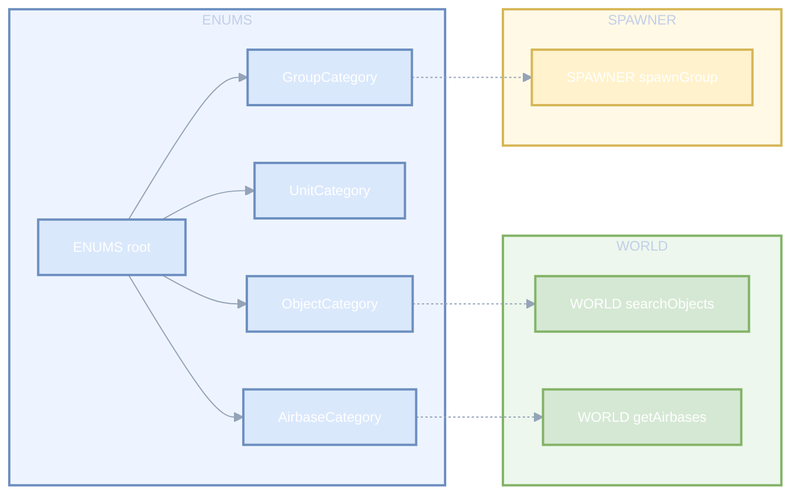
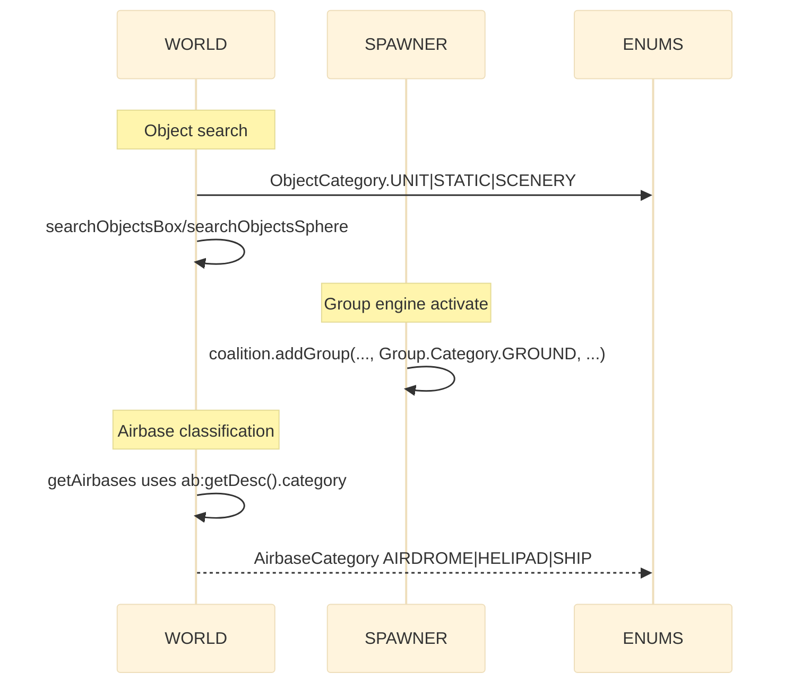

# ENUMS categories: objects, units, groups, airbases

Detailed reference and usage flows for DCS category enums exposed via AETHR.ENUMS. Includes consumer anchors and diagrams.

Primary sources

- Object categories class doc: [AETHR.ENUMS.ObjectCategory](../../dev/ENUMS.lua:24)
- Unit categories class doc: [AETHR.ENUMS.UnitCategory](../../dev/ENUMS.lua:31)
- Group categories class doc: [AETHR.ENUMS.GroupCategory](../../dev/ENUMS.lua:38)
- Airbase categories class doc: [AETHR.ENUMS.AirbaseCategory](../../dev/ENUMS.lua:45)
- Root table init: [AETHR.ENUMS](../../dev/ENUMS.lua:337)
- Runtime values set at:
  - ObjectCategory map: [dev/ENUMS.lua](../../dev/ENUMS.lua:339)
  - UnitCategory map: [dev/ENUMS.lua](../../dev/ENUMS.lua:346)
  - GroupCategory map: [dev/ENUMS.lua](../../dev/ENUMS.lua:353)
  - AirbaseCategory map: [dev/ENUMS.lua](../../dev/ENUMS.lua:360)

Overview relationships

Consumption anchors

- WORLD object search
  - Box search: [AETHR.WORLD:searchObjectsBox()](../../dev/WORLD.lua:330)
  - Sphere search: [AETHR.WORLD:searchObjectsSphere()](../../dev/WORLD.lua:384)
  - Uses [AETHR.ENUMS.ObjectCategory](../../dev/ENUMS.lua:339) for objectCategory filters

- SPAWNER group instantiation
  - Spawn group engine call: [AETHR.SPAWNER:spawnGroup()](../../dev/SPAWNER.lua:425) uses Group.Category.GROUND
  - The group category corresponds to [AETHR.ENUMS.GroupCategory](../../dev/ENUMS.lua:353)

- WORLD airbase classification
  - Airbase retrieval and classification: [AETHR.WORLD:getAirbases()](../../dev/WORLD.lua:428)
  - Airbase categories map to [AETHR.ENUMS.AirbaseCategory](../../dev/ENUMS.lua:360)

Lookup and usage sequence

Common patterns and guardrails

- When calling WORLD search functions, pass one of [AETHR.ENUMS.ObjectCategory](../../dev/ENUMS.lua:339) values:
  - UNIT, WEAPON, STATIC, SCENERY, BASE
- SPAWNER uses DCS Group.Category directly in engine calls; use [AETHR.ENUMS.GroupCategory](../../dev/ENUMS.lua:353) for consistent internal modeling
- WORLD airbase descriptor desc.category is engine numeric; the ENUMS AirbaseCategory provides stable symbolic names

Cross-module examples

- Count ground units in active divisions
  - [AETHR.WORLD:updateGroundUnitsDB()](../../dev/WORLD.lua:860) calls [AETHR.WORLD:searchObjectsBox()](../../dev/WORLD.lua:330) with [AETHR.ENUMS.ObjectCategory.UNIT](../../dev/ENUMS.lua:339)

- Draw mission zones using line type and coalition colors
  - [AETHR.ZONE_MANAGER:drawMissionZones()](../../dev/ZONE_MANAGER.lua:978) chooses colors by ownedBy coalition and line types from CONFIG; shapes and lines reference [MarkerTypes and LineTypes](./lines_and_markers.md)

Validation checklist

- ObjectCategory mapping is set at [dev/ENUMS.lua](../../dev/ENUMS.lua:339)
- UnitCategory mapping is set at [dev/ENUMS.lua](../../dev/ENUMS.lua:346)
- GroupCategory mapping is set at [dev/ENUMS.lua](../../dev/ENUMS.lua:353)
- AirbaseCategory mapping is set at [dev/ENUMS.lua](../../dev/ENUMS.lua:360)
- WORLD object searches at [dev/WORLD.lua](../../dev/WORLD.lua:330), [dev/WORLD.lua](../../dev/WORLD.lua:384)
- SPAWNER engine add uses group category at [dev/SPAWNER.lua](../../dev/SPAWNER.lua:428)

Related breakouts

- Lines and markers: [lines_and_markers.md](./lines_and_markers.md)
- Coalition and texts: [coalition_and_text.md](./coalition_and_text.md)
- Spawn types and prio: [spawn_types.md](./spawn_types.md)
- Surface types: [surface_types.md](./surface_types.md)