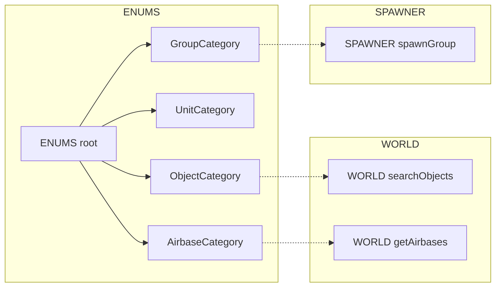
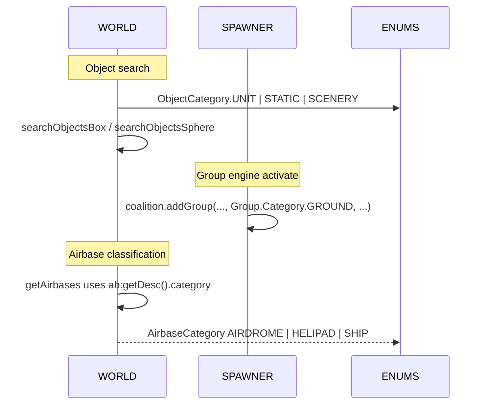

# ENUMS categories: objects, units, groups, airbases

Detailed reference and usage flows for DCS category enums exposed via AETHR.ENUMS. Includes consumer anchors and diagrams.

# Primary sources

- Object categories class doc: [AETHR.ENUMS.ObjectCategory](https://github.com/Gh0st352/AETHR/blob/main/dev/ENUMS.lua#L24)
- Unit categories class doc: [AETHR.ENUMS.UnitCategory](https://github.com/Gh0st352/AETHR/blob/main/dev/ENUMS.lua#L31)
- Group categories class doc: [AETHR.ENUMS.GroupCategory](https://github.com/Gh0st352/AETHR/blob/main/dev/ENUMS.lua#L38)
- Airbase categories class doc: [AETHR.ENUMS.AirbaseCategory](https://github.com/Gh0st352/AETHR/blob/main/dev/ENUMS.lua#L45)
- Root table init: [AETHR.ENUMS](https://github.com/Gh0st352/AETHR/blob/main/dev/ENUMS.lua#L337)
- Runtime values set at:
  - ObjectCategory map: [dev/ENUMS.lua](https://github.com/Gh0st352/AETHR/blob/main/dev/ENUMS.lua#L339)
  - UnitCategory map: [dev/ENUMS.lua](https://github.com/Gh0st352/AETHR/blob/main/dev/ENUMS.lua#L346)
  - GroupCategory map: [dev/ENUMS.lua](https://github.com/Gh0st352/AETHR/blob/main/dev/ENUMS.lua#L353)
  - AirbaseCategory map: [dev/ENUMS.lua](https://github.com/Gh0st352/AETHR/blob/main/dev/ENUMS.lua#L360)

# Overview relationships

# Consumption anchors

- WORLD object search
  - Box search: [AETHR.WORLD:searchObjectsBox()](https://github.com/Gh0st352/AETHR/blob/main/dev/WORLD.lua#L330)
  - Sphere search: [AETHR.WORLD:searchObjectsSphere()](https://github.com/Gh0st352/AETHR/blob/main/dev/WORLD.lua#L384)
  - Uses [AETHR.ENUMS.ObjectCategory](https://github.com/Gh0st352/AETHR/blob/main/dev/ENUMS.lua#L339) for objectCategory filters

- SPAWNER group instantiation
  - Spawn group engine call: [AETHR.SPAWNER:spawnGroup()](https://github.com/Gh0st352/AETHR/blob/main/dev/SPAWNER.lua#L425) uses Group.Category.GROUND
  - The group category corresponds to [AETHR.ENUMS.GroupCategory](https://github.com/Gh0st352/AETHR/blob/main/dev/ENUMS.lua#L353)

- WORLD airbase classification
  - Airbase retrieval and classification: [AETHR.WORLD:getAirbases()](https://github.com/Gh0st352/AETHR/blob/main/dev/WORLD.lua#L428)
  - Airbase categories map to [AETHR.ENUMS.AirbaseCategory](https://github.com/Gh0st352/AETHR/blob/main/dev/ENUMS.lua#L360)

# Lookup and usage sequence

# Common patterns and guardrails

- When calling WORLD search functions, pass one of [AETHR.ENUMS.ObjectCategory](https://github.com/Gh0st352/AETHR/blob/main/dev/ENUMS.lua#L339) values:
  - UNIT, WEAPON, STATIC, SCENERY, BASE
- SPAWNER uses DCS Group.Category directly in engine calls; use [AETHR.ENUMS.GroupCategory](https://github.com/Gh0st352/AETHR/blob/main/dev/ENUMS.lua#L353) for consistent internal modeling
- WORLD airbase descriptor desc.category is engine numeric; the ENUMS AirbaseCategory provides stable symbolic names

# Cross-module examples

- Count ground units in active divisions
  - [AETHR.WORLD:updateGroundUnitsDB()](https://github.com/Gh0st352/AETHR/blob/main/dev/WORLD.lua#L860) calls [AETHR.WORLD:searchObjectsBox()](https://github.com/Gh0st352/AETHR/blob/main/dev/WORLD.lua#L330) with [AETHR.ENUMS.ObjectCategory.UNIT](https://github.com/Gh0st352/AETHR/blob/main/dev/ENUMS.lua#L339)

- Draw mission zones using line type and coalition colors
  - [AETHR.ZONE_MANAGER:drawMissionZones()](https://github.com/Gh0st352/AETHR/blob/main/dev/ZONE_MANAGER.lua#L978) chooses colors by ownedBy coalition and line types from CONFIG; shapes and lines reference [MarkerTypes and LineTypes](./lines_and_markers.md)

# Validation checklist

- ObjectCategory mapping is set at [dev/ENUMS.lua](https://github.com/Gh0st352/AETHR/blob/main/dev/ENUMS.lua#L339)
- UnitCategory mapping is set at [dev/ENUMS.lua](https://github.com/Gh0st352/AETHR/blob/main/dev/ENUMS.lua#L346)
- GroupCategory mapping is set at [dev/ENUMS.lua](https://github.com/Gh0st352/AETHR/blob/main/dev/ENUMS.lua#L353)
- AirbaseCategory mapping is set at [dev/ENUMS.lua](https://github.com/Gh0st352/AETHR/blob/main/dev/ENUMS.lua#L360)
- WORLD object searches at [dev/WORLD.lua](https://github.com/Gh0st352/AETHR/blob/main/dev/WORLD.lua#L330), [dev/WORLD.lua](https://github.com/Gh0st352/AETHR/blob/main/dev/WORLD.lua#L384)
- SPAWNER engine add uses group category at [dev/SPAWNER.lua](https://github.com/Gh0st352/AETHR/blob/main/dev/SPAWNER.lua#L428)

# Related breakouts

- Lines and markers: [lines_and_markers.md](./lines_and_markers.md)
- Coalition and texts: [coalition_and_text.md](./coalition_and_text.md)
- Spawn types and prio: [spawn_types.md](./spawn_types.md)
- Surface types: [surface_types.md](./surface_types.md)