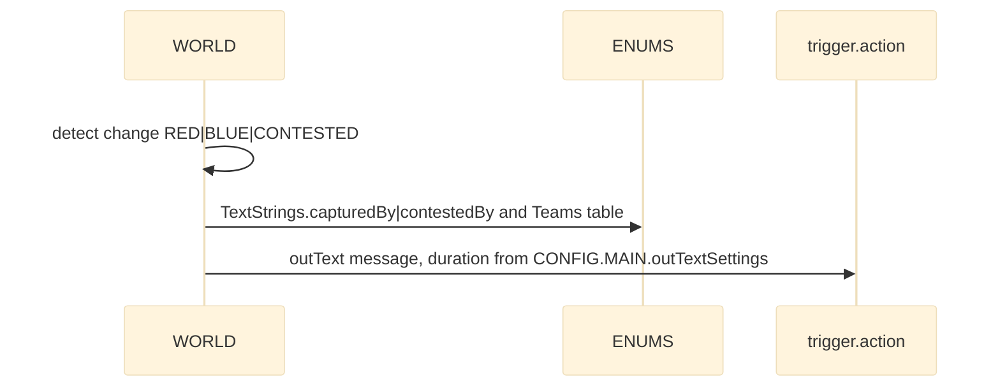
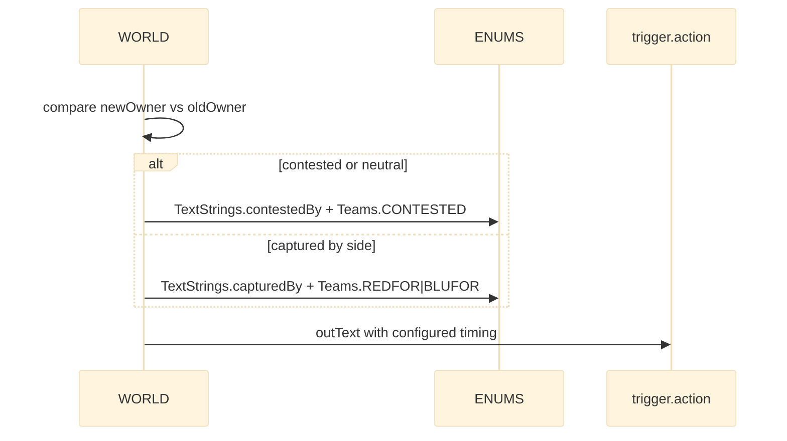

# ENUMS coalition and text strings

Coalition constants, phonetic alphabet and common user-facing strings used across world ownership, zone rendering and messaging.

Primary sources

- Coalition class doc: [AETHR.ENUMS.Coalition](../../dev/ENUMS.lua:102)
- Coalition mapping: [AETHR.ENUMS.Coalition = { ... }](../../dev/ENUMS.lua:417)
- Text strings class doc: [AETHR.ENUMS.TextStrings](../../dev/ENUMS.lua:156)
- Text strings mapping: [AETHR.ENUMS.TextStrings = { ... }](../../dev/ENUMS.lua:471)
- Phonetic class doc: [AETHR.ENUMS.Phonetic](../../dev/ENUMS.lua:109)
- Phonetic mapping: [AETHR.ENUMS.Phonetic = { ... }](../../dev/ENUMS.lua:424)
- Root table init: [AETHR.ENUMS](../../dev/ENUMS.lua:337)

Consumers and anchors

- WORLD ownership and text output
  - Airbase change handler: [AETHR.WORLD.airbaseOwnershipChanged()](../../dev/WORLD.lua:970)
    - Message composition using [TextStrings](../../dev/ENUMS.lua:471) at [dev/WORLD.lua](../../dev/WORLD.lua:989) to [dev/WORLD.lua](../../dev/WORLD.lua:996)
  - Zone change handler: [AETHR.WORLD:zoneOwnershipChanged()](../../dev/WORLD.lua:1006)
    - Message composition at [dev/WORLD.lua](../../dev/WORLD.lua:1025) to [dev/WORLD.lua](../../dev/WORLD.lua:1036)

- ZONE_MANAGER visuals using coalition indexing
  - Draw mission zones: [AETHR.ZONE_MANAGER:drawMissionZones()](../../dev/ZONE_MANAGER.lua:980) picks paint colors by zone.ownedBy (Coalition)
  - Draw arrows per coalition: [AETHR.ZONE_MANAGER:drawZoneArrows()](../../dev/ZONE_MANAGER.lua:1025) creates per-coalition arrows indexed 0..2

- WORLD arrows and colors
  - Update zone arrows: [AETHR.WORLD:updateZoneArrows()](../../dev/WORLD.lua:730) toggles visibility based on ownership differences; ArrowColors indexed by coalition

Ownership to text flow

```mermaid
%%{init: {"theme":"base", "themeVariables":{"primaryColor":"#0f172a","primaryTextColor":"#ffffff","lineColor":"#94a3b8","fontSize":"12px"}}}%%
flowchart LR

%% Classes
classDef world fill:#d5e8d4,stroke:#82b366,stroke-width:2px;
classDef enums fill:#dae8fc,stroke:#6c8ebf,stroke-width:2px;
classDef trigger fill:#f8cecc,stroke:#b85450,stroke-width:2px;
classDef process fill:#f5f5f5,stroke:#bfbfbf,stroke-width:2px;

%% Subgraphs
subgraph sgWorld [WORLD]
  OWN[Ownership change]
end

subgraph sgEnums [ENUMS]
  MAP[Map enum -> label]
end

subgraph sgMsg [Messaging]
  TXT[Build TextStrings message]
end

subgraph sgTrigger [trigger.action]
  OUT[trigger.action.outText with duration]
end

%% Edges
OWN -- "enum map" --> MAP
MAP -- "compose" --> TXT
TXT -- "outText" --> OUT

%% Class applications
class OWN world
class MAP enums
class TXT process
class OUT trigger

%% Styles for subgraphs
style sgWorld fill:#edf7ed,stroke:#82b366,stroke-width:2px
style sgEnums fill:#eef4ff,stroke:#6c8ebf,stroke-width:2px
style sgMsg fill:#f5f5f5,stroke:#bfbfbf,stroke-width:2px
style sgTrigger fill:#ffe6e6,stroke:#b85450,stroke-width:2px,stroke-dasharray: 5 5
```

Airbase change sequence

Zone change sequence

Coalition indexing and visuals

- Coalition indices NEUTRAL=0, RED=1, BLUE=2 are used to index color maps in CONFIG Zone.paintColors and ArrowColors
- ZONE_MANAGER and WORLD rendering functions consistently read colors using ownedBy as index

Phonetic alphabet usage

- Phonetic codes [AETHR.ENUMS.Phonetic](../../dev/ENUMS.lua:424) provide stable strings for radio-like identifiers
- While not directly referenced in the listed consumers, the mapping is intended for UI and reporting utilities that need NATO spelling

Validation checklist

- Coalition mapping present at [dev/ENUMS.lua](../../dev/ENUMS.lua:417)
- TextStrings mapping present at [dev/ENUMS.lua](../../dev/ENUMS.lua:471)
- Phonetic mapping present at [dev/ENUMS.lua](../../dev/ENUMS.lua:424)
- WORLD handlers use TextStrings at [dev/WORLD.lua](../../dev/WORLD.lua:989) to [dev/WORLD.lua](../../dev/WORLD.lua:1036)
- ZONE_MANAGER rendering reads coalition-indexed colors at [dev/ZONE_MANAGER.lua](../../dev/ZONE_MANAGER.lua:980) and creates per-coalition arrows at [dev/ZONE_MANAGER.lua](../../dev/ZONE_MANAGER.lua:1025)

Related breakouts

- Categories: [categories.md](./categories.md)
- Lines and markers: [lines_and_markers.md](./lines_and_markers.md)
- Spawn types and priority: [spawn_types.md](./spawn_types.md)
- Surface types: [surface_types.md](./surface_types.md)

Conventions

- GitHub Mermaid fenced blocks
- Labels avoid double quotes and parentheses inside bracket labels
- Relative links use stable line anchors to source