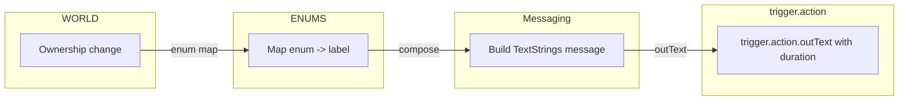
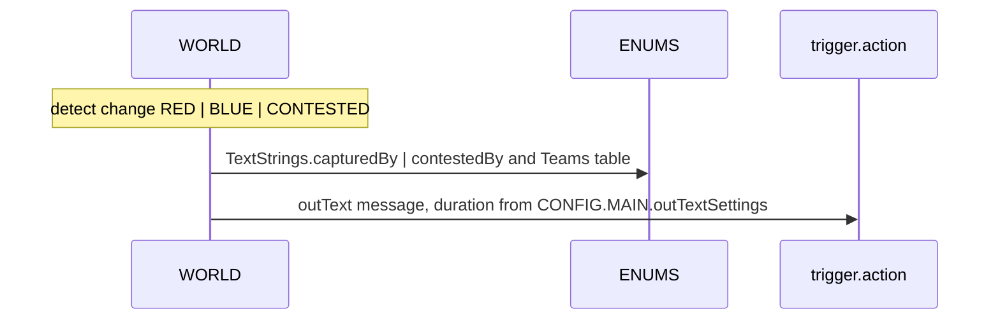
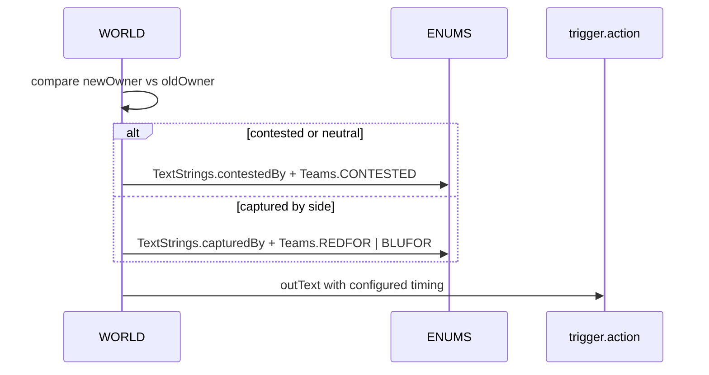

# ENUMS coalition and text strings

Coalition constants, phonetic alphabet and common user-facing strings used across world ownership, zone rendering and messaging.

# Primary sources

- Coalition class doc: [AETHR.ENUMS.Coalition](https://github.com/Gh0st352/AETHR/blob/main/dev/ENUMS.lua#L102)
- Coalition mapping: [AETHR.ENUMS.Coalition = { ... }](https://github.com/Gh0st352/AETHR/blob/main/dev/ENUMS.lua#L417)
- Text strings class doc: [AETHR.ENUMS.TextStrings](https://github.com/Gh0st352/AETHR/blob/main/dev/ENUMS.lua#L156)
- Text strings mapping: [AETHR.ENUMS.TextStrings = { ... }](https://github.com/Gh0st352/AETHR/blob/main/dev/ENUMS.lua#L471)
- Phonetic class doc: [AETHR.ENUMS.Phonetic](https://github.com/Gh0st352/AETHR/blob/main/dev/ENUMS.lua#L109)
- Phonetic mapping: [AETHR.ENUMS.Phonetic = { ... }](https://github.com/Gh0st352/AETHR/blob/main/dev/ENUMS.lua#L424)
- Root table init: [AETHR.ENUMS](https://github.com/Gh0st352/AETHR/blob/main/dev/ENUMS.lua#L337)

# Consumers and anchors

- WORLD ownership and text output
  - Airbase change handler: [AETHR.WORLD.airbaseOwnershipChanged()](https://github.com/Gh0st352/AETHR/blob/main/dev/WORLD.lua#L970)
    - Message composition using [TextStrings](https://github.com/Gh0st352/AETHR/blob/main/dev/ENUMS.lua#L471) at [dev/WORLD.lua](https://github.com/Gh0st352/AETHR/blob/main/dev/WORLD.lua#L989) to [dev/WORLD.lua](https://github.com/Gh0st352/AETHR/blob/main/dev/WORLD.lua#L996)
  - Zone change handler: [AETHR.WORLD:zoneOwnershipChanged()](https://github.com/Gh0st352/AETHR/blob/main/dev/WORLD.lua#L1006)
    - Message composition at [dev/WORLD.lua](https://github.com/Gh0st352/AETHR/blob/main/dev/WORLD.lua#L1025) to [dev/WORLD.lua](https://github.com/Gh0st352/AETHR/blob/main/dev/WORLD.lua#L1036)

- ZONE_MANAGER visuals using coalition indexing
  - Draw mission zones: [AETHR.ZONE_MANAGER:drawMissionZones()](https://github.com/Gh0st352/AETHR/blob/main/dev/ZONE_MANAGER.lua#L980) picks paint colors by zone.ownedBy (Coalition)
  - Draw arrows per coalition: [AETHR.ZONE_MANAGER:drawZoneArrows()](https://github.com/Gh0st352/AETHR/blob/main/dev/ZONE_MANAGER.lua#L1025) creates per-coalition arrows indexed 0..2

- WORLD arrows and colors
  - Update zone arrows: [AETHR.WORLD:updateZoneArrows()](https://github.com/Gh0st352/AETHR/blob/main/dev/WORLD.lua#L730) toggles visibility based on ownership differences; ArrowColors indexed by coalition

# Ownership to text flow

# Airbase change sequence

# Zone change sequence

# Coalition indexing and visuals

- Coalition indices NEUTRAL=0, RED=1, BLUE=2 are used to index color maps in CONFIG Zone.paintColors and ArrowColors
- ZONE_MANAGER and WORLD rendering functions consistently read colors using ownedBy as index

# Phonetic alphabet usage

- Phonetic codes [AETHR.ENUMS.Phonetic](https://github.com/Gh0st352/AETHR/blob/main/dev/ENUMS.lua#L424) provide stable strings for radio-like identifiers
- While not directly referenced in the listed consumers, the mapping is intended for UI and reporting utilities that need NATO spelling

# Validation checklist

- Coalition mapping present at [dev/ENUMS.lua](https://github.com/Gh0st352/AETHR/blob/main/dev/ENUMS.lua#L417)
- TextStrings mapping present at [dev/ENUMS.lua](https://github.com/Gh0st352/AETHR/blob/main/dev/ENUMS.lua#L471)
- Phonetic mapping present at [dev/ENUMS.lua](https://github.com/Gh0st352/AETHR/blob/main/dev/ENUMS.lua#L424)
- WORLD handlers use TextStrings at [dev/WORLD.lua](https://github.com/Gh0st352/AETHR/blob/main/dev/WORLD.lua#L989) to [dev/WORLD.lua](https://github.com/Gh0st352/AETHR/blob/main/dev/WORLD.lua#L1036)
- ZONE_MANAGER rendering reads coalition-indexed colors at [dev/ZONE_MANAGER.lua](https://github.com/Gh0st352/AETHR/blob/main/dev/ZONE_MANAGER.lua#L980) and creates per-coalition arrows at [dev/ZONE_MANAGER.lua](https://github.com/Gh0st352/AETHR/blob/main/dev/ZONE_MANAGER.lua#L1025)

# Related breakouts

- Categories: [categories.md](./categories.md)
- Lines and markers: [lines_and_markers.md](./lines_and_markers.md)
- Spawn types and priority: [spawn_types.md](./spawn_types.md)
- Surface types: [surface_types.md](./surface_types.md)

# Conventions

- GitHub Mermaid fenced blocks
- Labels avoid double quotes and parentheses inside bracket labels
- Relative links use stable line anchors to source