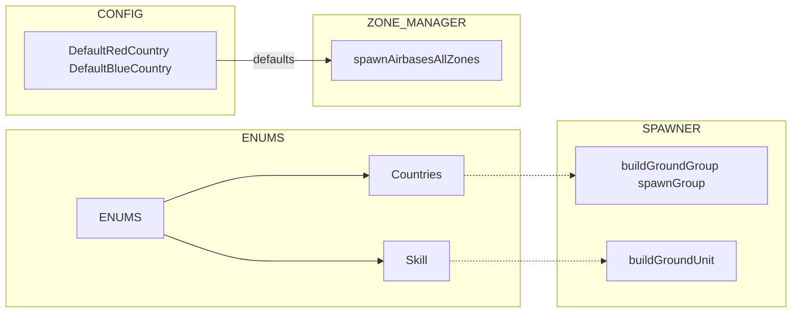
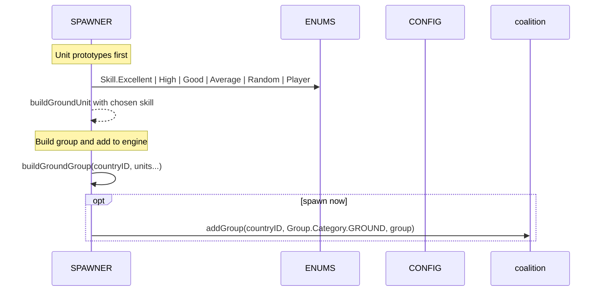
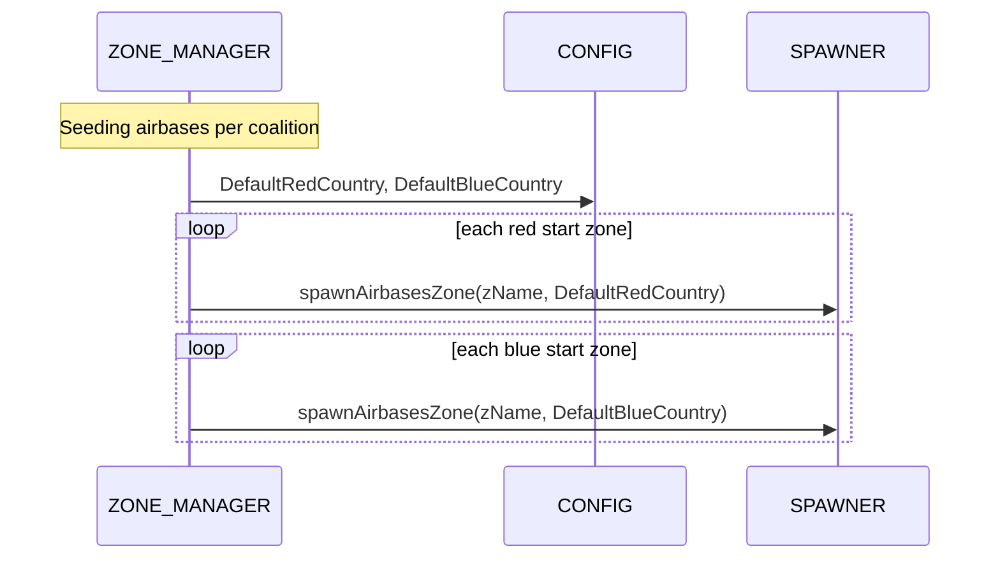

# ENUMS countries and skill

Country id mapping and AI skill strings exposed via ENUMS, with consumers across SPAWNER, WORLD and ZONE_MANAGER.

# Primary sources

- Countries mapping: [AETHR.ENUMS.Countries](https://github.com/Gh0st352/AETHR/blob/main/dev/ENUMS.lua#L481)
- Skill class doc: [AETHR.ENUMS.Skill](https://github.com/Gh0st352/AETHR/blob/main/dev/ENUMS.lua#L165)
- Skill mapping: [AETHR.ENUMS.Skill = { ... }](https://github.com/Gh0st352/AETHR/blob/main/dev/ENUMS.lua#L482)
- Root table init: [AETHR.ENUMS](https://github.com/Gh0st352/AETHR/blob/main/dev/ENUMS.lua#L337)

# Related CONFIG defaults

- Default country ids for zone-based spawning: [AETHR.CONFIG.MAIN.DefaultRedCountry](https://github.com/Gh0st352/AETHR/blob/main/dev/CONFIG_.lua#L177), [AETHR.CONFIG.MAIN.DefaultBlueCountry](https://github.com/Gh0st352/AETHR/blob/main/dev/CONFIG_.lua#L178)

# Consumers and anchors

- SPAWNER
  - Build group with country: [AETHR.SPAWNER:buildGroundGroup()](https://github.com/Gh0st352/AETHR/blob/main/dev/SPAWNER.lua#L321) uses countryID for coalition.addGroup payload
  - Spawn group with optional country override: [AETHR.SPAWNER:spawnGroup()](https://github.com/Gh0st352/AETHR/blob/main/dev/SPAWNER.lua#L425)
  - Dynamic spawner spawn: [AETHR.SPAWNER:spawnDynamicSpawner()](https://github.com/Gh0st352/AETHR/blob/main/dev/SPAWNER.lua#L438)
  - Build unit skill parameter: [AETHR.SPAWNER:buildGroundUnit()](https://github.com/Gh0st352/AETHR/blob/main/dev/SPAWNER.lua#L282) accepts skill, falls back to random if nil; Skill strings should come from [AETHR.ENUMS.Skill](https://github.com/Gh0st352/AETHR/blob/main/dev/ENUMS.lua#L482)

- ZONE_MANAGER
  - Spawn airbases per side using CONFIG defaults: [AETHR.ZONE_MANAGER:spawnAirbasesAllZones()](https://github.com/Gh0st352/AETHR/blob/main/dev/ZONE_MANAGER.lua#L1142) reads [DefaultRedCountry](https://github.com/Gh0st352/AETHR/blob/main/dev/CONFIG_.lua#L177) and [DefaultBlueCountry](https://github.com/Gh0st352/AETHR/blob/main/dev/CONFIG_.lua#L178)

- WORLD
  - Ownership updates do not use Countries directly, but country ids impact coalition on engine objects created via SPAWNER

# Overview relationships

# Group build and spawn sequence

# Airbase fillers by coalition

# Notes and guardrails

- Countries provides engine country.id passthrough; when running outside DCS, inject stubs if needed for static analysis
- Skill strings must be DCS-accepted values; use [AETHR.ENUMS.Skill](https://github.com/Gh0st352/AETHR/blob/main/dev/ENUMS.lua#L482) to avoid typos
- For side selection at scale, prefer CONFIG defaults and ZONE_MANAGER zone lists to keep coalition consistency

# Validation checklist

- Countries mapping present at [dev/ENUMS.lua](https://github.com/Gh0st352/AETHR/blob/main/dev/ENUMS.lua#L481)
- Skill mapping present at [dev/ENUMS.lua](https://github.com/Gh0st352/AETHR/blob/main/dev/ENUMS.lua#L482)
- SPAWNER group build and spawn at [dev/SPAWNER.lua](https://github.com/Gh0st352/AETHR/blob/main/dev/SPAWNER.lua#L321), [dev/SPAWNER.lua](https://github.com/Gh0st352/AETHR/blob/main/dev/SPAWNER.lua#L425), [dev/SPAWNER.lua](https://github.com/Gh0st352/AETHR/blob/main/dev/SPAWNER.lua#L438)
- ZONE_MANAGER zone-wide spawn by country at [dev/ZONE_MANAGER.lua](https://github.com/Gh0st352/AETHR/blob/main/dev/ZONE_MANAGER.lua#L1142)
- CONFIG default countries at [dev/CONFIG_.lua](https://github.com/Gh0st352/AETHR/blob/main/dev/CONFIG_.lua#L177)

# Related breakouts

- Categories: [categories.md](./categories.md)
- Coalition and text strings: [coalition_and_text.md](./coalition_and_text.md)
- Spawn types and priority: [spawn_types.md](./spawn_types.md)
- Lines and markers: [lines_and_markers.md](./lines_and_markers.md)