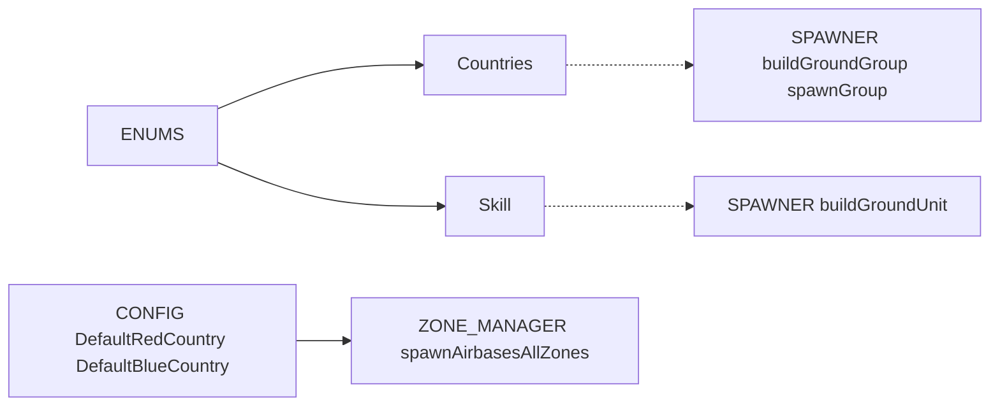
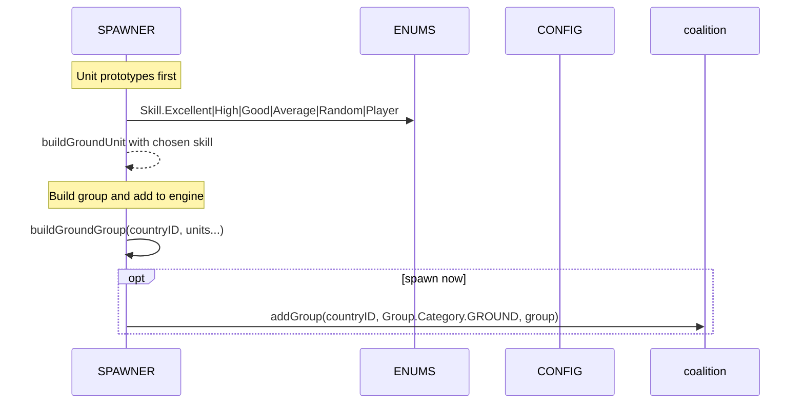
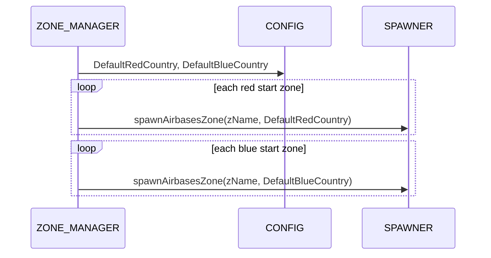

# ENUMS countries and skill

Country id mapping and AI skill strings exposed via ENUMS, with consumers across SPAWNER, WORLD and ZONE_MANAGER.

Primary sources

- Countries mapping: [AETHR.ENUMS.Countries](../../dev/ENUMS.lua:481)
- Skill class doc: [AETHR.ENUMS.Skill](../../dev/ENUMS.lua:165)
- Skill mapping: [AETHR.ENUMS.Skill = { ... }](../../dev/ENUMS.lua:482)
- Root table init: [AETHR.ENUMS](../../dev/ENUMS.lua:337)

Related CONFIG defaults

- Default country ids for zone-based spawning: [AETHR.CONFIG.MAIN.DefaultRedCountry](../../dev/CONFIG_.lua:177), [AETHR.CONFIG.MAIN.DefaultBlueCountry](../../dev/CONFIG_.lua:178)

Consumers and anchors

- SPAWNER
  - Build group with country: [AETHR.SPAWNER:buildGroundGroup()](../../dev/SPAWNER.lua:321) uses countryID for coalition.addGroup payload
  - Spawn group with optional country override: [AETHR.SPAWNER:spawnGroup()](../../dev/SPAWNER.lua:425)
  - Dynamic spawner spawn: [AETHR.SPAWNER:spawnDynamicSpawner()](../../dev/SPAWNER.lua:438)
  - Build unit skill parameter: [AETHR.SPAWNER:buildGroundUnit()](../../dev/SPAWNER.lua:282) accepts skill, falls back to random if nil; Skill strings should come from [AETHR.ENUMS.Skill](../../dev/ENUMS.lua:482)

- ZONE_MANAGER
  - Spawn airbases per side using CONFIG defaults: [AETHR.ZONE_MANAGER:spawnAirbasesAllZones()](../../dev/ZONE_MANAGER.lua:1142) reads [DefaultRedCountry](../../dev/CONFIG_.lua:177) and [DefaultBlueCountry](../../dev/CONFIG_.lua:178)

- WORLD
  - Ownership updates do not use Countries directly, but country ids impact coalition on engine objects created via SPAWNER

Overview relationships

Group build and spawn sequence

Airbase fillers by coalition

Notes and guardrails

- Countries provides engine country.id passthrough; when running outside DCS, inject stubs if needed for static analysis
- Skill strings must be DCS-accepted values; use [AETHR.ENUMS.Skill](../../dev/ENUMS.lua:482) to avoid typos
- For side selection at scale, prefer CONFIG defaults and ZONE_MANAGER zone lists to keep coalition consistency

Validation checklist

- Countries mapping present at [dev/ENUMS.lua](../../dev/ENUMS.lua:481)
- Skill mapping present at [dev/ENUMS.lua](../../dev/ENUMS.lua:482)
- SPAWNER group build and spawn at [dev/SPAWNER.lua](../../dev/SPAWNER.lua:321), [dev/SPAWNER.lua](../../dev/SPAWNER.lua:425), [dev/SPAWNER.lua](../../dev/SPAWNER.lua:438)
- ZONE_MANAGER zone-wide spawn by country at [dev/ZONE_MANAGER.lua](../../dev/ZONE_MANAGER.lua:1142)
- CONFIG default countries at [dev/CONFIG_.lua](../../dev/CONFIG_.lua:177)

Related breakouts

- Categories: [categories.md](./categories.md)
- Coalition and text strings: [coalition_and_text.md](./coalition_and_text.md)
- Spawn types and priority: [spawn_types.md](./spawn_types.md)
- Lines and markers: [lines_and_markers.md](./lines_and_markers.md)